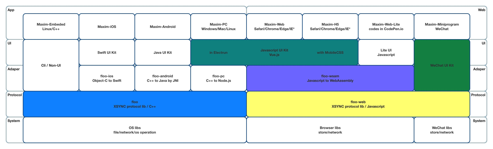

# Instant Messaging Development guide（IM）

## Product Features

Maximtop is a one-click IM cloud service based on multi-cloud architecture. Enterprises can quickly add chat functions to applications by integrating instant messaging IM SDK and using cloud services. After SDK integrated, the typical application architecture is as follows:

With the accumulation of instant messaging IM technology for more than ten years, Maximtop IM SDK and service API have been optimized to provide more professional services through simpler interfaces.

One-click enable multi-cloud architecture, which is the unique advantage of Maximtop IM Cloud Service.

One-click enable means from basic functions to service customization, all can be opened and used with one-click operation on the console; Multi-cloud architecture supports free migration of applications in different deployment modes of Public Cloud, Proprietary Cloud and Private Cloud, conforming to the business development stages, and implementing worry-free, seamless platform migration and switching.

With the omnipotent console, there are only two things you need to do, one is to integrate Maximtop IM SDK on the client side, and the other is to connect Maximtop API service on the server side. This paper mainly introduces the work related to client SDK integration.

Maximtop IM SDK is cross-platform, including mobile (iOS/Android), PC desktop (Linux/Windows/Mac), Web browser (including H5) and WeChat applet. In order to maximize reuse and improve service quality, the IM SDK technology stack of Maximtop is as follows:

1. Unified design and implementation of binary instant messaging protocol XSYNC, providing C++ version and JavaScript version respectively;
2. Encapsulate the C++ SDK of the whole platform based on C++ communication library, and continue to encapsulate the SDK of mobile (iOS/Android) and PC desktop (Linux/Windows/Mac) on this basis;
3. Both mobile terminals encapsulate the local UI Kit library before implementing the Maximtop DemoApp, but iOS and Android are slightly different. iOS encapsulates SDK through Object-C and then further transforms it into Swift library, while Android directly encapsulates Java library for upper layer use through Swig framework and JNI technology;
4. PC desktop encapsulates C++ communication library through Electron, and shares a set of UI components implemented by Vue.js with Web browser end;
5. Javascript communication library is provided to the Web browser (including H5) after being encrypted and encapsulated by WebAssembly;
6. WeChat applet is different from Web browser except protocol library due to platform reasons. The system layer calls WeChat's network and repository, and the upper layer uses WeChat's UI Kit;

## Access Guide for Beginners

Before you start integrating all clients, you need to create an application through Maximtop console, get the AppID of the application and set it on each side.

1. Create account

Register and login [Maximtop Console](https://console.maximtop.com)

1. Create application

After login, click to create application

After application created, App ID and other important information can be obtained in Application Information page; or you can click on the function page to configure it.

## Server-side

### API Document

[Server-side API](https://maximtop.com/docs/api/)

### On-premise Deployment

Download Center [Installation package](https://package.maximtop.com/linux/amd64/maxim.ctl) And then follow the steps directly from Console, you can also view [detailed installation document](quick-start/how-to-deploy-private-cloud.md)

## Client SDK

Maximtop IM Client SDK, codename floo. Following IM SDKs in document will be replaced with floo.

### API Details

1. [iOS API](https://maximtop.com/docs/ios/)
2. [Android API](https://maximtop.com/docs/android/)
3. [Web API](https://maximtop.com/docs/web/), WeChat applet API is exactly the same
4. [C++ API](https://maximtop.com/docs/floo/annotated.html)

### Platform Compatibility

Maximtop supports following platforms:

| Platform | Compatibility                                                                                         |
| -------- | ----------------------------------------------------------------------------------------------------- |
| iOS      | iOS 9.0 +                                                                                             |
| Android  | Android 4.1 +                                                                                         |
| Web      | IE 10 and above, Chrome, Firefox, Safari                                                              |
| PC       | Node.js version of the SDK supports Electron development framework, but only for x86\_64 architecture |
| Linux    | C++ version of the SDK, supports x86/x86-x64/ARM/MIPS architecture                                    |

### Changelog

To be added, please refer [Source update](https://github.com/maxim-top/)

### Client Error Code

| Error code                        | Description                                                               |
| --------------------------------- | ------------------------------------------------------------------------- |
| InvalidParam                      | Input parameters are invalid                                              |
| NotFound                          | Operate object is NOT exist                                               |
| UserNotLogin                      | User have NOT signed in                                                   |
| UserAlreadyLogin                  | User have signed in using another account                                 |
| UserAuthFailed                    | User sign in authentication failed, user name/id or password is incorrect |
| UserPermissionDenied              | User is NOT granted for the operation.                                    |
| UserNotExist                      | User is NOT exist                                                         |
| UserAlreadyExist                  | User has already exist                                                    |
| UserFrozen                        | User was frozen                                                           |
| UserBanned                        | User was banned to send message                                           |
| UserRemoved                       | User account was removed                                                  |
| UserTooManyDevice                 | User sign in from too many devices                                        |
| UserPasswordChanged               | User password was changed from other device                               |
| UserKickedBySameDevice            | User was kicked out by the same device                                    |
| UserKickedByOtherDevices          | User was kicked out by another device                                     |
| UserAbnormal                      | User sign in status is abnomal, advise to sign in again                   |
| UserCancel                        | User cancel operation                                                     |
| InvalidVerificationCode           | invalid verification code                                                 |
| InvalidRequestParameter           | invalid request parameter(s)                                              |
| InvalidUserNameParameter          | invalud username parameter                                                |
| MissingAccessToken                | missing access token                                                      |
| CurrentUserIsInRoster             | current user is in roster                                                 |
| CurrentUserIsInBlocklist          | current user is in block list                                             |
| AnswerFailed                      | the application does not exist or has already expired                     |
| InvalidToken                      | invalid token                                                             |
| RosterNotFriend                   | User was not in roster friend list                                        |
| RosterBlockListExist              | User was block by roster                                                  |
| RosterRejectApplication           | User application was reject by roster                                     |
| GroupServerDbError                | Server db error                                                           |
| GroupNotExist                     | Group NOT Found                                                           |
| GroupNotMemberFound               | User is NOT group member                                                  |
| GroupMsgNotifyTypeUnknown         | Unknown msg\_notify\_type                                                 |
| GroupOwnerCannotLeave             | Owner can not leave group                                                 |
| GroupTransferNotAllowed           | Group only can transfer to group member                                   |
| GroupRecoveryMode                 | Group is recovery mode                                                    |
| GroupExceedLimitGlobal            | Global group count exceed limit                                           |
| GroupExceedLimitUserCreate        | Group count user created exceed limit                                     |
| GroupExceedLimitUserJoin          | Group count user joined exceed limit                                      |
| GroupCapacityExceedLimit          | Group capacity exceed limit                                               |
| GroupMemberPermissionRequired,    | This operation needs group member permission                              |
| GroupAdminPermissionRequired,     | This operation needs group admin permission                               |
| GroupOwnerPermissionRequired      | This operation needs group owner permission                               |
| GroupApplicationExpiredOrHandled, | Application has expired or be handled                                     |
| GroupInvitationExpiredOrHandled,  | Invitation has expired or be handled                                      |
| GroupKickTooManyTimes             | User has been kicked too many times                                       |
| GroupMemberExist                  | User is already in group                                                  |
| GroupBlockListExist               | User is in group block list                                               |
| GroupAnnouncementNotFound         | Group announcement is not found                                           |
| GroupAnnouncementForbidden        | Group announcement has been forbidden by system admin                     |
| GroupSharedFileNotFound           | Group shared file is not found                                            |
| GroupSharedFileOperateNotAllowed  | Do not have permission operate shared file                                |
| GroupMemberBanned                 | Group banned member to send message                                       |
| SignInCancelled                   | Sign in operation was cancelled                                           |
| SignInTimeout                     | Sign in operation was timeout                                             |
| SignInFailed                      | Sign in operation failed                                                  |
| DbOperationFailed                 | Datebase read/write failed                                                |
| MessageInvalid                    | Message is invalid                                                        |
| MessageOutRecallTime              | Out of recall permission time                                             |
| MessageRecallDisabled             | Disable recall message                                                    |
| MessageCensored                   | Message include censored content                                          |
| MessageInvalidType                | Message don't support the operation                                       |
| ServerNotReachable                | Server is NOT reachable                                                   |
| ServerUnknownError                | Unknown server error                                                      |
| ServerInvalid                     | Server is invalid                                                         |
| ServerDecryptionFailed            | Server decryption failed                                                  |
| ServerEncryptMethodUnsupported    | Server don't support encrypt method                                       |
| ServerBusy                        | Server is busy                                                            |
| ServerNeedRetry                   | Server need retry                                                         |
| ServerTimeOut                     | Server time out                                                           |
| ServerConnectFailed               | Server connect failed                                                     |
| ServerDNSFailed                   | Server get DNS list failed                                                |
| ServerNeedReconnected             | Server changed need reconnect again                                       |
| ServerFileUploadUnknownError      | Server file upload unknow error                                           |
| ServerFileDownloadUnknownError    | Server file download unknow error                                         |
| ServerInvalidLicense              | Server invalid license                                                    |
| ServerLicenseLimit                | Server license limit                                                      |
| ServerAppFrozen                   | Server App frozen                                                         |
| ServerTooManyRequest              | Server too many request                                                   |
| ServerNotAllowOpenRegister        | Server not allow open register                                            |
| ServerFireplaceUnknownError       | Server Fireplace unknown error                                            |
| ServerResponseInvalid             | Server response invald                                                    |
| ServerInvalidUploadUrl            | Server invalid upload url                                                 |
