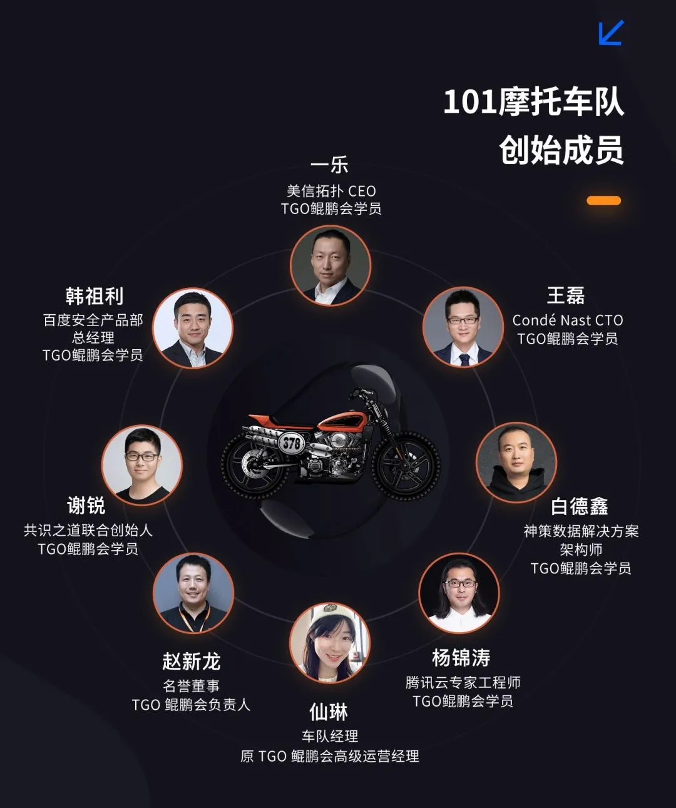

# 汽车工厂里的数字孪生与智能制造

艾姆姐 美信拓扑 _2021-08-20 16:19_

> 创新企业研习营北京站开启，立刻报名参加数字化转型主题分享与摩托车赛道技术开放日。

> 每隔几十年，各技术之间的融合就会催生出一个全新的事物，Omniverse便是这样诞生的。
>
> [https://zhuanlan.zhihu.com/p/364561061](https://zhuanlan.zhihu.com/p/364561061)

这是 NVIDIA 的黄教主说的，你可能没听过这话，但你一定记得前几天他用一个假的发布会骗过了所有人，也用数字孪生技术震惊了所有人。

我没有看懂，但我大受震撼。这是很多人的反应，但仔细阅读你就会发现，跟 Omniverse 一起的数字孪生技术其实已经应用在很多场景，其中，宝马的制造工厂就是一例。

> “宝马集团是第一家使用 NVIDIA Omniverse 来设计整个工厂端到端数字孪生的汽车制造商。其全球生产网络中的数千名规划师、产品工程师、设备经理和精益专家能够在同一个虚拟环境中进行协作，可在工厂实际建成或集成新产品之前，对极其复杂的制造系统进行设计、规划、工程、模拟和优化。”
>
> [https://zhuanlan.zhihu.com/p/364561061](https://zhuanlan.zhihu.com/p/364561061)

汽车行业是制造业中自动化和信息化程度最高的，在全球的工业机器人，有 35% 都是应用在汽车行业中的，由此可见一斑。始于 1916 年的 BMW 宝马，也是汽车行业的优秀代表；加上在 1923 年就有第一部 BMW 摩托车问世。2020 年 10 月，宝马成立数字化汽车（Digital Car）部门，将自动驾驶及驾驶辅助、智能互联及数字化服务等集合为一个部门，促进数字化研发力量的内部整合。

## TGO 鲲鹏会创新企业研习营 \[北京站]

创新企业研习营北京站将于 **8 月 28 日**举行，本站将会邀请**宝马汽车数字化生产与物流总监戚海飞**分享数字化转型实践经验分享，同时会对针对数字孪生等前沿技术应用进行深入探讨交流。

如果你对数字孪生、智能制造感兴趣，这个活动可不能错过。

在本站研习营分享中，戚海飞将从业务场景、团队转型、技术布局等几大维度，帮助传统行业在数字化转型的道路上打开思路。同时你将跟随宝马技术团队：了解传统企业在数字化转型过程中，需要掌握和应用哪些关键技术；学习如何把对的技术应用到合适的业务场景中；了解传统企业技术团队的转型需求和实践。

主题分享之外，我们还会组织大家**参观宝马 4S 店，了解宝马汽车文化，体验最新汽车及摩托车。随后会在专业赛车场来一场卡丁车、摩托车的极速驾驶之旅。**

**美信拓扑为本次活动独家赞助。**

### 活动信息

时间：8 月 28 日（周六）9:00-16:00

人员：TGO 鲲鹏会会员、101 摩托车队成员，和以上成员唯一推荐

规模：30 人

地点：宝马 4s 店 & 金港 GT 乐园

### 活动日程

*   9：00-11：00 数字化转型闭门会

    **主题：**《企业数字化领域的技术布局与团队管理》

    **分享嘉宾**：戚海飞，华晨宝马汽车有限公司数字化生产及物流总监，北京大学工商管理硕士学位，在汽车行业拥有超过 18 年的信息技术经验。从 2015 年开始，他带领华晨宝马汽车团队成立了 IMC（创新管理委员会），开启了公司的数字化转型之旅，并打造了“快速失败、快速学习、快速修复”的文化。
* 11:00-11:30 宝马汽车文化体验
* 11：30-12：30 用餐
*   13：00-14：00 赛道技术理论课程

    **讲师**：中国国家公路摩托车队车手
*   14：00-16：00 赛道骑行

    **地点**：金港 GT 乐园

    **注**：摩托车与卡丁车交叉进行

**点击下方小程序进行报名或点击文末阅读原文链接进行报名。**

TGO鲲鹏会会员服务，数字化转型与摩托车赛道开放日小程序

## 关于创新企业研习营

企业数字化转型的号角早已吹响，技术人身处数字经济时代的前沿，对企业未来的探索是当下的使命，科技创新显然是重中之重。多云治理、数据安全、通讯等成为企业创新改革的重要衡量。

身处浪潮之中，TGO 鲲鹏会联合 101 摩托车队发起城市骑行研习活动，主题为【面向未来的数字化转型】，集合众多互联网创新企业科技领导者，走访北京、杭州、上海、广州、成都等城市。走进企业，实际考察企业技术现状，探索产业发展，推动资源流通与企业合作。举办技术论坛及私董会，深入探讨传统企业数字化转型的最佳实践之路。

在 2021 年 4 月 2050 大会，创新企业研习营【杭州站】揭开序幕，由青宁信安创始人青润进行了主题分享《数据智能在动物保护方面的应用》，介绍了数字化技术在畜牧业里的应用以及动物穿戴设备的设计与研发。

欢迎持续关注并参与各地分站活动。

## 关于 TGO 鲲鹏会

TGO 鲲鹏会是极客邦旗下科技领导者聚集和交流的组织，我们希望构建全球化的有技术背景的优秀人才同侪学习成长平台。会员由 CTO、架构师、技术 VP、具有技术背景的 CEO 等组成，累计会员人数 1200 +。目前已成立北京、上海、深圳、广州、杭州、成都、硅谷、南京、台北、厦门、武汉、苏州分会。

## 关于 101 摩托车队

一群技术人聚在了一起，因为对摩托车的热爱。

2020 年，TGO 鲲鹏会会员一乐、韩祖利、谢锐、王磊、白德鑫成立北京分会摩托车兴趣小组，以「安全拉风」为理念，聚集技术圈里喜爱摩托车的朋友。小组在提高骑行技术的同时，也会随时探讨 IT 技术发展与行业变革中的各种机会与挑战。10 月，在 TGO 鲲鹏会支持下成功组织摩托车赛道骑行活动，受到技术朋友们的热烈响应。

2021 年，摩托车骑行小组正式更名「101 摩托车队」，旨在连接更多的行业内技术人，一起快乐安全骑行。101 是二进制代表技术，也是兄弟连的意思。

## 关于美信拓扑

美信拓扑，一家很酷的云服务公司，他们研发的新一代云原生 IM，是可以一键启用多云架构的即时通讯云服务。目前各种组件正在陆续开源。

## **特别提示**

继续关注「美信拓扑」，了解按月付费十分钟安装的即时通讯私有云。

