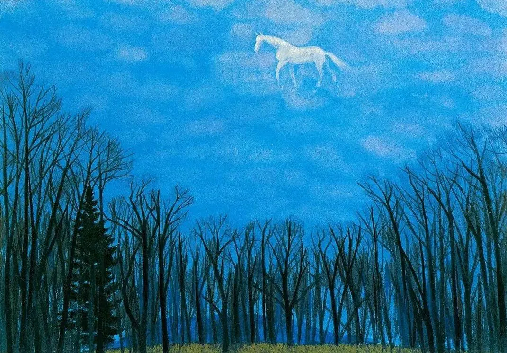

# 今晚，我们聊聊东山魁夷

原创 艾姆姐 美信拓扑 _2020-11-05 15:31_

《绵云》

> 东山魁夷（Higashiyama Kaii），被认为是战后日本最重要的画家之一，作品以风景画为主，画风有着静谧而深厚的精神力量，1969年获得日本文化勋章与文化功劳者称号，2018年是其诞辰110周年。

一家公司要上市，新华社发了一篇有趣的文章，用了这张画。

所有看画的人，秒懂。

东山魁夷在《青色风景》书中说：“这里描绘的白马也好、森林也好，都不是现实中的，而是来自我的空想。那么这匹马表示什么呢？不时有人这样问我。我只回答‘白马是我的心愿’，任由看的人想象。”

已经诞辰112周年的他老人家，不知道看到心愿变成这样，会是什么感觉。

但这样美丽的画，真是会让人立即爱上吧，至少对我来讲。

川端康成在住院时写信给他说：“我在病房每次看你的画，就觉得春光照到了身边，画中杉树的绿色也会发亮！”

这句话说的是下面这幅画，取材于京都清秀的风景：

《冬华》

介绍里是这样说的，“雾凇的树枝向天空伸展，如白色的珊瑚。树枝的交错编织出梦幻的韵律与冬天的寂静。”

东山魁夷与中国还是有不少缘分，1972年，日本田中角荣访华实现中日邦交正常化时，将东山魁夷的画作《春晓》赠送毛泽东主席，寓意中日之间的明媚春天即将开始。

《春晓》

这幅画现在藏于中国国家博物馆，看🌲树的形状，倒是有可能取材于黄山。因为1971年，在绘制日本奈良唐招提寺壁画时，东山魁夷提出要加入中国的风景，为此专程来到中国写生，最终将黄山和桂林的美景永远留在了日本唐招提寺的壁画上。

今晚 11.5 19:30，刚好是51CTO技术经理研习营的公开直播课，我们（美信拓扑）CEO一乐作为最后一场分享嘉宾，会说说这件事与管理的关系，如果你刚好是技术管理者，欢迎来聊 :D

> 51CTO技术经理研习营，由 51CTO 主办，面向 3-6 年技术人的线下学习实战课程，以技术管理底层方法论为基础，配合项目实战演练，梳理技术经理工作中的典型场景和困扰，逐一击破，带 来体系化的技术管理学习与实践。
