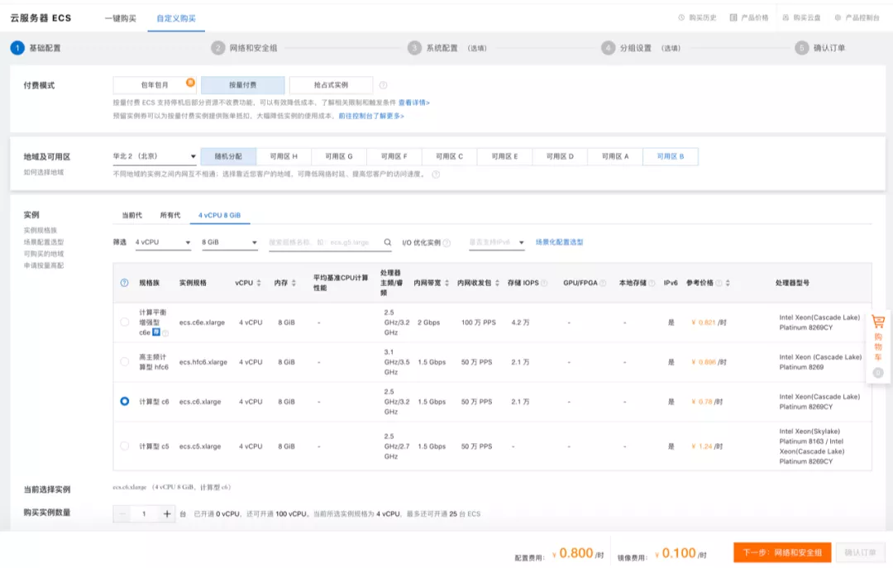
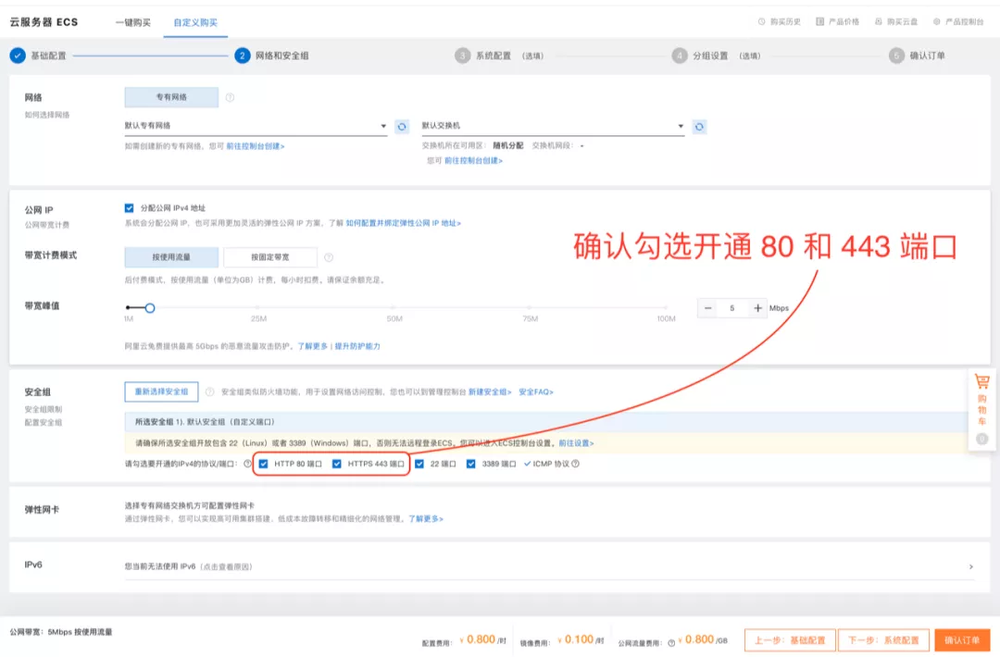

# 一毛钱一小时的 IM 私有云要吗？

原创 艾姆姐 美信拓扑 _2020-07-18 17:17_

> 云原生技术的成熟，意味着已经可以完全打破技术服务私有部署高成本重商务的旧规则。只要完成多云架构，完全可以同时满足客户对业务数据的掌控和公有云一样的低成本开支。
>
> 这一点，至少我们美信拓扑，可以做到。
>
> 而我们作为技术人的幸运，不应该止步于仅仅早于他人见识前沿技术，而是投身于这技术的洪流中，去创造去感受。一起来吧！
>
> 本文适合正在或即将进行即时通讯 IM 服务选型的朋友阅读，也适合所有做云服务的技术朋友阅读，欢迎留言讨论。

继做完[十分钟安装一套即时通讯私有云](install-an-instant-messaging-im-private-cloud-in-ten-minutes.md)\[1]和[树莓派安装的 IM 私有云](how-much-concurrency-is-supported-by-im-private-cloud-in-raspberry-pi.md)\[2]之后，就在今天，美信拓扑 IM 私有云正式上线阿里云云市场，IM 服务又朝着便宜可靠迈出了一大步。

现在你只要在阿里云后台购买主机，选择美信拓扑 IM 私有云的镜像，就可以获得一台预装了 IM 私有云的云服务器。

基础镜像定价 56 元/月，并且支持按量付费，也就意味着你可以用 0.1 元/小时 的价格开通使用。


**每小时只需要一毛钱，你就可以拥有自己的IM私有云。这是美信拓扑多云架构对在IM领域的最新实践，也是云原生技术再一次在技术服务领域发挥价值的案例。**

当然，私有云的服务器费用需要单独支付，不过好处是服务器规格从 4c8g 开始可以自由选择，我们也开通了**阿里云全球所有可用区**，没有任何限制。

## 如何购买使用

购买美信拓扑 IM 私有云与购买普通云主机非常类似，只需进入美信拓扑 IM 私有云产品页面\[3]点击立即购买，一步步操作即可。


第一步，选择系统配置。

系统镜像使用页面默认值不要修改，服务器配置为4核8G即可，如果你后面会更改规格可以适当提高（如何调整见后文）：



第二步，设置网络和安全组。

外网带宽5M，安全组开放端口80和443、开放端口80和443、开放端口80和443（重要事情说三遍）：



第三步，查看已安装服务信息。

购买完毕后服务器会自动启动，安装程序也会随机运行，自动安装美信拓扑 IM 私有云（大概需要十几分钟）。随后可以登录到服务器终端，执行命令获取用户名、密码、AppID等信息：

```
cat /etc/maxim/market
```

其中，用户名和密码用于登录美信拓扑控制台台， AppID 则用于客户端登录和服务端调用。

然后就可以玩啦！✌️

## 配置与定制


如图所示，美信拓扑 IM 私有云的所有配置均可通过官方控制台\[4]进行操作，云市场版本与官方下载版本相同，因此亦可参照官方私有部署文档\[5]。

### **1. 查看服务状态？**

有两种方式可以查看服务状态，一种是通过美信拓扑控制台，登陆后在「系统状态」标签下查看系统状态，如下图：


你也可选择第二种方式，即登陆服务器终端运行命令：

```
kubectl -n $(kubectl get namespace|grep maxim-|awk '{print $1}') get pods
```

如果所有 Kubernetes 内 Pod 均为 Running ，则系统运行正常。需要注意的是，第二种方式仅为服务运行，是否正常工作还要以控制台中巡检程序的结果为准。

### **2. 如何调整规格**

当前云市场安装镜像默认是 20 人规格，如需要扩容调整，也是跟官网下载版本相同。通过前述操作步骤第 3 步获取的账号密码进入美信拓扑控制台，选择 market App，然后点击「私有云」标签，重新下载目标规格的 Token 文件：


然后登陆服务器，运行如下命令：

```
ln -sf /usr/bin/maxim-market /usr/bin/maxim.ctl ##老版本需要复制链接；
/usr/bin/maxim.ctl update --token-file INSTALL_TOKEN_FILE
```

注意：更换规格会产生额外的费用，请确保控制台已充值相应金额，否则会导致服务被自动关停。

## **引用**

1、[十分钟安装一套即时通讯 IM 私有云](install-an-instant-messaging-im-private-cloud-in-ten-minutes.md)\
2、[树莓派中的 IM 私有云支持多少并发？](how-much-concurrency-is-supported-by-im-private-cloud-in-raspberry-pi.md)\
3、阿里云云市场产品：美信拓扑 IM 私有云\
https://market.aliyun.com/products/56014009/cmjj00041852.html\
4、美信拓扑官方控制台\
https://console.maximtop.com/\
5、美信拓扑 IM 私有部署指南\
https://www.maximtop.com/docs/install\_maxim/\
6、美信拓扑 IM 客户端与SDK下载\
https://www.maximtop.com/downloads/\
7、美信拓扑开源 Github 地址\
https://github.com/maxim-top\
8、美信拓扑 IM 客户端与SDK下载\
https://www.maximtop.com/docs/install\_maxim/

## 关于美信拓扑

**美信拓扑**，一家很酷的技术公司，他们研发的一键启用多云架构的即时通讯云服务，具有超强的伸缩能力，可以支撑从亿级用户千万并发的公有云服务，到一台主机十分钟安装完成的私有云。目前各种组件正在陆续开源。

**特别提示**

扫码关注「美信拓扑」，了解一键启用多云架构的即时通讯云服务。


