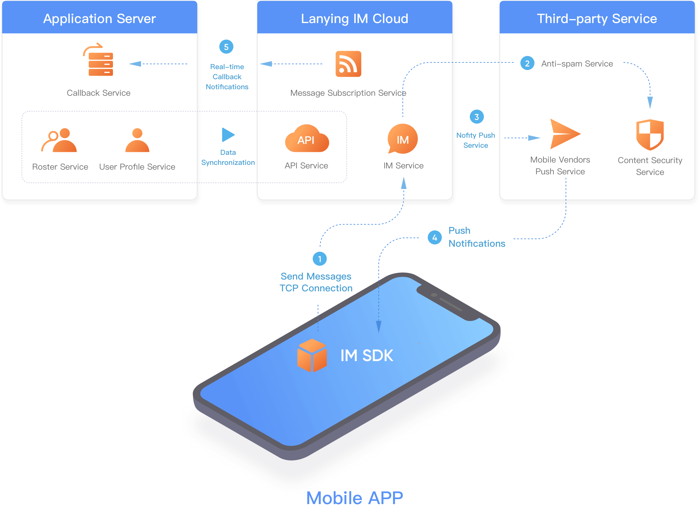

# Instant Messaging Development guide(IM)

## Product Features

Lanying IM, developed by [MaximTop](https://www.lanyingim.com/) team, is a new generation IM cloud service. Benefits from cloud-native technologies and multi-cloud architecture, the private cloud is charged monthly as well as the public cloud.

The SDK is designed in a minimalist approach and thus easy to integrate. Developers can effortlessly add chat functions to applications by integrating the SDK and the cloud API services.

The typical application architecture is as follows:

With the accumulation of instant messaging IM technology for more than ten years, Lanying IM SDK and service API have been optimized to provide more professional services through simpler interfaces.

One-click enable multi-cloud architecture, which is the unique advantage of Lanying IM Cloud Service.

One-click enable means from basic functions to service customization, all can be opened and used with one-click operation on the console; Multi-cloud architecture supports free migration of applications in different deployment modes of Public Cloud, Proprietary Cloud and Private Cloud, conforming to the business development stages, and implementing worry-free, seamless platform migration and switching.

With the omnipotent console, there are only two things you need to do, one is to integrate Lanying IM SDK on the client side, and the other is to connect Lanying API service on the server side. This paper mainly introduces the work related to client SDK integration.

Lanying IM SDK is cross-platform, including mobile (iOS/Android), PC desktop (Linux/Windows/Mac), Web browser (including H5) and WeChat applet. In order to maximize reuse and improve service quality, the IM SDK technology stack of Lanying is as follows:

1. Unified design and implementation of binary instant messaging protocol XSYNC, providing C++ version and JavaScript version respectively;
2. Encapsulate the C++ SDK of the whole platform based on C++ communication library, and continue to encapsulate the SDK of mobile (iOS/Android) and PC desktop (Linux/Windows/Mac) on this basis;
3. Both mobile terminals encapsulate the local UI Kit library before implementing the Lanying IM DemoApp, but iOS and Android are slightly different. iOS encapsulates SDK through Object-C and then further transforms it into Swift library, while Android directly encapsulates Java library for upper layer use through Swig framework and JNI technology;
4. PC desktop encapsulates C++ communication library through Electron, and shares a set of UI components implemented by Vue.js with Web browser end;
5. Javascript communication library is provided to the Web browser (including H5) after being encrypted and encapsulated by WebAssembly;
6. WeChat applet is different from Web browser except protocol library due to platform reasons. The system layer calls WeChat's network and repository, and the upper layer uses WeChat's UI Kit;

## Access Guide for Beginners

Before you start integrating all clients, you need to create an application through Lanying IM cloud console, get the AppID of the application and set it on each side.

1. Create account

Register and login [Lanying IM Cloud Console](https://console.lanyingim.com)

1. Create application

After login, click to create application

After application created, App ID and other important information can be obtained in Application Information page; or you can click on the function page to configure it.

## Server-side

### API Document

[Server-side API](reference/server-api/)

### Private Deployment

Download the [Installation package](https://package.lanyingim.com/linux/amd64/maxim.ctl) , then follow the steps from the console. View [installation document](quick-start/how-to-deploy-private-cloud.md) for details.

## Client SDK

The codename of Lanying IM SDK is Floo, which comes from The Wizarding World of Harry Potter. We'll use Floo to represent IMSDK in the following document.

### API Details

1. [iOS API](../zh-hans/reference/floo-ios.md)
2. [Android API](reference/floo-android.md)
3. [Web API](reference/floo-web.md), WeChat applet API is exactly the same
4. [C++ API](reference/floo.md)

### Platform Compatibility

Lanying IM supports following platforms:

| Platform | Compatibility                                                                                         |
| -------- | ----------------------------------------------------------------------------------------------------- |
| iOS      | iOS 9.0 +                                                                                             |
| Android  | Android 4.1 +                                                                                         |
| Web      | IE 10 and above, Chrome, Firefox, Safari                                                              |
| PC       | Node.js version of the SDK supports Electron development framework, but only for x86\_64 architecture |
| Linux    | C++ version of the SDK, supports x86/x86-x64/ARM/MIPS architecture                                    |

### Changelog

To be added, please refer [Source update](https://github.com/maxim-top/)

### Client Error Code

| Error code                       | Description                                                                                                |
| -------------------------------- | ---------------------------------------------------------------------------------------------------------- |
| NoError                          | The operation was performed successfully without error.                                                    |
| GeneralError                     | A generic error occurred during operation execution.                                                       |
| InvalidParam                     | There are invalid parameters in the input parameters.                                                      |
| NotFound                         | The path or file does not exist.                                                                           |
| DbOperationFailed                | The local database operation failed.                                                                       |
| SignInCancelled                  | The user has cancelled the login operation.                                                                |
| SignInTimeout                    | The user login operation has timed out.                                                                    |
| SignInFailed                     | The user login operation has failed.                                                                       |
|                                  |                                                                                                            |
| UserNotLogin                     | The user hasn't logged in yet.                                                                             |
| UserAlreadyLogin                 | Other user has logged in.                                                                                  |
| UserAuthFailed                   | User authentication failed, username/id or password is incorrect.                                          |
| UserPermissionDenied             | The user does not have permission to perform this action.                                                  |
| UserNotExist                     | The user does not exist.                                                                                   |
| UserAlreadyExist                 | The user is already exist.                                                                                 |
| UserFrozen                       | The user has been frozen.                                                                                  |
| UserBanned                       | The use has been banned from sending messages.                                                             |
| UserRemoved                      | The user has been removed.                                                                                 |
| UserTooManyDevice                | The use has logged into too many devices.                                                                  |
| UserPasswordChanged              | The user has changed passwords on other device.                                                            |
| UserKickedBySameDevice           | The user is kicked out by the same device.                                                                 |
| UserKickedByOtherDevices         | The user is kicked out by other device.                                                                    |
| UserAbnormal                     | The user login status is not normal, the user is advised to login again.                                   |
| UserCancel                       | The user has cancelled the operation.                                                                      |
| UserOldPasswordNotMatch          | The old password does not match when the password is changed.                                              |
| UserSigningIn                    | The user is signning in.                                                                                   |
|                                  |                                                                                                            |
| PushTokenInvalid                 | The push token is not valid.                                                                               |
| PushAliasBindByOtherUser         | Push alias is bound by other user.                                                                         |
| PushAliasTokenNotMatch           | The push alias does not match the token.                                                                   |
|                                  |                                                                                                            |
| InvalidVerificationCode          | The verification code is not valid.                                                                        |
| InvalidRequestParameter          | The request parameters are not valid.                                                                      |
| InvalidUserNameParameter         | The username parameter is not valid.                                                                       |
| MissingAccessToken               | The access token parameter is missing.                                                                     |
| CurrentUserIsInRoster            | The current user is already in the roster list.                                                            |
| CurrentUserIsInBlocklist         | The current user is already in the black list.                                                             |
| AnswerFailed                     | The application does not exist or has already expired.                                                     |
| InvalidToken                     | The current token is not valid.                                                                            |
| InvalidFileSign                  | The current file signature is not valid.                                                                   |
| InvalidFileObjectType            | The current file object type is not valid.                                                                 |
| InvalidFileUploadToType          | The to type of the uploaded file is not valid.                                                             |
| InvalidFileDownloadUrl           | The file download url is not valid.                                                                        |
|                                  |                                                                                                            |
| MessageInvalid                   | The current message format is not valid.                                                                   |
| MessageOutRecallTime             | The current message has exceeded the allowed recall time.                                                  |
| MessageRecallDisabled            | The current message is not recallable.                                                                     |
| MessageCensored                  | The current message include censored content.                                                              |
| MessageInvalidType               | This operation is not supported by the current message type.                                               |
| MessageBadArg                    | The current message contains illegal characters.                                                           |
| MessageRateLimitExceeded         | The message sending frequency has reached the limit.                                                       |
|                                  |                                                                                                            |
| RosterNotFriend                  | The current roster is not a friend.                                                                        |
| RosterBlockListExist             | The current roster is already on the blocklist.                                                            |
| RosterRejectApplication          | The current user does not accept any application.                                                          |
| RosterHasDeletedFromSystem       | The current roster has been deleted from the system.                                                       |
|                                  |                                                                                                            |
| GroupServerDbError               | An error occurred in the server database.                                                                  |
| GroupNotExist                    | The Specified group not found.                                                                             |
| GroupNotMemberFound              | The user is not in the specified group.                                                                    |
| GroupMsgNotifyTypeUnknown        | The group message notification type is unknown.                                                            |
| GroupOwnerCannotLeave            | The group owner cannot leave the group.                                                                    |
| GroupTransferNotAllowed          | Group owners can only be transferred to group members. The currently specified user is not a group member. |
| GroupRecoveryMode                | the current group is recovery mode.                                                                        |
| GroupExceedLimitGlobal           | The number of global groups reaches the limit.                                                             |
| GroupExceedLimitUserCreate       | The number of incoming members reached the limit when the group was created.                               |
| GroupExceedLimitUserJoin         | The number of group members has reached the limit.                                                         |
| GroupCapacityExceedLimit         | The maximum group capacity is limited.                                                                     |
| GroupMemberPermissionRequired    | This operation needs group member permission.                                                              |
| GroupAdminPermissionRequired     | This operation needs group admin permission.                                                               |
| GroupOwnerPermissionRequired     | This operation needs group owner permission.                                                               |
| GroupApplicationExpiredOrHandled | The current group application has expired or be handled.                                                   |
| GroupInvitationExpiredOrHandled  | The current group invitation has expired or be handled.                                                    |
| GroupKickTooManyTimes            | The current user has been kicked more than 3 times.                                                        |
| GroupMemberExist                 | The current user is already in the group.                                                                  |
| GroupBlockListExist              | The current user is already in group blocklist.                                                            |
| GroupAnnouncementNotFound        | The current group announcement with the specified id was not found.                                        |
| GroupAnnouncementForbidden       | The current group announcement with the specified id was forbidden by the system admin.                    |
| GroupSharedFileNotFound          | Group shared file is not found.                                                                            |
| GroupSharedFileOperateNotAllowed | Do not have permission to operate group shared files.                                                      |
| GroupMemberBanned                | The current user is banned by the group.                                                                   |
|                                  |                                                                                                            |
| ServerNotReachable               | The current server not reachable.                                                                          |
| ServerUnknownError               | An unknown error occurred on the server.                                                                   |
| ServerInvalid                    | The current server host is not valid.                                                                      |
| ServerDecryptionFailed           | A decryption failed error occurred on the server.                                                          |
| ServerEncryptMethodUnsupported   | The server does not currently support the specified encryption method.                                     |
| ServerBusy                       | The server is currently busy.                                                                              |
| ServerNeedRetry                  | The server needs to retry.                                                                                 |
| ServerTimeOut                    | A timeout error occurred on the server.                                                                    |
| ServerConnectFailed              | A connection failure error occurred on the server.                                                         |
| ServerDNSFailed                  | The current server failed to obtain the dns list.                                                          |
| ServerNeedReconnected            | The current server has changed and needs to be reconnected.                                                |
| ServerFileUploadUnknownError     | An unknown file upload error occurred on the server.                                                       |
| ServerFileDownloadUnknownError   | An unknown file download error occurred on the server.                                                     |
| ServerInvalidLicense             | An invalid license error occurred on the server.                                                           |
| ServerLicenseLimit               | A license limit error occurred on the server.                                                              |
| ServerAppFrozen                  | An app freeze error occurred on the server.                                                                |
| ServerTooManyRequest             | The server is being accessed too many times.                                                               |
| ServerNotAllowOpenRegister       | The server is not allowed open registration.                                                               |
| ServerFireplaceUnknownError      | An unknown error occurred on the fireplace server.                                                         |
| ServerResponseInvalid            | The current response returned by the server is not valid.                                                  |
| ServerInvalidUploadUrl           | The current upload server url is not valid.                                                                |
| ServerAppLicenseInvalid          | The current server app license is not valid.                                                               |
| ServerAppLicenseExpired          | The current server app license has expired.                                                                |
| ServerAppLicenseExceedLimit      | The current server app license has reached its limit.                                                      |
| ServerAppIdMissing               | The current server appid is missing.                                                                       |
| ServerAppIdInvalid               | The current server appid is not valid.                                                                     |
| ServerAppSignInvalid             | The current server app sign is not valid.                                                                  |
| ServerAppNotifierNotExist        | The current server app notifier not exist.                                                                 |
| ServerNoClusterInfoForClusterId  | The specified cluster id has no cluster information.                                                       |
| ServerFileDownloadFailure        | A download error occurred on the server.                                                                   |
| ServerAppStatusNotNormal         | The current status of the server app is not normal.                                                        |
| ServerPlatformNotAllowed         | The server does not support the currently logged in device platform.                                       |
| ServerCannotCreateDeviceSn       | The server cannot generate the serial number of the currently logged in device.                            |
| ServerRtcNotOpen                 | The RTC service is not open.                                                                               |
