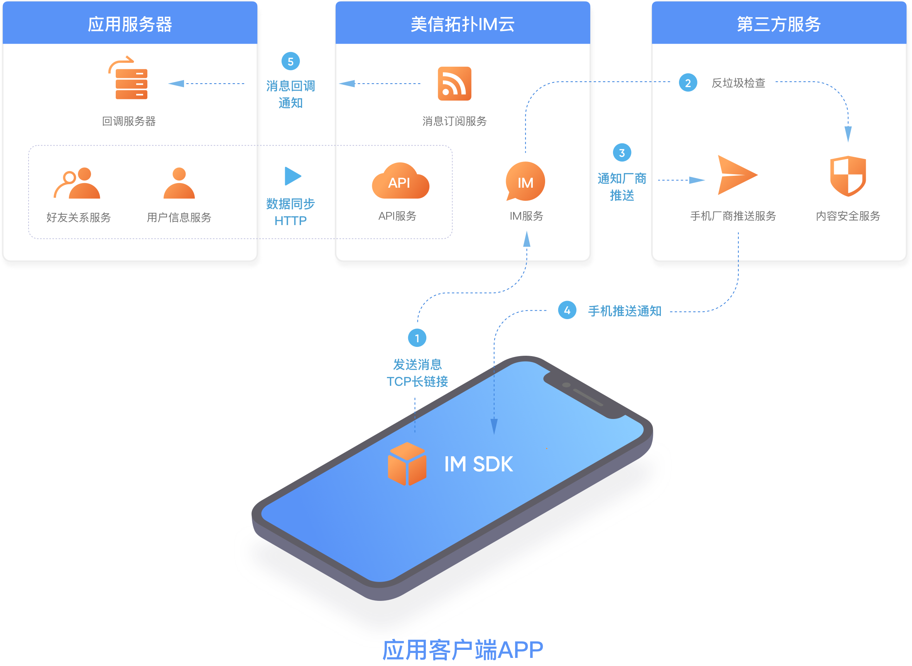

# 即时通讯开发指南（IM）

## 产品概述

蓝莺IM，是由[美信拓扑](https://www.lanyingim.com/)团队研发的新一代即时通讯云服务，SDK设计简单集成方便，服务采用云原生技术和多云架构，私有云也可按月付费。

企业可以通过集成蓝莺IM SDK，配合使用云服务，为应用快速添加聊天功能。集成SDK后，典型的应用架构如下：

依靠十余年的即时通讯 IM 技术积累，蓝莺IM SDK和云服务 API 都已经过优化设计，通过更加简单的接口提供更加专业的服务。

一键启用多云架构，是蓝莺IM云服务的独特优势。

一键启用意味着，从基础功能到服务定制，均可通过控制台一键操作即开即用；而多云架构，支持应用在公有云、专有云和私有云的不同部署方式自由迁移，顺应业务发展阶段，无缝迁移无忧切换。

配合无所不能的控制台，你需要做的只有两件事，一是客户端集成蓝莺IM SDK，二是服务端对接蓝莺云服务 API。本文主要介绍 SDK 集成相关内容。

蓝莺IM SDK 是跨平台的，包括移动端（iOS/Android）、PC桌面端（Linux/Windows/Mac）、Web浏览器端（包括H5）以及微信小程序等。为了最大程度的复用，并提高服务质量，SDK 技术栈如下：

1. 统一设计并实现二进制即时通讯协议 XSYNC ，分别实现了 C++ 版和 Javascript 版；
2. 在 C++ 通讯库的基础上封装了全平台的 C++ SDK，并以此为基础继续封装了移动端（iOS/Android）和PC桌面端（Linux/Windows/Mac）SDK；
3. 移动端在实现蓝莺IM Demo 前均封装了本地的 UI Kit 库，但 iOS 和 Android 稍有不同，iOS 通过 Object-C 封装 SDK 后进一步转化成 Swift 库，而 Android 则通过 Swig 框架和 JNI 技术直接封装了 Java 库供上层使用；
4. PC桌面端通过 Electron 封装 C++ 通讯库后，与 Web 浏览器端共享一套由 Vue.js 实现的 UI 组件；
5. Javascript 通讯库通过 WebAssembly 加密封装后提供给 Web 浏览器端（包括H5）使用；
6. 微信小程序由于平台原因，除协议库外均与 Web 浏览器端不同，系统层调用了微信的网络和存储库，上层用的微信的 UI Kit；

## 新手接入指南

开始集成所有客户端之前，你需要通过蓝莺IM云服务控制台，创建应用并获取应用的 AppID 然后在各端设置。

1. 创建账号

注册并登陆[蓝莺IM云服务控制台](https://console.lanyingim.com)

1. 创建应用

登录成功后，点击创建应用

创建应用成功后，应用信息页面内获得该应用的 App ID 等重要信息，也可以点击功能页进行配置。

## 服务端

### API 文档

[服务端 API](reference/server-api/)

### 私有部署安装

下载[安装包](https://package.lanyingim.com/linux/amd64/maxim.ctl) 后直接在控制台按照步骤操作，亦可查看[详细安装文档](quick-start/how-to-deploy-private-cloud.md)

## 客户端SDK

蓝莺IM SDK，代号 floo。文中有 IM SDK 的地方将会用 floo 代替。

### SDK API 详细文档

1. [iOS API](reference/floo-ios/protocols.md)
2. [Android API](reference/floo-android.md)
3. [Web API](reference/floo-web.md)，微信小程序API与此完全相同
4. [C++ API](reference/floo-ios/constants.md)

### 平台兼容

蓝莺IM SDK支持以下平台：

| 平台      | 兼容性                                        |
| ------- | ------------------------------------------ |
| iOS     | 兼容iOS 9.0 +                                |
| Android | 兼容Android 4.1 +                            |
| Web     | 兼容 IE10 及以上、Chrome、Firefox、Safari等         |
| PC      | Node.js版本SDK支持Electron开发框架，但仅支持 x86_64 架构 |
| Linux   | C++版本SDK，支持 x86/x86-x64/ARM/MIPS 架构        |

### Changelog

待补充，请参考[源码更新](https://github.com/maxim-top/)

### 客户端错误码

| 错误编码                           | 描述信息                                                                    |
| --------------------------------- | ------------------------------------------------------------------------- |
| NoError                           | 操作成功，无错误。                                                           |
| GeneralError                      | 操作执行过程中发生了一个通用错误。                                              |
| InvalidParam                      | 输入参数中存在无效参数。                                                      |
| NotFound                          | 路径或文件不存在。                                                           |
| DbOperationFailed                 | 本地数据库操作失败。                                                          |
| SignInCancelled                   | 用户已取消登陆操作。                                                          |
| SignInTimeout                     |  用户登陆操作已超时。                                                         |
| SignInFailed                      | 用户登陆操作已失败。                                                          |
|                                   |                                                                           |
| UserNotLogin                      | 用户还没有登录。                                                             |
| UserAlreadyLogin                  | 其他用户已登录。                                                             |
| UserAuthFailed                    | 用户认证失败，用户名/id或密码错误。                                             |
| UserPermissionDenied              | 用户没有执行此操作的权限。                                                     |
| UserNotExist                      | 用户不存在。                                                                 |
| UserAlreadyExist                  | 用户已经存在。                                                               |
| UserFrozen                        | 用户被冻结。                                                                 |
| UserBanned                        | 该用户已被禁止发送消息。                                                       |
| UserRemoved                       | 用户被删除。                                                                 |
| UserTooManyDevice                 | 用户登录了太多的设备。                                                         |
| UserPasswordChanged               | 用户在其他设备上修改了密码。                                                    |
| UserKickedBySameDevice            | 用户被同一设备踢出。                                                          |
| UserKickedByOtherDevices          | 用户被其他设备踢出。                                                          |
| UserAbnormal                      | 用户登陆状态不正常，建议用户重新登陆。                                           |
| UserCancel                        | 用户已取消操作。                                                             |
| UserOldPasswordNotMatch           | 更换密码时旧密码不匹配。                                                      |
| UserSigningIn                     | 用户正在登录中。                                                             |
|                                   |                                                                           |
| PushTokenInvalid                  | 推送token不合法。                                                           |
| PushAliasBindByOtherUser          | 推送别名被其他用户绑定。                                                      |
| PushAliasTokenNotMatch            | 推送别名与token不匹配。                                                      |
|                                   |                                                                           |
| InvalidVerificationCode           | 验证码无效。                                                                |
| InvalidRequestParameter           | 请求参数不合法。                                                             |
| InvalidUserNameParameter          | 用户名参数不合法。                                                           |
| MissingAccessToken                | 缺少access token参数。                                                      |
| CurrentUserIsInRoster             | 当前用户已经在联系人列表中。                                                   |
| CurrentUserIsInBlocklist          | 当前用户已经在黑名单中。                                                       |
| AnswerFailed                      | 应用程序不存在或已经过期。                                                     |
| InvalidToken                      | 当前token不合法。                                                           |
| InvalidFileSign                   | 当前文件签名不合法。                                                          |
| InvalidFileObjectType             | 当前文件对象类型不合法。                                                      |
| InvalidFileUploadToType           | 当前上传文件to类型不合法。                                                    |
| InvalidFileDownloadUrl            | 文件下载url不合法。                                                          |
|                                   |                                                                           |
| MessageInvalid                    | 当前消息格式不合法。                                                          |
| MessageOutRecallTime              | 当前消息已经超出允许撤回时间。                                                  |
| MessageRecallDisabled             | 当前消息禁止撤回。                                                            |
| MessageCensored                   | 当前的信息包括经过审查的内容。                                                  |
| MessageInvalidType                | 当前消息类型不支持该操作。                                                     |
| MessageBadArg                     | 当前消息包含非法字符。                                                        |
| MessageRateLimitExceeded          | 消息发送频率达到限制。                                                        |
|                                   |                                                                           |
| RosterNotFriend                   | 当前联系人不是好友。                                                         |
| RosterBlockListExist              | 当前联系人已经在黑名单中。                                                    |
| RosterRejectApplication           | 当前用户不接受任何申请。                                                      |
| RosterHasDeletedFromSystem        | 当前联系人已经从系统中被删除。                                                 |
|                                   |                                                                           |
| GroupServerDbError                | 服务器数据库发生错误。                                                        |
| GroupNotExist                     | 指定群组未找到。                                                             |
| GroupNotMemberFound               | 用户不在指定群组中。                                                          |
| GroupMsgNotifyTypeUnknown         | 群组消息通知类型未知。                                                        |
| GroupOwnerCannotLeave             | 群主不能离开群。                                                             |
| GroupTransferNotAllowed           | 群主只能转让给群成员，当前指定用户不是群成员。                                    |
| GroupRecoveryMode                 | 当前组为“恢复模式”。                                                          |
| GroupExceedLimitGlobal            | 全局群数量达到限制。                                                          |
| GroupExceedLimitUserCreate        | 创建群时传入成员数量达到限制。                                                  |
| GroupExceedLimitUserJoin          | 群成员加入数量达到限制。                                                       |
| GroupCapacityExceedLimit          | 群最大容量达到限制。                                                          |
| GroupMemberPermissionRequired     | 该操作需要具有群成员权限。                                                     |
| GroupAdminPermissionRequired      | 该操作需要具有群管理员权限。                                                    |
| GroupOwnerPermissionRequired      | 该操作需要具有群主权限。                                                       |
| GroupApplicationExpiredOrHandled  | 当前群组请求已过期或正在处理。                                                  |
| GroupInvitationExpiredOrHandled   | 当前群组邀请已过期或正在处理。                                                  |
| GroupKickTooManyTimes             | 当前用户已经被群组踢出超过三次。                                                |
| GroupMemberExist                  | 当前用户已经在群组之中。                                                       |
| GroupBlockListExist               | 当前用户已经在群组黑名单中。                                                   |
| GroupAnnouncementNotFound         | 当前指定id的群公告没有找到。                                                   |
| GroupAnnouncementForbidden        | 当前指定id的群公告被系统管理员禁止。                                            |
| GroupSharedFileNotFound           | 群共享文件未找到。                                                           |
| GroupSharedFileOperateNotAllowed  | 不具备操作群共享文件的权限。                                                   |
| GroupMemberBanned                 | 用户被群组禁言。                                                             |
|                                   |                                                                           |
| ServerNotReachable                | 当前服务器不可达。                                                           |
| ServerUnknownError                | 当前服务器发生未知错误。                                                      |
| ServerInvalid                     | 当前服务器host不合法。                                                       |
| ServerDecryptionFailed            | 当前服务器发生解密失败错误。                                                   |
| ServerEncryptMethodUnsupported    | 服务器目前不支持指定的加密方法。                                                |
| ServerBusy                        | 当前服务器忙。                                                               |
| ServerNeedRetry                   | 当前服务器需要重试。                                                          |
| ServerTimeOut                     | 当前服务器发生超时错误。                                                      |
| ServerConnectFailed               | 当前服务器发生连接失败错误。                                                   |
| ServerDNSFailed                   | 当前服务器获取dns列表失败。                                                   |
| ServerNeedReconnected             | 当前服务器发生改变需要重新连接。                                                |
| ServerFileUploadUnknownError      | 当前服务器发生文件上传未知错误。                                                |
| ServerFileDownloadUnknownError    | 当前服务器发生文件下载未知错误。                                                |
| ServerInvalidLicense              | 当前服务器发生许可证不合法错误。                                                |
| ServerLicenseLimit                | 当前服务器发生许可证达到限制错误。                                              |
| ServerAppFrozen                   | 当前服务器发生app被冻结错误。                                                  |
| ServerTooManyRequest              | 当前服务器被访问太多次。                                                       |
| ServerNotAllowOpenRegister        | 当前服务器不允许注册。                                                        |
| ServerFireplaceUnknownError       | fireplace服务器发生未知错误。                                                 |
| ServerResponseInvalid             | 当前服务器返回的响应不合法。                                                   |
| ServerInvalidUploadUrl            | 当前上传服务器url不合法。                                                     |
| ServerAppLicenseInvalid           | 当前服务器应用程序许可证不合法。                                                |
| ServerAppLicenseExpired           | 当前服务器应用程序许可证过期。                                                  |
| ServerAppLicenseExceedLimit       | 当前服务器应用程序许可证达到限制。                                              |
| ServerAppIdMissing                | 当前服务器appid缺失。                                                        |
| ServerAppIdInvalid                | 当前服务器appid无效。                                                        |
| ServerAppSignInvalid              | 当前服务器app签名无效。                                                       |
| ServerAppNotifierNotExist         | 当前服务器应用程序通知不存在。                                                 |
| ServerNoClusterInfoForClusterId   | 指定的集群id没有集群信息。                                                    |
| ServerFileDownloadFailure         | 当前服务器发生下载错误。                                                      |
| ServerAppStatusNotNormal          | 当前服务器app状态不正常。                                                     |
| ServerPlatformNotAllowed          | 服务器不支持当前登录的设备平台。                                                |
| ServerCannotCreateDeviceSn        | 服务器不能产生当前登录设备的设备号。                                             |
| ServerRtcNotOpen                  | RTC服务未打开。                                                              |
