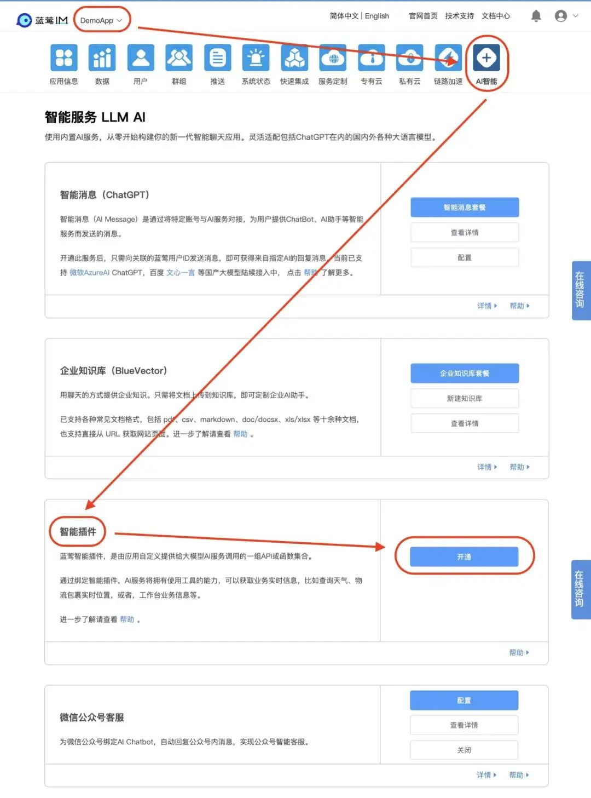
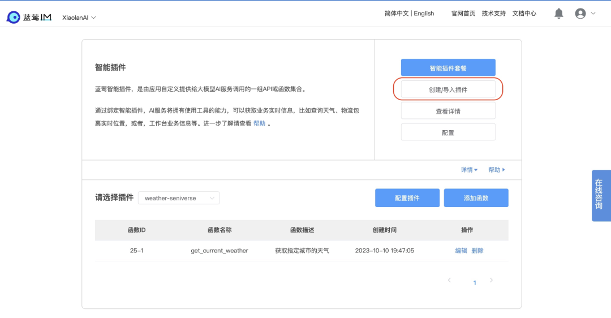
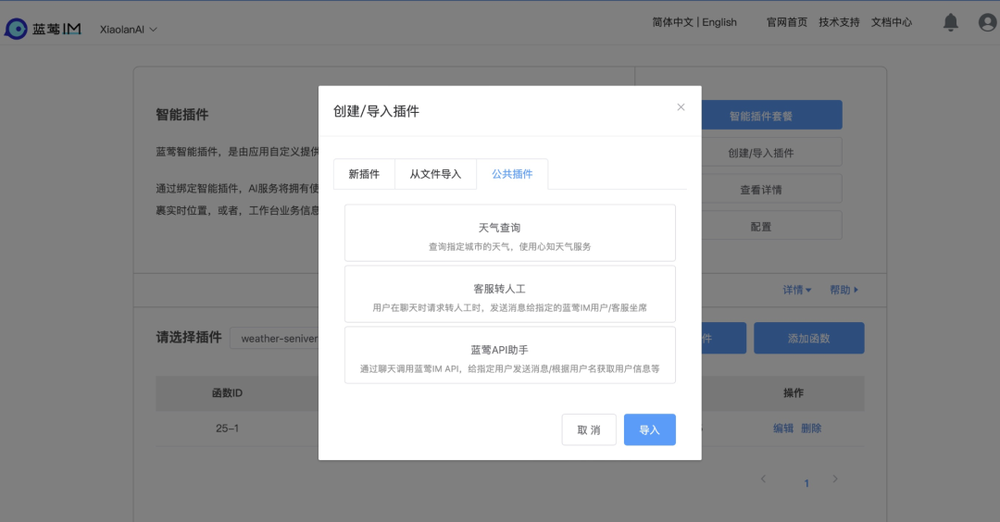
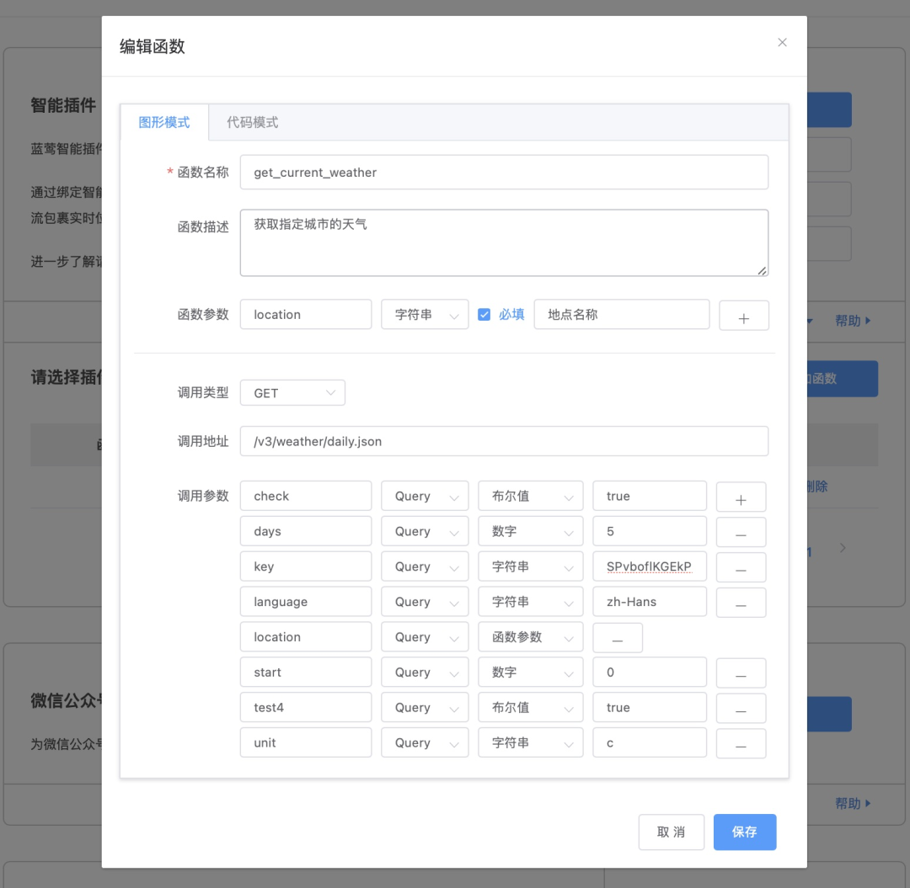
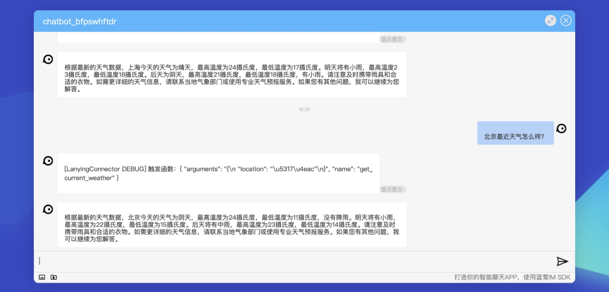
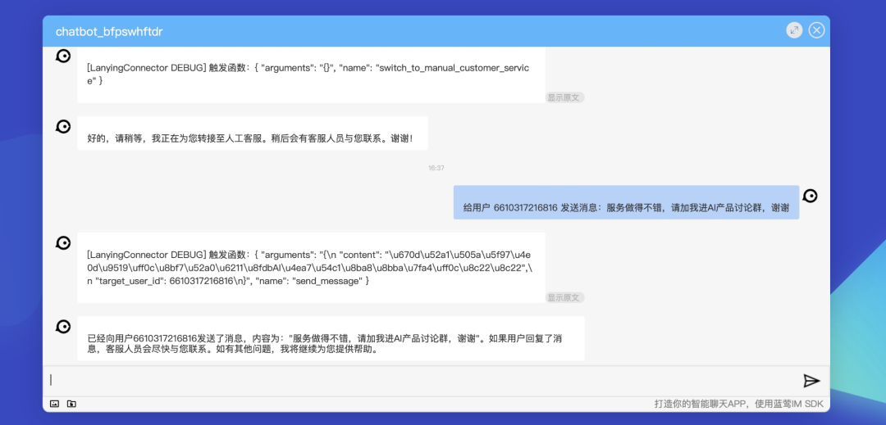
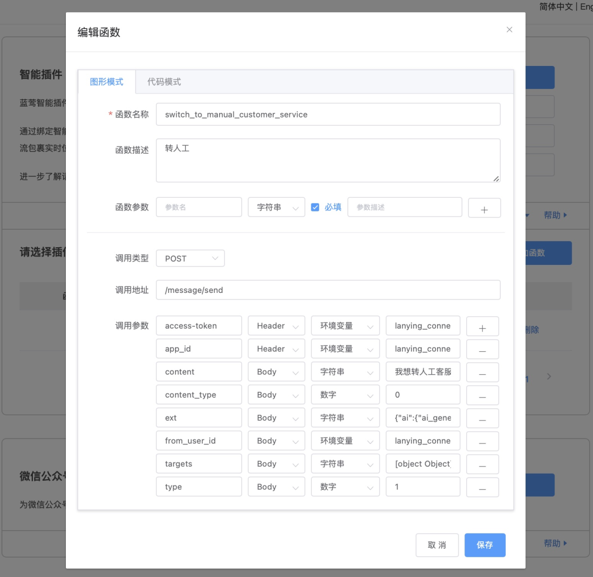

# AI驱动的应用：插件、应用市场和AI Agents

原创 一乐 蓝莺IM _2023-10-11 19:39_ _发表于北京_

> 蓝莺智能插件发布，让AI可以与应用系统进行交互。
>
> AI现在不仅可以有知识，也可以有实时信息，也可以驱动业务系统。
>
> 你可以通过对话直接进行API调用，实现查询天气、调用蓝莺API、客服转人工等功能，配置详情可直接跳到公共插件部分查看。
>
> 如果你想了解设计思路和高级用法，也可以直接跳到示例后面。
>
> 让你的AI开始干活吧！👏🏻

AI只是不断变强，我们对AI的理解却已完全不同。

ChatGPT横空出世时，我们都知道软件要变化，但不知道会变成什么样子。所以才发明了AI Native/AI First，来表达未来智能应用跟现在软件的不同。

等到ChatGPT发布插件，一众软件从懵懂中醒来，开始瑟瑟发抖，我们好像看到了AI吞噬软件世界的景象。

这个以史上最快速度达到一亿月活的APP，让我们有理由放开想象，充分思考它连接用户和其他应用的可能。

因为开发者们如果有现成的API可用，可以在几十分钟内按照OpenAI的标准实现自己的插件，去替代过去的软件。

这个替代并没有发生，我们现在也在开始冷静，[它们可能也并不会发生](https://mp.weixin.qq.com/s?__biz=Mzg5NTc0MjgwMw==\&mid=2247488730\&idx=1\&sn=8823d7086466a19de56be0117a4a630e\&scene=21#wechat_redirect)。

## **AI能做什么和我们需要它做什么，是两个问题。**

所有软件都是需求的沉淀，但根本的需求是不会变的，变的只是我们满足需求的方式。

ChatGPT并没有通过插件引爆应用市场，原因至少有二。

一方面，虽然有海量的用户，除了对话本身，他们的需求还是各异的，这就使得在具体某个需求上累积的用户并没有实际想象的多。另一方面，在具体需求满足上，AI跟应用还只是有限度的打通，并不能完全闭环，这大大限制了用户从旧应用体系脱离的意愿和速度。

为了解决这个闭环问题，关于自主智能体（AI Agents）的研究和讨论开始引起重视。在[国产大模型选型](https://docs.lanyingim.com/articles/product-and-technologies/how-to-choose-domestic-llm-services.html)的文章里我们提过OpenAI关于自主智能体的设计，也说明了函数调用的重要性。

AI Agents的两大基础，是知识和工具。通过扩充上下文、企业知识库、或者精调等方式可以满足AI对知识的获取，是武装AI的大脑。而工具则是给AI装上手和脚，让它可以与现实世界或者AI外的系统进行交互。

函数调用则是这个工具的基础。借助于此，企业可以通过插件机制与AI整合，加上自身对业务的理解，满足用户需求。

## **很多时候，能说一万句，不如完成一次用户的需求。**

所以我们相信，大模型AI并不会取代AI以外的软件，尤其是企业应用。

只要用户需求是分散的，智能应用的未来就还属于企业和开发者，**AI Native实际是AI Drive**。

这个驱动的来源，也是大模型AI服务通过函数调用开放出来的能力，今天我们也称其为智能插件（AI Plugin）。

是的，它并不是OpenAI的专属。

## 蓝莺智能插件

蓝莺智能插件（AI Plugin），是由应用自定义提供给大模型AI服务调用的一组API或函数集合。

通过绑定智能插件，AI服务将拥有使用工具的能力，可以获取业务实时信息，比如查询天气、物流包裹实时位置，或者，工作台业务信息等。

开通方法如下：

## 实现原理

智能插件的核心是定义函数调用，由AI对调用进行拼装驱动业务层获取最新信息，补充进最终回复里。基本步骤如下：

1. 用户提出问题，应用服务器将问题和相关函数调用的定义发给AI服务；
2. AI识别出缺失的业务信息，根据上下文信息拼装成函数调用返回给应用服务；
3. 应用服务收到拼装好的函数后，进行实际的API或函数调用，获得业务实时信息；
4. 应用服务器将上一步获得的业务信息发给AI服务；
5. AI服务根据业务信息和已有的知识进行推理，将最终回复返回给用户；

我们定义插件中的函数，就是通过定义，让大模型知道如何组装调用参数，同时定义最终调用的方法，比如使用GET或POST方法，比如增加鉴权Header等。

## 公共插件示例

后台开通蓝莺智能插件服务，就可以创建新插件：

或者导入已有的公共插件：

### 1. 天气查询

> 插件说明：查询指定城市的天气。

导入插件后即可使用，可以在编辑时查看此插件的配置：

可以看到此插件使用了心知天气的服务，接入点已经填写`https://api.seniverse.com/`。

函数配置如下：

注：因为是免费版本有调用限制，可以自行注册其服务升级版本，修改为自己的Key值即可。

效果如下：

### 2. 蓝莺API助手

> 插件说明：通过聊天调用蓝莺IM API，给指定用户发送消息/根据用户名获取用户信息等。

插件配置同上，只需要设置接入点：

函数配置，以发送消息为例：

需要注意的是：

1. 这个插件中用到了系统环境变量，也就是说可以通过此变量获取与AI聊天用户的信息以及所在应用的AppID等信息；
2. ext字段为消息自定义使用，这里设置了ai参数，是提醒AI不要对此消息再进行回复，防止出现AI对话循环。此设置可在任何消息中带入，以达到开关AI回复的目的。

效果如下：

### 3. 客服转人工

> 插件说明：用户在聊天时请求转人工时，发送消息给指定的蓝莺IM用户/客服坐席。

插件配置同上，也是使用了蓝莺API中的发型消息接口，不过除了设置接入点，还需要设置后面人工客服的用户ID：

函数设置如下：

比之前调用API多的一点，就是在默认文本内容`Body`中增加了`我想转人工客服`，这个内容根据需要调整即可。

效果如下：

## 设计思路

可以看到，插件设计很简单，就是做了两件事：

一是定义函数告诉AI在什么情况下需要调用函数，同时需要从聊天上下文中抽取参数，组装到`函数参数`中。

二是定义调用格式告诉插件引擎，在收到组装好的函数调用后，如何调用实际服务。在这个过程中，则会根据函数配置，将AI组装的函数参数用在调用的各个位置，比如`QueryString`、`Header`或者POST请求体`Body`中。

在函数设置之外，也有插件配置。主要目的为简化函数设置，这里设置的Header将会被所有函数共享，因此到了函数设置中就没有必要重复Header设置了。

另外，我们设计了`环境变量`，支持在插件配置中定义变量，这对增加鉴权/AdminToken一类的设置将会有用。也是一次鉴权设置所有API都起效。

## 高级用法

### 大型插件

前面讲到，插件是函数调用的集合，但在实际企业应用中，函数可能很多，并不适合在每次API调用中将全部可用函数传入。

因此我们对插件函数启用了企业知识库，也就是说，会通过对话的上下文先将相关函数进行过滤，选取最有可能用到的函数。

这样我们可以支持超过`1000`个函数以上的大型插件，这对企业应用来讲非常关键。

也因此这里会有AI引擎的选择和函数数量设置：

### 业务触发器

在最简单的使用场景下，我们是将插件/函数调用作为知识获取工具来用，但是实际上由于已经开始与业务系统交互，它也可以作为业务逻辑的触发器。

比如，你可以编写一个插件，获取最新产品报价，比如说蓝莺企业知识库。

当插件进行调用时，在被调用服务里触发人工提醒，发送提醒信息告诉销售人员，有用户正在了解企业知识库，你可以直接跟他聊天。

你也可以触发推送提醒，将官网或者营销信息进一步推送给咨询者。

定义这样的场景，你可以在`函数描述`里进行详细说明，提醒AI在用户聊到相关场景时触发调用。

如果你还有更好玩的想法，欢迎告诉我们，我们也会随时在产品群内分享😊

## 后记

如果有关于智能插件AI Plugin或者AI Agents的想法，或者希望第一时间试用智能聊天产品，欢迎添加「小蓝会聊天」微信进群讨论：

本文内容已进入小蓝文章知识库，可使用蓝莺 Link 提问：

[https://lanying.link/00h0vp](https://lanying.link/00h0vp)

## 关于蓝莺IM

**蓝莺IM是新一代智能聊天云服务。**

企业可以通过集成蓝莺IMSDK，同时拥有Chat和AI两大功能，当前AI引擎已支持ChatGPT（包括OpenAI和Microsoft Azure）、Minimax、百度文心一言、智谱AI，讯飞星火、阿里通义千问陆续接入中。

如果你希望在强AI时代打磨好自己的产品，欢迎继续关注蓝莺IM，我们会持续输出最新的经验与技术：

.jpeg>)
