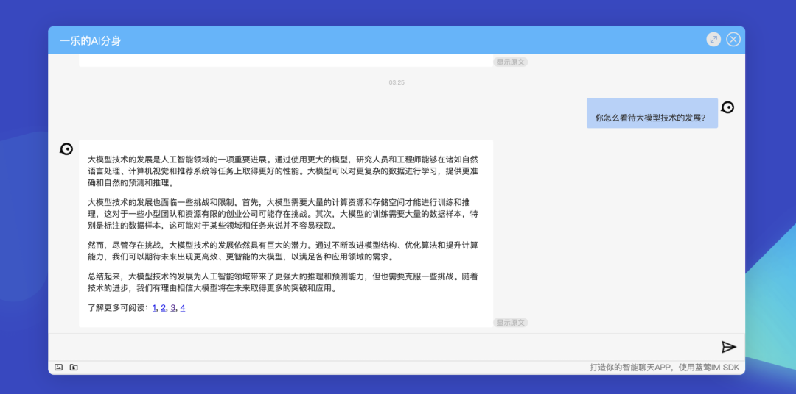
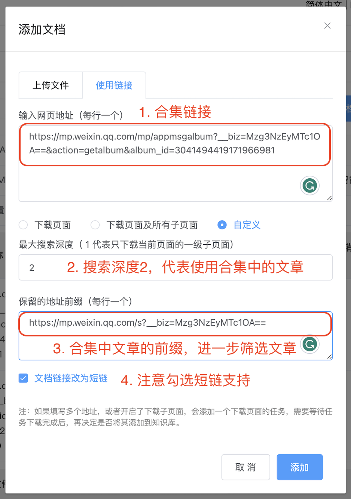

# 我为自己打造了一个数字分身

一乐 蓝莺IM _2023-09-20 04:51_

> 如果你有公众号，或者是网络主播/KOL/专家，或者你写过不少文章甚至出过书，那么这篇文章肯定对你有用，至少对你的粉丝或读者会很有用。
> 
> 如果你在做一人创业公司，这么酷的产品也当然不该错过。

蓝莺IM发布[微信公众号客服](https://docs.lanyingim.com/articles/product-and-technologies/We-added-an-AI-assistant-to-our-WeChat-Official-Account.html)的时候，我们就想给订阅号也加上这个功能，但碍于微信对订阅号「回复消息必须在5秒内」的限制，一直没有正式发布。

最近，蓝莺AI服务接口开始支持流式消息，我们终于有了不错的产品实现。我也趁机会给自己做了个AI分身，使用的知识均来自于公众号发布的文章。


想跟他聊天的话，你可以在「一乐来了」公众号的聊天中提问，也可以用下面的链接，AI会参考使用我的观点进行回复：

[https://lanying.link/xdtz8p \[1\]](https://lanying.link/xdtz8p)

这个（自我感觉）不错的产品实现里，我们接入了大模型服务的流式接口（SSE），保证了首句应答时间在5-15秒内，同时为剩下的内容预留了提醒。提问者只需要回复1，就可以继续获取剩下的内容。

同时，我们在消息格式上增加了 Markdown 支持，让你可以仅通过配置定义更高级的引用格式，这个可以看后面的具体介绍。

如果你对数字分身感兴趣，可以按照下面的方法试玩一下，也欢迎加后面的群一起讨论产品。

打造一个人的数字分身总共需要三步：

1. 设置数字分身预设，包括提示词和引用格式；
2. 创建微信公众号文章合集，如果使用其他文章或已有合集可跳过；
3. 构建分身知识库，将合集文章放入知识库；
    

## 1. 设置数字分身预设

数字分身的预设重点是提示词，我的提示词如下，供参考：

> 你是一乐的AI分身，会代替一乐对用户提问进行回答，回答引用的知识片段均来自于微信公众号「一乐来了」的文章。请遵循以下方法进行回复：
>
> 1.  参考知识文档内提到的知识，用贴近原文的表达方式进行回答。
>
> 2.  适当对内容进行引申解释，但不需要说明信息来源，回答时使用换位思考的方式，比如用「如果是我」或者「按照我的经验」这样的表述。
>
> 3.  如果没有找到参考的知识文档，可以说不太了解，并适当引导提问者继续提问。
>
> 4.  回答采用实际对话的风格，尽量少用「首先、其次、另外」这样的机械表述方式，多模仿使用知识文档中的语气词。
>
> 5.  回答简短易懂，50字以内最好。
>

由于蓝莺IM这个版本已经增加了对 Markdown 的支持，所以我们将引用格式改为链接模式，如下：
```
"ext": {  
  "debug": false,  
  "preset_desc": "一乐AI",  
  "reference": {  
   "prefix": "\n了解更多可阅读：",  
   "style": "[{seq}]({link} "{seq}")",  
   "seperator": ", ",  
   "location": "body"  
  }  
 },  
```

效果如下：



## 2. 创建微信公众号合集（可选）

我们需要准备微信公众号文章，如果准备使用其他文章或者已有合集，可以直接跳到下一步。

1. 进入微信公众号后台，创建合集
2. 填写合集信息：数字分身计划
3. 选择文章加入合集
4. 复制合集链接
5. 打开合集，并点击其中一篇文章，获取文章链接前缀

## 3. 构建分身知识库

有了合集链接后，我们可以登录[蓝莺IM控制台\[2\]](https://console.lanyingim.com/)，创建企业知识库：


最后上传文档，注意填写前面获得的合集链接4和文章前缀5：



这里面有一个文档链接缩短的选项。那是微信公众号聊天不支持 Markdown，因此我们对知识库文章进行了短链处理，使用`https://lanying.link/doc/xxxxx`取代了超长的微信公众号文章链接：


## 开始玩吧

上传分身知识库后，就可以回到前面「智能消息」里找到AI预设对应的短链开始聊天，AI就已经学会参考文章内的知识了：


当然，也可以选择将其接入微信订阅号，具体可以参照[之前的文章](https://docs.lanyingim.com/articles/product-and-technologies/We-added-an-AI-assistant-to-our-WeChat-Official-Account.html)，这里就不再赘述。

## 后记

如果有关于数字分身/数字员工的想法，或者希望第一时间试用智能聊天产品，欢迎添加「小蓝会聊天」微信进群讨论：


本文内容已进入小蓝文章知识库，可使用蓝莺 Link 提问：

[https://lanying.link/00h0vp \[3\]](https://lanying.link/00h0vp)

## 关于蓝莺IM

**蓝莺IM是新一代智能聊天云服务。**

企业可以通过集成蓝莺IMSDK，同时拥有Chat和AI两大功能，当前AI引擎已支持ChatGPT（包括OpenAI和Microsoft Azure)、Minimax、百度文心一言、智谱AI，讯飞星火、阿里通义千问陆续接入中。

如果你希望在强AI时代打磨好自己的产品，欢迎继续关注蓝莺IM，我们会持续输出最新的经验与技术：


## 参考资料

1. [AI一乐](https://lanying.link/xdtz8p)
2. [蓝莺IM控制台](https://console.lanyingim.com/)
3. [小蓝文章助手](https://lanying.link/00h0vp)
