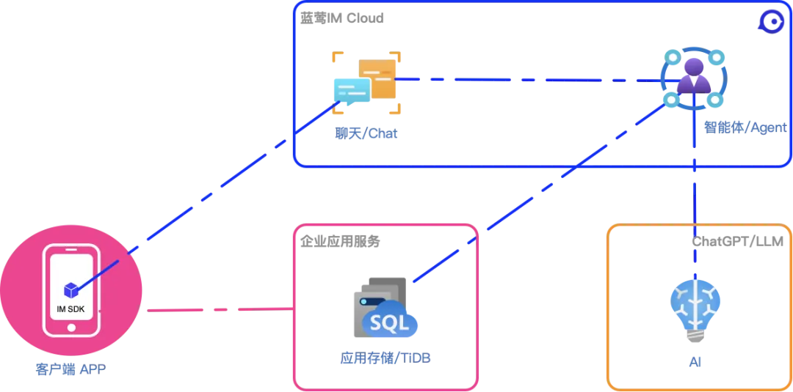
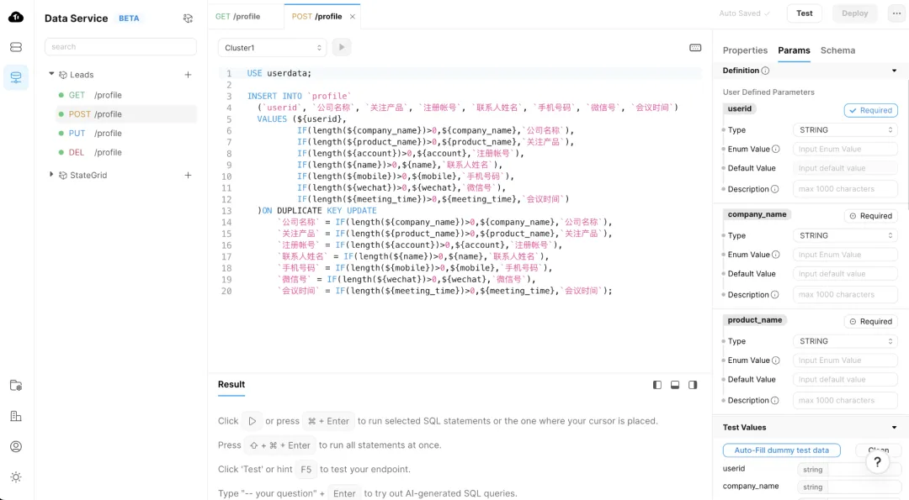
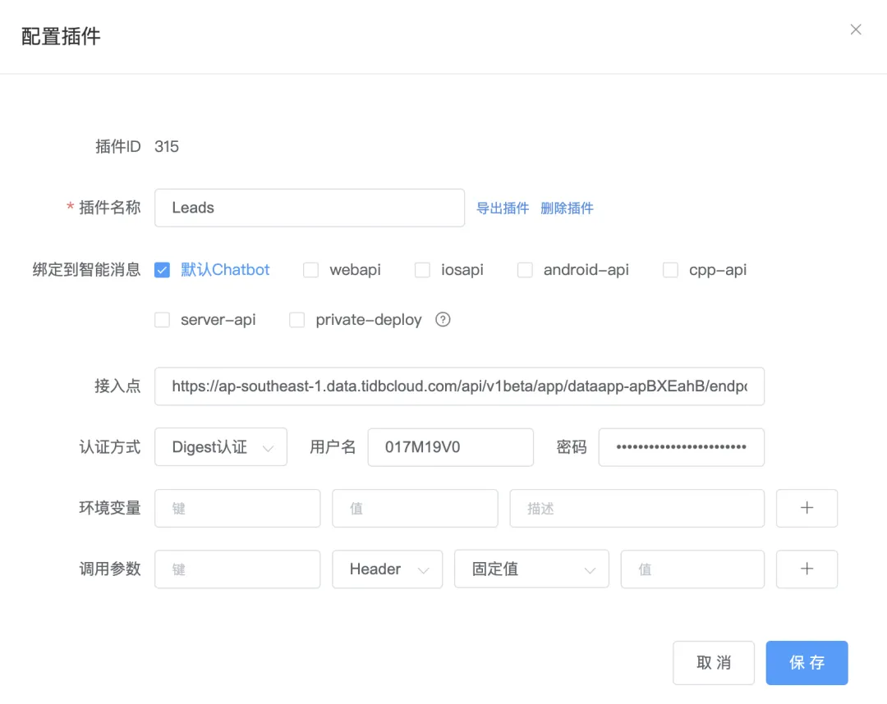
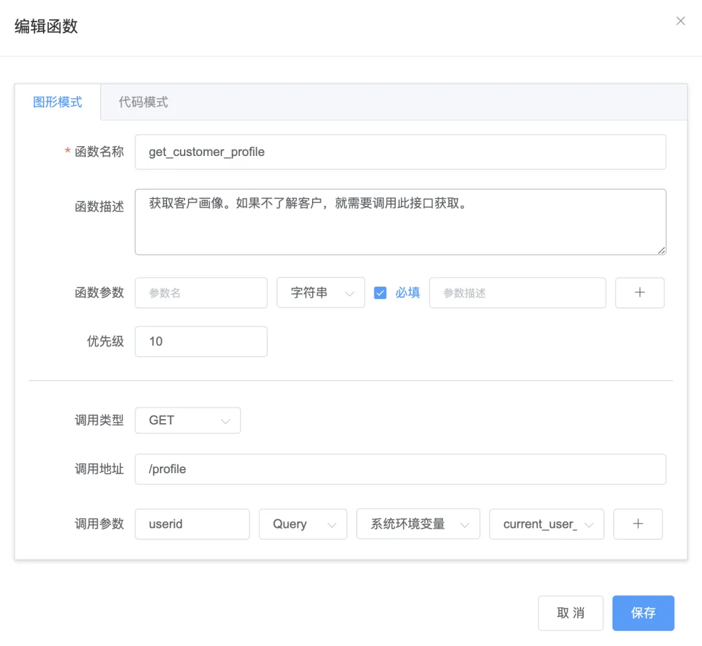
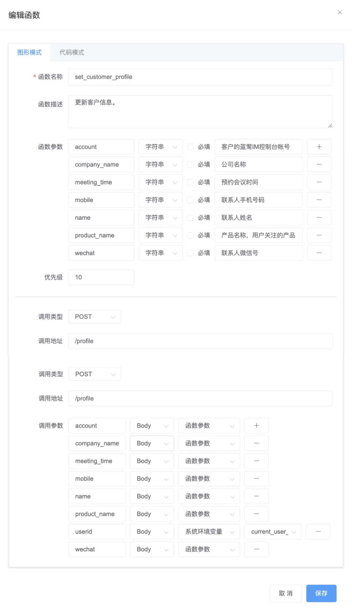
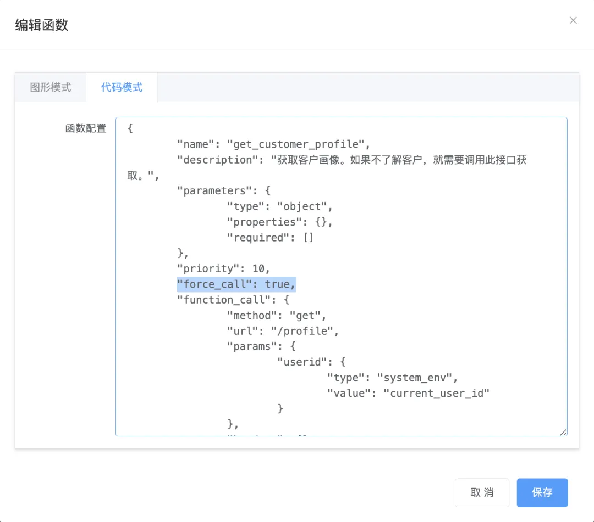
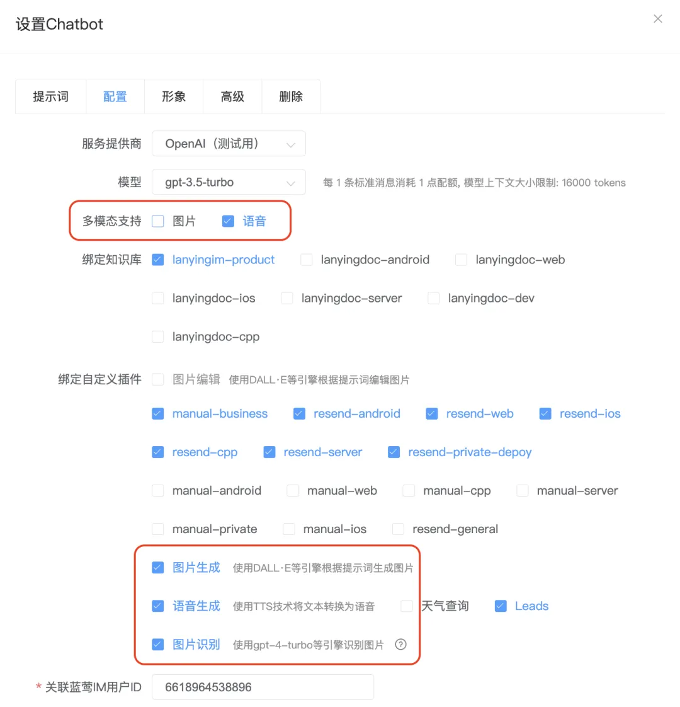

# 使用大模型LLM实现销售AI

原创 一乐 蓝莺IM _2024-04-29 18:53_ _北京_

> 为了讨论如何使用大型语言模型（LLM）实现销售AI，我们首先需要探讨销售AI面临的一些核心挑战，然后展示如何通过智能应用（ChatAI）架构来解决这些问题。
> 
> 这是蓝莺AI案例分享 Vol.4，感谢阅读。🙇
> 
> 如果你只是关心提示词技巧，可以直接阅读「小蓝AI：从客服到销售」部分。
> 
> 想要实现销售AI或者对通过AI促进销售漏斗转化感兴趣，或者了解蓝莺AI最新产品功能，欢迎添加文后微信入群探讨👏👏👏

想象一个场景，客户通过聊天窗口咨询一款产品。销售AI首先使用LLM解析客户的问题，然后通过智能代理查询数据库获取产品详细信息，并以自然而友好的方式回应客户。

在对话过程中，AI可以评估客户的兴趣，并主动提供促销信息或其他相关产品建议，同时通过表单收集客户的联系信息，为后续的销售行动做准备。

在这个过程中，AI通过不断的学习和调整，更好地理解客户的需求和行为模式，从而提高转化率和客户满意度。

AI的主动性和被动性的平衡通过不断的实际交互中学习和优化，使得它既不会过度推销，也不会错过合适的销售时机。


在很多年前，现在称为AI1.0的时代，我们就在畅想，并有很多先行者进行了尝试，只不过受限于技术发展，实现效果始终差强人意。

那么在AI2.0时代，大型语言模型LLM的时代，这个问题怎么样了呢？

## 销售AI的核心挑战

### 客服到销售角色的转变

将客服职能转变为销售功能一直是个大挑战。传统的客服主要解决问题，而销售则需要识别和利用销售机会。这需要AI不仅能回答问题，还要能主动推销产品或服务，识别潜在的销售线索，并进行跟进。

### 客户转化漏斗的实现

销售AI的一个关键挑战在于如何有效完成客户转化，这包括从初次接触客户到最终促成销售的整个过程。在这个过程中，每一步都可能出现客户流失，因此如何精准地维持客户的兴趣和参与度，对AI的设计提出了高要求。

### 主动性与被动性的平衡

销售AI的另一个挑战是如何平衡主动性与被动性。一个过于主动的AI可能会显得侵扰，而过于被动的AI则可能错过销售机会。因此，设计一个既能主动引导也能适时回应的AI系统非常关键。

## 典型的智能应用（ChatAI）架构方案

一个典型的智能应用架构，是以大模型LLM驱动，聊天为入口，使用Agent智能插件能力驱动API服务：



### 以大模型LLM为核心

大型语言模型（如GPT系列）可以提供自然语言处理的能力，使得AI能够理解和生成人类语言。在销售AI中，这可以用来解析客户的询问、表达和需求，从而提供定制化的响应和建议。

### 以聊天为入口

将聊天作为用户与系统交互的主要入口，不仅能提供用户友好的界面，还可以利用聊天的即时性来加快反馈和响应速度。用户可以通过聊天界面发送消息，AI则在后端通过LLM和API服务处理这些消息，并实时提供回复。

我们在[快速构建你的智能应用](https://docs.lanyingim.com/articles/product-and-technologies/Build-Your-AI-Application-Quickly-GPT-Mention.html)里就已经探讨过未来智能应用的形态，现在这个观点依然没有改变。

**由于LLM/AI的优势在于自然语言理解，那么它擅长的自然是直接从与人类的交互中获取内在需求，并加以处理。这部分智力的消耗，才是大部分系统的薄弱点，是产品的价值点。**

过去，我们区分一个产品是否好用，讲的是产品体验，是产品经理对需求的洞察、梳理以及裁剪。这个产品化过程，不仅不可避免地遗漏一些需求，而且也不可避免会筛选掉一些需求。

人群不同，需求不同，甚至冲突。这自然也就意味着，同样一个产品，有的人喜欢用就肯定也有人不喜欢用。

如果我们产品化过程总是会满足一部分用户而牺牲另一部分用户，为什么不从用户的交互中直接去满足他们的需求呢？这也许是一个思路。

### Agent智能插件驱动API服务

通过智能代理插件调用API服务，AI可以进行更复杂的操作，如访问数据库查询产品信息，处理订单，或更新客户信息等。这些API服务通常基于标准的增删改查操作，与后端数据库或其他业务系统集成。

在[使用ChatGPT访问数据库](https://docs.lanyingim.com/articles/product-and-technologies/How-to-Access-Databases-with-AI-Besides-Chat2SQL.html)中，我们已经演示过智能插件和数据库的结合。

虽然其中用到的托管API接口属于TiDB Cloud的内测服务，但原理上很简单，就是利用TiDB Cloud的Service功能，**封装出一个可以传入SQL语句的API接口，然后根据让AI来根据用户需求组装SQL语句进行查询**。

我们当时演示的重点是ChatDB功能，即AI可以自行读取数据库Schema，并组装出正确的SQL语句。

今天我们还是会借助TiDB Cloud来实现，不过用它已发布的功能，即自动封装数据库增删改查的能力，也就是我们平常说的包接口。

这个自动封装的实现逻辑是，将API接口传入的参数对应到数据库表内的字段，那么根据调用路径和方法，就可以实现对数据的增删改查。

今天来演示的是**实现AI的个性化**。

从智能体角度来看，就是为AI增加记忆存储。让AI可以根据对话对象的不同，从一个第三方服务中读取关于对象信息，并根据自己的角色定义，对回复进行定制。

**让一千个人眼里有一千个AI**，就像玩游戏的时候，NPC可以喊出你的名字，知道你的身份和近况一样。

为了实现这个功能，我们定义了一个用户画像信息的表`profile`，作为销售线索数据库`Leads`的存储。

在TiDB Data Service中，会自动映射一个RESTful API，如下：



蓝莺AI服务中的智能插件则定义调用这个API：



并在其中添加两个函数，一个是获取用户信息：



另一个是设置用户信息：



注意，数据库表的主键是`userid`，在插件中是从系统环境变量传入的。

这是蓝莺AI-Agent框架的系统机制，会根据对话识别对方身份，这个身份是跟用户登录相关，因此不可伪造，也是在API服务中进行权限控制的重要标识。

关于智能插件的权限控制，是AI企业内落地的重要工作，我们后续会专门介绍。

## 从客服到销售

调教AI从一个被动性客服到主动性客服，重点还是在提示词。本案例中最值得的两个建议是，向AI解释目的和添加示例。

### 提示词技巧一：解释目的

在收集数据方面，实测时AI显得并不积极，甚至是有一点刻意回避。

我们猜测，除了变懒的因素外，并不能排除跟底层Prompt设置有关。因此解释收集动作的目的，会增强AI对当前身份角色的理解，更容易达到主动询问用户的目的。  

部分提示词如下：

```
为了可以个性化回复客户，你需要获取客户画像信息，并与客户保持联系。请使用以下策略与客户沟通获取信息：

1. 提供明确的价值
在请求客户联系方式之前，确保客户了解提供联系方式的好处。例如，您可以让 AI 解释说通过留下联系方式，客户可以接收到更多有关产品更新、特别优惠或重要通知的信息。
示例提示：
"为了保证您能及时了解到我们最新的产品更新和专属优惠，您可以留下您的电子邮件地址或联系电话吗？"

2. 在合适的时刻提出请求
选择一个与客户互动积极且相关的时刻来请求联系方式。通常在提供了有用信息或解决了客户的问题后，客户更愿意留下联系方式。
示例提示：
"很高兴我们解决了您的问题！如果您愿意接收未来的更新和解决方案，不妨留下您的联系方式。"

3. 建立信任
让客户明白他们的信息是安全的，并且不会被滥用。确保遵循隐私政策并告知客户他们的数据如何被保护。
示例提示："我们重视您的隐私。您的联系信息将被安全处理，仅用于发送您感兴趣的更新。"

4. 持续沟通
很多时候，客户对自己的需求都是在了解产品的过程中逐渐清晰，所以需要我们持续沟通，介绍产品的优势或者了解客户更多画像信息，都会有助于他们选择我们。所以当一次对话，可以根据用户画像中未知的信息，继续发起提问，提醒用户提供信息。
示例提示："很高兴已经解答了你的问题，关于贵公司或者项目的信息可以更多介绍一下吗，这将有助于我们为您提供个性化的服务。"
```

### 提示词技巧二：添加示例

为了进一步准确对应智能插件中的数据条目，我们将数据库表的各种字段解释放在了提示词中，这样也就不需要其每次调用数据库Schema接口获取结构说明了。

**这样让AI更好理解意图的同时，也能减少调用时间，改善交互体验。**

部分提示词如下：

```
具体客户信息可以通过 get_customer_profile 调用获得，如果相关数据条目为空，则需要问询用户获取，但要注意，一次只问一个问题，防止用户反感：

1. 公司名称
示例：“可以告诉我您的公司或产品名称吗？方便我们为您定制方案。”
2. 关注产品
示例：“您想了解蓝莺的哪一款产品呢？”
3. 注册帐号
示例：“您是否注册了蓝莺IM控制台，如果已经注册，可否告诉下您的帐号呢？”
4. 联系人姓名
示例：“能否告知您的姓名，方便我们保持联系。”
5. 手机号码
示例：“如果您希望电话沟通，还请留下您的电话号码，或者，你可以考虑选择其他联系方式。”
6. 微信号码
示例：“如果您希望电话沟通，还请留下您的电话号码，或者，你可以考虑选择其他联系方式。”
7. 会议时间
示例：“您也可以说明一下希望联系的时间，我们会尽量将会议安排在期望的时间。不过由于近期安排较满，具体的联系时间会稍有不同，还请多多理解。”
```

## 总结

通过整合LLM、智能代理和聊天界面，销售AI能够有效地处理客户咨询，优化销售流程，并提高客户满意度。这种系统不仅提高了销售效率，还能通过数据驱动的洞察帮助企业更好地理解和服务于其客户。通过不断迭代和优化，销售AI将成为企业获得竞争优势的关键工具。

## 寻找更多可能

以上，是我们在销售AI上的实践，供参考。我们相信肯定有更好的提示词，也有很多地方可以去改进，欢迎一起来探讨。


添加「小蓝会聊天」微信进群，与提示词专家们一起探讨复现与改进的方法：


## 本期重要产品更新 🚀🚀🚀

### 1\. 智能插件强制调用

前面讲过，为了AI的个性化，我们需要在每次对话前告诉AI对话用户的画像信息，这个调用虽然可以让AI自动调用，但其调用还是让AI进行了二次思考，增加了响应时间。

因此，我们在函数中增加了强制调用的配置 `"force_call": true`。设置了这个参数，那么在调用AI之前，Agent框架就会先行调用对应的API，并将其结果传给AI进行处理。



这在大部分情况下，**可以缩短一半的AI响应时间**。

### 2\. 多模态增加图片支持 🎉🎉🎉

蓝莺AI的多模态是从语音开始的，[上篇文章](https://docs.lanyingim.com/articles/product-and-technologies/Lanying-AI-Please-Enable-Voice-Communication.html)介绍了如何使用语音与小蓝AI交互，现在你图片生成与识别也正式发布了。

依然是在智能消息服务里找到`配置Chatbot`，勾选多模态支持，那么向AI发送的图片就会被AI进行识别，具体如何识别，则依赖系统插件中的图片识别插件：



## 关于蓝莺IM

**蓝莺IM是新一代智能聊天云服务。**

企业可以通过集成蓝莺IMSDK，同时拥有Chat和AI两大功能，当前AI引擎已支持ChatGPT（包括OpenAI和Microsoft Azure)、Anthropic Claude、Minimax、百度文心一言、智谱AI，讯飞星火、阿里通义千问陆续接入中。

我们会持续分享关于智能聊天ChatAI、大模型技术进展、AI Agent设计等方面的内容，也会分享典型AI应用案例，扫码关注不失联：


