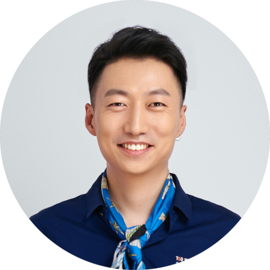

# 参加Agent黑客马拉松，手工定制GPT

TGO鲲鹏会 蓝莺IM _2023-11-10 20:15_ _发表于北京_

> 蓝莺IM全力支持此次活动，将向此次活动参加队伍开放所有AI服务。
>
> 建议持续关注TGO鲲鹏会公众号的AI分身，直接聊天就可以玩😁😁😁

在 TGO 鲲鹏会主办的 GTLC 大会·华中站中，我们特别呈现一场引领 AI 实战的重头戏——Agent Hackathon。

这不是一场简单的实践活动，它是一次深度的技术探讨和创新的集结。**本次活动为所有热爱 AI 的开发者，无论是梦想成为未来技术领袖的青年才俊，还是在企业中推动技术进步的开发者，以及追求个人技术卓越的独立创客，提供了一个展示才华和构想未来的舞台。**

我们旨在通过这场 Hackathon，在为开发者们提供一个技术交流平台的同时，通过激烈的创新与实践竞技，探索 AI 在未来社会中的广泛应用。参与者将在此发掘潜能、展现技术、并与同行建立联系，共同推动人工智能领域向前发展。

  

**↑↑↑**
**扫码报名** **Agent Hackathon** 
## 活动主题

Agent Hackthon 主题不限，例如一个开源库的文档查询和代码自动生成，极客时间上课程的问答助手，博弈论最新战况和足球队小饭桌活动查询，介绍你自己企业的宣传大使。当然如果能造福 TGO 鲲鹏会成员和广大技术人就最好不过， 因此我们先打造了个样例，也欢迎大家在此基础上迭代，一起共建。

### 参考案例一：TGO 鲲鹏会 AI

当前，TGO 鲲鹏会公众号后台客服已接入 # 蓝莺 IM 企业知识库，内容包含所有新会员报道文章。当前实现的功能有：

1. TGO 鲲鹏会介绍，可回答潜在学员关于如何加入的问题；
2. 学员和企业展示，可介绍学员履历、企业信息或产品；
3. 连接学员和企业，可推荐领域专家，增强会员间联系，快速了解特定行业领域学员；
4. 连接学员曾经工作企业，可通过领域获取企业信息，发掘潜在合作商机；

参加队伍可选择获得此 AI 提示词，使用相关企业知识库，或者创作新的更符合 Agent 风格的提示词，一起为 TGO 鲲鹏会学员服务。

### 参考案例二：极客时间课程助理 AI 分身

为极客时间专栏讲师编写基于课程内容的 AI 分身，回答课程问题，并能在合适的时机推荐讲师更多课程或书籍。

其他共建主题，稍后发布。

## 活动规则

1. 参加者需要先报名并组队，每支队伍 2-3 人，可提前组队也可在活动群内临时组队；
2. 参加者需要现场参与活动，包括 GTLC 华中站当天下午闭门会以及第二天研讨会；
3. 每支队伍会指派一名 Agent 顾问作为指导，在活动期间提供帮助和建议；
4. 在 Agent 研讨会对所有项目进行讨论和投票，最终列入精选创意项目进行宣传；
5. 活动以创意和体验为主，目标是让参加者都可以定制调校一个实用的 AI Agent；

## 主办方为参赛者提供的基础服务

1. 智能消息：可通过撰写提示词来定义 AI，可选择各种大模型比如 Minimax、百度文心一言、智谱 AI、微软 Azure ChatGPT 等；
2. 企业知识库：可通过上传文档或网站内容为 AI 提供领域知识，进一步定制行业或垂直领域 GPT；
3. AI 插件：可通过函数定义让 AI 调用或驱动已有 API，提供更丰富强大的 AI 分身；

以上服务均由蓝莺 IM 提供；需要特别说明的是，参赛者也可以使用其他大模型平台参与本次活动。

## Agent Hackathon 顾问团成员

梁宇鹏
Agent Hackathon 出品人
蓝莺 IM 创始人兼 CEO
TGO 鲲鹏会(北京)董事

艾芙（徐雁斐）
AI 应用咨询专家
南瓜博士公众号主笔
TGO 鲲鹏会(上海)学员

Agent Hackathon 是一场科技与智慧的盛宴，每一位参与者都将是这场科技革命的重要实践者。我们不仅寻找编程的高手，更期待那些敢于挑战现状，能够用代码描绘未来的梦想家积极参与。

现在，就是你展现才华、实现梦想的时刻。携手 Agent Hackathon，一起开启属于你的 AI 传奇，共创智能未来。报名入口现已开启，我们在 GTLC 华中站翘首以待，期待你的加入！

**↑↑↑**
**扫码报名** **Agent Hackathon**

GTLC 全球技术领导力大会，是由 TGO 鲲鹏会主办的顶级技术领导者大会，始于 2016 年，已经在北京、上海、深圳、杭州、南京、成都、硅谷、台北、新加坡等十余个 TGO 鲲鹏会学员城市举办。据不完全统计，超过半数的参会者为科技公司技术一号位。

2023 年 11 月 25 日，GTLC·华中站将聚焦于 AIGC 与数字化转型，分析 AI 与数字化转型的发展动态，助力科技领导者们把握行业趋势，提升创新能力，在 AIGC 与数字化浪潮中取得突破和成功。本次 GTLC·华中站举办地为湖北省武汉市洪山区中建科技产业园。欢迎具有技术背景的 CEO、CTO、技术 VP、架构师 等，以及在科技公司任职的 CMO、CPO、CIO 等高级管理者报名参会。

## ·END·

***GTLC 大会华中站扫码报名*** 
**↓↓↓**

## 关于 TGO 鲲鹏会

TGO 鲲鹏会是极客邦科技旗下科技领导者同侪学习平台，学员由具有技术背景的 CEO、CTO、技术 VP、架构师等组成，共计超 1800 位 ，在北京、上海、深圳、广州、杭州、成都、南京、厦门、武汉、苏州、台北、硅谷、新加坡等地区定期举办学习活动。

TGO 鲲鹏会采用了“学员共建”的组织形式，希望通过“共建、自治”的方式维护各城市的健康发展，为学员提供必要的服务，帮助学员个人更好地学习和成长，助力学员企业之间更好地合作与交流。加入 TGO 鲲鹏会，全方位提升自身价值，成为卓越科技领导者！

## 关于蓝莺IM

**蓝莺IM是新一代智能聊天云服务。**

企业可以通过集成蓝莺IMSDK，同时拥有Chat和AI两大功能，当前AI引擎已支持ChatGPT（包括OpenAI和Microsoft Azure)、Minimax、百度文心一言、智谱AI，讯飞星火、阿里通义千问陆续接入中。

如果你希望在强AI时代打磨好自己的产品，欢迎继续关注蓝莺IM，我们会持续输出最新的经验与技术：

