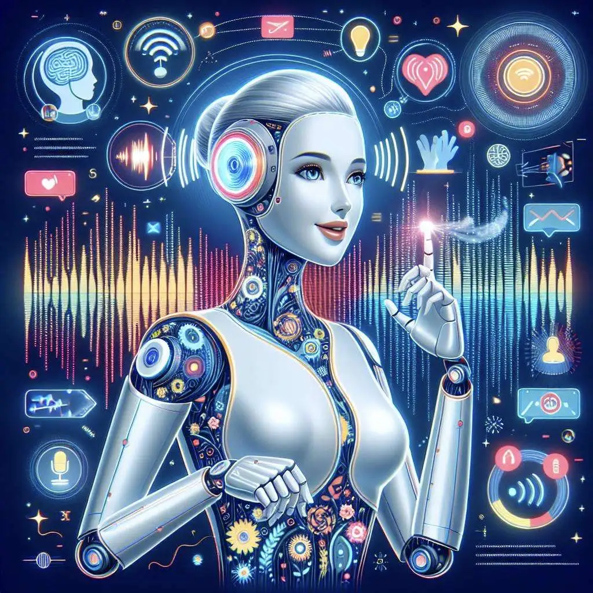
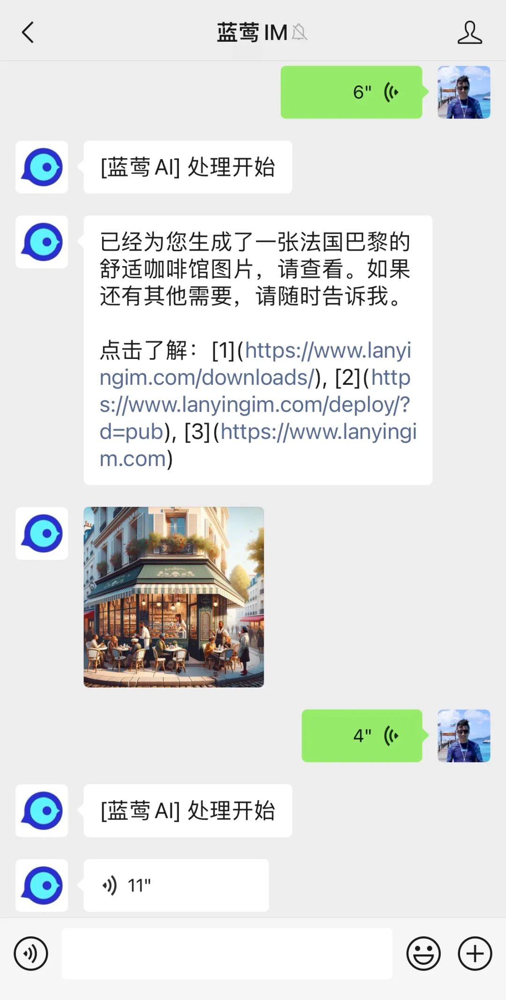

# 小蓝AI：请打开语音交流

原创 一乐 蓝莺IM _2024-04-16 21:16_ _北京_

> 小蓝AI会讲话了，来听听她的声音吧👩
>
> 构建智能应用，多模态是重要特性，阅读本文了解如何使用以及组装你自己的AI。
>
> 当然，画画的能力也一样。你也可以来试试DALL·E的超强绘图能力，也可以替换成你自己的画图服务。

在[上一篇文章](https://docs.lanyingim.com/articles/product-and-technologies/Build-Your-AI-Application-Quickly-GPT-Mention.html)里，我们谈到智能应用的一个重要特性是多模态，因为媒介的改变对通讯类APP的影响是巨大的，这一点，想一下语音对讲对微信的重要性就很容易理解。

过去一段时间里，语音文本转换技术一直是重投入的AI技术加上大量垂直场景的训练才行，这就为拥有该技术的公司建立了巨大的壁垒。然而现在已经是AGI的时代，跟所有其他AI技术一样，语音文本转换的技术也不可避免要被大模型取代。

今天我们介绍的，就是使用大模型AI服务的语音文本转换接口来构建智能应用。

也如前文所述，我们在实现某个功能的时候，除了功能本身外，还会考虑企业开发者实现的难度以及替换的灵活性，所以这次依然也做了几件事：

> 1. 对接大模型AI的语音文本转换接口ASR/TTS；
> 2. 将这个功能以插件形式实现，保证功能可以在任何组件内使用；
> 3. 全平台支持，将多模态支持扩展到微信公众号以及微信中；

下面我们分别介绍这些工作，同时为了参照理解，会附上相关服务的截图，感兴趣的同学可以在平台上直接试用。

## 1. 语音文本转换

语音文本转换其实包含了两个场景，一个是语音转文本，即语音识别（Automatic Speech Recognition，ASR），另一个是语音生成，即文本转语音（Text to Speech，TTS）。

在实际应用中，一个是处理用户输入，一个是输出给用户。所以，我们设计也将其分为了两部分，也就是你在**配置Chatbot**里可以看到的两部分，识别用户语音和生成AI语音：

## 2. 插件实现

前面的图也可以看到，我们将语音文本放在了插件里，你可以通过开通插件来启用功能。当然也不要怕，我们已经将其做成公共插件，可以在智能插件服务里随时导入并定制。

将语音生成做成插件后，你就可以通过**配置插件**里修改语音清晰度以及音色选择，这里还是以OpenAI为例：

因为是普通插件设计，也就意味着可以随时通过修改插件配置，直接替换使用其他的大模型AI服务，而不需要业务层任何改动。

## 3. 全平台支持（微信/公众号）

作为一个智能应用框架，还有一部分工作是方便应用落地，自然的也加入了对接系统的支持。也就是说，你在微信公众号中的AI客服，和使用AI支持的微信号，都可以默认启用者两个功能了。

## 后记

最近大模型热度稍有降低，企业内AI落地开始明显增多，制造业里很多企业也开始拥抱企业知识服务。

当然这里面有政策的引导，各地也不断有文件出台需要促进AI的应用，但本质上还依赖于企业的思考。

虽然AI在业务中如何开展尚需要一些实践探索或检验，但至少有两个问题是企业想清楚了的。一是未来的业务中肯定会使用人工智能技术提高效率，二是企业知识服务是最不可能出错的基础设施，它能够明确带来企业内效率的提升，也是其他AI服务的基础。

还是那句话，**现在，以及相当长时间的未来，最重要的是还是找到产品与AI的最佳结合方式。**

如果你希望与我们一起探索智能应用的无限可能，欢迎添加「小蓝会聊天」微信进群：

本文内容已进入小蓝文章知识库，可使用蓝莺 Link 提问：

[https://lanying.link/00h0vp](https://lanying.link/00h0vp)

## 关于蓝莺IM

**蓝莺IM是新一代智能聊天云服务。**

企业可以通过集成蓝莺IMSDK，同时拥有Chat和AI两大功能，当前AI引擎已支持ChatGPT（包括OpenAI和Microsoft Azure）、Anthropic Claude、Minimax、百度文心一言、智谱AI，讯飞星火、阿里通义千问陆续接入中。

我们会持续分享关于智能聊天ChatAI、大模型技术进展、AI Agent设计等方面的内容，也会分享典型AI应用案例，扫码关注不失联：

