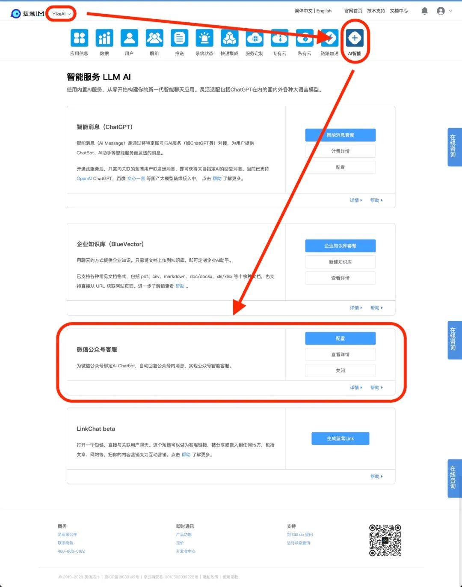

# 我们给微信公众号加上了AI助手

有AI的小蓝 蓝莺IM _2023-07-25 03:57_

> 这是蓝莺为大模型AI开发的第四个产品，如果你也想为自己的微信公众号添加一个AI客服，可以直接查看文后的服务开通方法。

前几天我们发布了[企业知识库](It-is-time-to-make-LLM-learn-enterprise-knowledge.md)，让AI可以学习文档里的知识。

刚做完，就有朋友来找过来问，说自己过去写了很多知识付费课程，要把文章放到知识库里做一个自己的AI助教，这样的提示词该怎么写？

我们忽然意识到，即使是科技行业的从业者，很多人对大模型的理解还很朦胧，并不清楚大模型的能力的能力，也自然用不好。

于是我们搞了一次提示词工作坊（Prompt Workshop），跟大家一起探讨提示词的写作。

是的，听别人说十遍，不如自己写一遍。

不过这也正常，因为大模型相关的产品和想法都仍处在相互催化的爆发阶段，已经到了让人眼花缭乱的地步。即使是每天都在打磨大产品的我们，也会经常发现新的好玩的想法。


这些想法有部分来自实现过程的思考，但有更多是来自朋友的启发、客户的需求，今天又是一个例子。

有个朋友问，如果我想把网站的的产品目录放在知识库里，然后通过微信公众号为客户服务，要怎么做？

简单，我们告诉他，[AI可以做智能客服](how-to-implement-an-intelligent-customer-service-by-chatgpt.md)，企业知识库可以储存产品网站，就剩下对接微信公众号了。

而任何的跟蓝莺服务对接的场景，都可以用蓝莺连接器（lanying-connector），对接第三方服务就行。

然后我们忽然意识到，他们并没有准备开发自己的APP，也没有相应的服务开发以及运维的能力，无代码的方式才是最适合他们的。

因此，我们将这个服务进行了封装，就是你现在看到的「微信公众号客服」功能，是可以在后台「AI服务」版块直接开通的：



开通后，就可以像下面这样，有一个在微信公众号里的大模型AI客服了：


你可以看到的文章引用，就是我们前面讲[企业知识库里的知识溯源\[1\]](https://docs.lanyingim.com/articles/product-and-technologies/It-is-time-to-make-LLM-learn-enterprise-knowledge.html)功能。

也因为这个无代码的目标，我们将其做成了配置里可以调整的方式，他们来自于新的配置 [reference\[2\]](https://github.com/maxim-top/lanying-connector/blob/0045afa255c181602bde4b538d55f919359d08f1/configs/openai-xiaolan-bluevector.json#L20)，你也可以参照在智能消息的AI预设中增加如下配置:

```
"ext": {
    "debug": false,
    "preset_desc": "小蓝AI",
    "reference": {
        "prefix": "\n详情可查看官网：\n",
        "style": "{seq}.{doc_id} {link}",
        "seperator": "\n",
        "location": "body"
    }
}
```

要不，你的微信公众号也来一个？

## 如何开通？

其实只需要三步：

1. 开通微信公众号**服务号**，在公众号后台「设置与开发」选项中获取基本配置，开发者ID(AppID)和开发者密码(AppSecret)；
2. 将上述信息填入本服务配置内，并关联蓝莺IM用户ID，此用户ID通常为「智能消息」内绑定的用户ID；
3. 获取本服务生成的服务器地址(URL)、令牌(Token)和IP白名单，将三者填回微信公众号后台服务器配置中，消息加密选择明文模式即可；

配置完毕就可以在公众号中测试AI服务的消息了。

不过需要注意的是，微信公众号服务设置生效会有延时，按照经验，建议等待5-10分钟后测试。

## 后记

对大模型AI未来有自己期待的功能，或者有想要的产品或功能，欢迎进群一起交流。


本文内容已进入小蓝文章知识库，可使用蓝莺 Link 提问：

[https://lanying.link/00h0vp \[3\]](https://lanying.link/00h0vp)

## 关于蓝莺IM

**蓝莺IM是新一代智能聊天云服务。**

企业可以通过集成蓝莺IMSDK，同时拥有Chat和AI两大功能，当前AI引擎已支持ChatGPT，百度文心一言、阿里通义千问等均在接入中。

如果你希望在强AI时代打磨好自己的产品，欢迎继续关注蓝莺IM，我们会持续输出最新的经验与技术：

.jpeg>)

## 参考资料

1. [企业知识库里的知识溯源](https://docs.lanyingim.com/articles/product-and-technologies/It-is-time-to-make-LLM-learn-enterprise-knowledge.html)
2. [在蓝莺智能消息的AI预设里设置reference](https://github.com/maxim-top/lanying-connector/blob/0045afa255c181602bde4b538d55f919359d08f1/configs/openai-xiaolan-bluevector.json#L20)
3. [小蓝文章助手](https://lanying.link/00h0vp)
