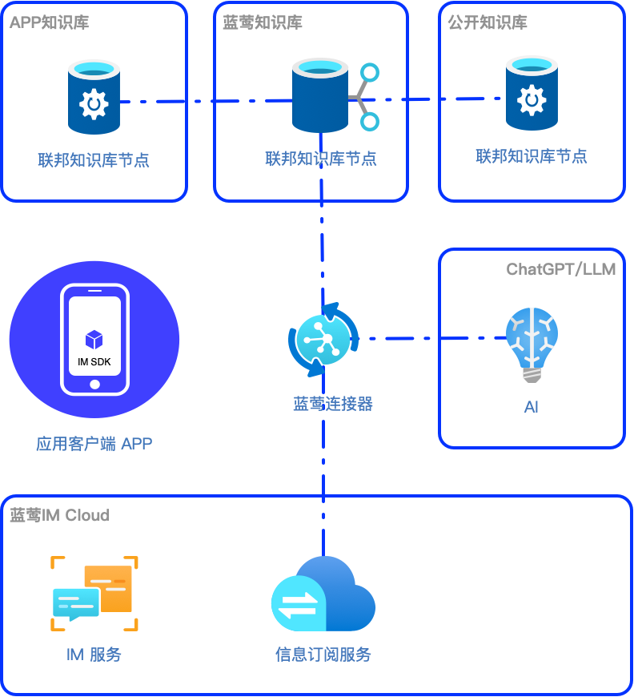

# 不要总想着自己训练大模型，你的业务可能并不需要

一乐 蓝莺IM _2023-07-01 19:13_

至少企业知识库是这样。

我要训练大模型，我要做私有部署，我要做模型 Fine-tune，我要搞垂类 GPT。最近真是听了好多这样的话，让我想起之前刷到的一个视频：

_我长大要开飞机，我想当宇航员，我要有所大大的房子，哈哈哈哈哈_

视频标题叫《还记得你儿时的梦想吗？》，在可爱快乐的小牛小羊之后，镜头换成了牛排烤串。

是的，我们都有过梦想，实现了的理想在过去叫梦想，但很多人的梦想其实只是美好的想象。

前两天，于游前几天发了[一篇文章](https://mp.weixin.qq.com/s?__biz=MzkwOTQ0Njg4OA==\&mid=2247484205\&idx=1\&sn=c939e7b9aa6963c9e3fa3fc5dd9c4d1f\&scene=21#wechat_redirect)，引用了清华东老师的分享：

_某些团队号称自己的模型规模在非常小的情况下，比如说 7B 就达到了 GPT3.5 的水平，从智谱的目前公布的情况，这个牛吹的真的是可以。_

一席话，引起了群里几位同学的共鸣，也道出了私有部署大模型在算力购买、模型部署后的另一门槛：预训练。

这篇文章不会讨论预训练，我将会回到业务本质，结合大模型当前的发展和企业知识库，说一说我们对当前技术和行业发展的一些看法。

简而言之，我们认为大模型跟任何其他技术一样，还是**要为业务服务，如无必要，勿搞模型**。

不管你是在犹豫要不要私有部署大模型，还是已经在玩，希望这篇文章能够对你有所启发。

如果你没有时间阅读全文，知道以下几点即可：

> 1. 大模型发展虽然出现变革但仍有挑战。模型小型化不断突破，但很小模型想达到 GPT-3.5 相当水平在短期内并不现实。同时，大模型的幻觉与智力涌现犹如一体两面，属于原理上难以解决的问题。
> 2. 优先选择嵌入 Embedding 方式才是企业使用大模型的正确姿势。在当前大模型快速发展的时期，最重要的是打磨自己的业务。只有在业务上可行，才有精调甚至私有部署大模型的必要。AI-Native 的智能应用尤其如此。
> 3. 大模型时代，企业知识服务出现新范式。知识提供从过去以网页浏览方式提供，转向以聊天 Chat 方式为人服务，以知识 API 方式为 AI 服务，并可能进一步发展为以联邦架构为基础的知识交换市场。这可能是未来智能化转型的重点。

## 1. 大模型能力现状与挑战

大模型带来的强 AI 风已经刮过[各种人类考试 \[1\]](https://openai.com/research/gpt-4)。

慢慢的，已经没人怀疑它是否能够通过图灵测试了。这也意味着，大模型 AI 通过 Chat 对话方式提供的服务，在很多场景下已经媲美甚至超越人类了。

但我们必须认识到的一点是，最新的这些能力很多还只存在于 ChatGPT，很多大模型 AI 的能力还仍然在发展阶段。

即使是发明了 Transformer 架构的 Google，Bard 的效果依然离 ChatGPT 有不少距离。

中文大模型方面，可以参照 SuperCLUE 发布的[评测基准 6 月榜单](https://mp.weixin.qq.com/s?__biz=MzA5NzAxNTA0MQ==\&mid=2247490190\&idx=1\&sn=e07a391920420ee9e0e93e3dd219a9b2\&scene=21#wechat_redirect)，模型差距可见一斑。

需要提醒的是，看起来在评测基准上差距只有几分，实际上可能是行与不行的区别。

### 大模型能力涌现需要大参数

关于[大模型能力涌现的研究\[2\]](https://arxiv.org/abs/2206.07682)，很早就提出，大模型的能力是在规模参数大到一定程度才会涌现。虽然机制尚不完全明确，但研究表明，像我们之前提到[智能客服\[3\]](https://docs.lanyingim.com/articles/product-and-technologies/chatgpt-intelligent-customer-service-ten-service-guidelines.html)使用的 Instruction Following 能力，在规模参数约为 68B（训练算力在 10^23 FLOPs 左右）才开始涌现。

如何训练大模型在更小规模上达到能力涌现，是当前研究的重点，我们虽然可以期待未来有新的突破，但这需要时间。

重要的是，私有部署一个可用大模型的成本之高昂，训练要求之高，并非一般企业所能承担。这也是最近开始有声音感慨[大模型应用落地难](https://mp.weixin.qq.com/s?__biz=MjM5ODIzNTc2MA==\&mid=2660982335\&idx=1\&sn=7247e586478d8dd2531c37533e2e2dbb\&scene=21#wechat_redirect)的原因之一。

**一个弱智的大模型是大模型还是弱智，这是一个问题。**

不过退一步讲，即使有这种能力，我们依然需要思考是否是最合适的方案。

按照我们朴素的观察，如果一件事情有更经济更低成本的解决方案，那这种方案更有可能在竞争中胜出，这跟企业愿意投入多少是无关的。

当前在大模型的应用中，使用 Embedding 嵌入+基座大模型的方式，比起私有部署大模型的方案，就是一个更低成本而且在很多情况下有更好性能的方案。

### 胡编乱造的大模型无法解释

大模型的问题当然远不止如此。

我们对大模型的机制了解越多，越发觉得大模型幻觉问题是一个在原理上解决不了的问题。而且渐渐的，我们甚至开始接受这种胡编乱造，因为人也会犯错，人也会撒谎不是。

**是啊，它不过犯了其他大模型都会犯的错而已。**

胡编乱造问题我们在[开始实现智能客服\[4\]](https://docs.lanyingim.com/articles/product-and-technologies/how-to-implement-an-intelligent-customer-service-by-chatgpt.html)的时候就已经发现，当时我们使用了专门的提示词指令对 ChatGPT 进行约束，可以在一定程度上解决这个问题，但这种解决方案对大模型在遵循指令的能力要求很高。

不过在实际应用中，我们可以通过产品设计来提高对幻觉的容忍度。一方面，我们会选择专业场景，即让 AI 做人类助理，为专业人员提供建议和支持，或者让专业人员做内容的验证器，在最后输出前把关。

在智能客服中使用人机协同模式是一个例子，让客服人员做 AI 的质检和补充。而在企业内实现 AI 助手则是另一个例子，因为企业员工有关于业务和产品的专业知识，他们自然会对 AI 生成的内容进行甄别。

这也引出了大模型的另一个问题，可解释性。

本来 AI 模型的可解释性就是一个难题，在大语言模型里则是难上加难。大模型可以给出问题答案、完形填空、提供决策，但对于回答的内容，却并不能说出为什么这么回答以及知识从何而来，这跟我们知道架构与算法，却没弄清能力为何涌现一样。

但如果需要对信息进行甄别，对于 AI 回答进行解释就变得有其必要。尤其是在企业知识库方面，我们更需要对知识进行溯源，以便了解更多或者执行更新。

要应对这些问题，靠大模型自身暂时无法解决，但一个整合大模型使用和知识跟踪的企业知识库方案就可以做到，我们下文详述。

综上，大模型技术本身在技术上有突破，但也存在不少挑战，意味着当前在使用大模型时，应该避开这些问题或者有针对性地解决，这也要求我们不要拘泥于大模型本身，灵活借助外部基础设施如向量数据库来完成整体方案。

## 2. 企业知识库管理的新范式

我们一直在说大模型，一直在说 GPT，但还有两件事情不可忽视。

一件是以 API 形式对外服务，这一点跟过去几年[云服务对行业的改变\[5\]](https://docs.lanyingim.com/articles/Industry-development/the-next-decade-of-cloud-services.html)是一致的，只不过这一回才轮到 AI 服务而已，我们[之前\[6\]](https://docs.lanyingim.com/articles/product-and-technologies/how-to-add-chatgpt-to-your-app.html)也提过。

另一件事则没有那么容易理解，那就是以聊天方式的服务交互。

**ChatGPT = Chat + GPT**

过去，人类与计算机的交互方式是专业编程人员学习计算机的语言与机器交互，现在，计算机学会了人类的语言，与机器的交互可以通过自然语言来进行。这必然引起应用形态的重构，智能客服是一个[例子](https://mp.weixin.qq.com/s?__biz=Mzg3NzEyMTc1OA==\&mid=2247484244\&idx=1\&sn=b41f74ecdf127e0f5253f4bb71b4faaa\&scene=21#wechat_redirect)，企业知识库也是。

说到交互的改变，可能有的人会想到微信这种语音交互对原来文本社交网络的影响，但这一次可能要远大与此，真正能与之相比的可能要算图形界面 GUI 对原来命令行 CLI 交互的改变，要说到 Windows 操作系统这种级别的产品变革。

用 Chat 提供服务的方式，也就是对话式用户界面 CUI，之前被说起来都是 Conversational UI，不过我是越来越觉得 ChatUI 更贴切。

这两件事，是我们做 Chat AI Cloud 的原因，也是企业知识库新范式的基础。下面我们就从模式、原理和产品三个方面详细说明。

### 使用大模型服务的三种模式

对大模型的使用从轻度到重度有三种模式：

1. **纯提示词模式（PromptOnly）**：直接使用提示词调用大模型 API，这是最容易上手的方式；
2. **嵌入向量模式（Embedding）**：将知识预处理存入向量数据库，在提问时通过相似度查询找到关联知识，然后跟问题一起加入提示词，再调用大模型 API；
3. **精调模型模式（Fine-tune）**：将知识通过 Fine-tune 训练存入大模型，然后使用时再进行 Prompt 调用；

在讨论这几种方案时，我们经常会听到两种错误观点：

> 错误观点一：现在虽然上下文有限制，但 Claude 已经放开到 100K，未来各大模型肯定都会放开，到时候所有内容直接加到提示词里调用就行。嵌入向量模式就是过渡方案。

这个观点有个最大的问题是忽略了成本。以扩展到 100K 上下文来算，如果模式一每次调用都将全部知识文本带上，同时模式二我们选择 4K 知识片段，那每次调用模式一都将是模式二调用成本的 25 倍。

这个问题在上下文越大时问题越严重，而且单次 API 调用越大，大模型处理响应越慢，迟早会到达用户无法忍受的延时。

这背后有一个算法上的原因，即 OpenAI 执行[Attention 的算法复杂度是 O (n^2)](https://mp.weixin.qq.com/s?__biz=MTMwNDMwODQ0MQ==\&mid=2652994889\&idx=1\&sn=257342371bc677cadce5d8a04752ee99\&scene=21#wechat_redirect) ，这意味着，随着序列长度的增加，执行 Attention 计算所需的计算资源呈指数增长。

也因此引发了第二个问题，即大模型支持的上下文在相当长时间内最大也只会到 MB 级别，而模式二支持的知识库大小则可轻松突破 GB 级别。

> 错误观点二：Embedding 模式没有思维链（Chain of Thought）能力，回答问题时将不能根据知识做完整推断。

我们在上一节讲过大模型的问题，模式三虽然有思维链，但却对大模型的所有问题毫无解决方法。而模式二则可轻松解决。

而且我们依然不能忽视成本问题，因为我们还有个朴素的观点认为，如果 AI 想要做到我们现在想象的，渗透到方方面面的应用中，那么它的成本就要足够低才行。而模式三的成本比起模式二，成本超出近两个数量级。

我们以 OpenAI 的调用价格来对比。

Embedding 模式，训练时调用 Adav2 模型，费用是`$0.0001 / 1K tokens`，使用时调用 ChatGPT 模型，费用是提问`$0.0015 / 1K tokens`，回答`$0.002 / 1K tokens`。

Fine-tune 模式，训练时调用 Davinci 模型，费用是`$0.0300 / 1K tokens`，使用时也是 Davinci 模型，费用是`$0.1200 / 1K tokens`。

也就是说，**后者训练成本是前者的 300 倍，使用成本是前者的接近 80 倍**。

这还是单次训练成本的比较。考虑到方案三数据无法撤回，任何更新都会触发模型重新训练。这部分隐含的时间成本和资源消耗都是巨大的。

那 Embedding 方案能达到多好的效果呢？这要从 Embedding 的原理来看。

### Embedding 嵌入原理

Embedding 方案的具体操作原理是其实分三步：

1\. 预处理

先将知识文档分片，然后将分片后的知识片段 Segment 通过调用大模型 API 获取其对应的向量，这个向量也就是我们所说的嵌入，即 Embedding。

随后将上述调用后得到的 Embedding-Segment 键值对存入向量数据库，即完成预处理。因此这个阶段也会产生大模型调用成本。

2\. 获取关联知识片段

在用户提问后，企业知识库需要先将用户提问通过调用大模型 API 获得对应的向量。然后通过此向量到向量数据库中通过相似度算法获得最相似的 TopK 知识片段。

3\. 组合提问

最终调用大模型时，服务将会组合三部分形成最终的提示词，即预设提示词、上一步获得的知识片段、用户提问。

是的，你没有看错，最终调用还是组合成了提示词。只不过这个提示词是动态的增加了通过向量相似度获得的相关知识。

如果你已经用过提示词，就应该了解提示词的巨大威力，现在看到的大多数 ChatGPT 应用，其实都是通过提示词来实现的。而我们耳熟能详的 ChatGPT 的[少样本 Few-shot 学习能力\[7\]](https://arxiv.org/abs/2005.14165)、[根据人类反馈的强化学习 RLHF\[8\]](https://arxiv.org/abs/2203.02155)也都在其中发挥作用。

**Embedding、嵌入、向量到底是什么？**

很多人在接触这个方案时，最难的就是这个术语怎么理解。简单来说，他们是一个东西，都是对于知识在大模型中的表达。

这个概念的解释最快速的来自[这里\[9\]](https://www.zhihu.com/question/38002635)：

> 深度学习领域的流形假设：自然的原始数据是低维的流形嵌入于(embedded in)数据所在的高维空间。

> 深度学习的任务就是把高维原始数据（图像，句子）映射到低维流形，使得高维的原始数据被映射到低维流形之后变得可分，而这个映射就叫嵌入（Embedding）。

> 后来，开始把低维流形的表征向量叫做 Embedding，其实是一种误用。

只不过用得多了，误用也变成了通用。现在看 OpenAI 的文档，Embedding 不是映射的动作，而是映射的结果：向量。

理解了这个映射的原理，你就可以想象，为什么嵌入从原理上其实是足够有效的。

所有的知识不管是预训练还是 Fine-tune，最终都会进入模型，分布在模型的空间中。当我们生成回复预测每一个单词时，对结果影响最大的自然也是离它最近的词。如果对于回复有影响的只是它附近的词，那我就可以只需要提问时带上跟它有关的语句就行了，因为其他的语句对结果影响不大。

而知识里面哪些语句属于问题附近的知识，则是通过语句的向量相似度来计算得到的。至于向量相似度为何能够反映语句的临近程度，这个有专门的论文研究，篇幅所限此处就不再展开。

### 先业务再精调，优先嵌入才是使用大模型的正确姿势

前面的分析，我们主要从应用角度来阐述和分析。其实在学术领域，这方面的研究早就开始。我们称为提示词模式的方案一，其实做的是 Prompt-tuning，这也是很多时候你会听到说用提示词也是一种精调，也并没有错。

Prompt-tuning 确实是随着 GPT 热起来之后才开始引起重视，因为比起 Fine-tuning，它的优势非常明显，由于工作重点是调整输入而非修改模型，因此计算成本低，需要的资源和训练时间也更少。

根据[Google 的研究\[10\]](https://arxiv.org/abs/2104.08691)，在参数规模达到十亿以上时，Prompt-tuning 的效果就可以与模型精调相比。也就是说，在较小规模上还有差距。

[清华和智源的研究\[11\]](https://arxiv.org/abs/2110.07602)往这个方向走了一步，他们引入了 Prefix-Tuning，就是在 Prompt 前面加了个前缀 Prefix，然后在模型中对这个 Prefix 进行特殊处理。最终在各个规模的小模型上取得了跟 Fine-tune 相当的性能。

也就是说，在公有云大模型上，方案 1 接近于方案 3，在私有部署大模型（默认较小规模），那么方案 1 略输于方案 3，但有 Prefix-Tuning 研究在，方案 2 作为加强版的方案 1，随着技术研究的发展，是有可能达到方案 3 水准的。

当然，方案 2 与方案 3 并非完全互斥，如果我们把知识分为行业公共知识和公司专有知识，行业公共知识通过 Fine-tune 进私有模型，而公司专有知识使用方案 2，则这样的方案效果应该是最好的，只不过复杂度上升，成本也是最高。

综上，我们认为，优先选择方案 2，通过 Embedding 方式使用公有大模型才是企业开展大模型的正确姿势。在当前大模型快速发展的时期，最重要的是打磨自己的业务。只有在在业务上可行，才有精调甚至私有部署大模型的必要。

### 为企业打造懂业务的 AI 老专家

在互联网黑话里，有一句广为流传，就是 GIFY，Google is your friend。提醒的是，有事先问谷歌，再问你的朋友和同事。

这个现象很典型。它意味着在工作和技能交流中，跟人类对话相比，任何文字和网站都显得生硬和低效，最适合新人的方式还是让他提问，在回答中消化。虽然这看起来是新人犯懒，但实际上是人之天性。

但对企业老人来讲，虽然他们有新人需要的经验和知识，却很少有足够的耐心来事无巨细地指导他人，重要的是他们还有自己的工作，而经验和知识的传承优先级并不高，多数时候甚至不是他们的工作内容。

他们是来工作的，不是来做客服的。

所以跟着黑话同时存在的，是**大多数企业中都有一个脾气不好的老专家**。企业需要他们也希望他们能够传承业务知识，但事与愿违，他们做不好。

现在情况有些不一样，因为我们有了大模型。一个有脑子能思考的 AI，加上企业知识库变得有知识，那耐心并细致地解答内部问题就是水到渠成的事了。

## 3. 以大模型为核心的企业知识服务

未来企业知识库会变是什么样子呢？

以大模型 AI 为中心来构建，并不只是能聊天那么简单。除此之外，还有很多需要做的事情，比如知识溯源和更新、多文档类型支持、权限管理、垂直领域定制、本地化部署等。

### 企业知识库要做什么？

**1. 知识溯源**

如前所述，大模型的幻觉以及回复内容的可解释性，使得知识溯源变得极其重要。尤其当专业人员作为大模型 AI 的验证者时，对 AI 的回复内容进行确认，是这个知识库服务首先需要做的。用一下必应这些搜索引擎，也会感受到他们在这方面的思考。

而企业知识库，本质上做的是企业知识管理与检索工作。

**2. 知识更新**

我们前面详细说明了 Embedding 方案比精调方案的优势，对知识的即时更新而不需要重新训练，算是成本和方法上的巨大超越。

**3. 多文档类型**

企业内知识其实是很分散的，它存在于各种文档、Wiki 或者内部网站中，因此企业知识库需要对知识来源做好足够的支持。我们当前已经支持的就有 Doc/Docx、PDF、Markdown、TXT、HTML、CSV、Xls/Xlsx，还可以通过 URL 自动拉取内容。

**4. 权限管理**

有知识就会有权限，不同级别可以阅读接触的知识是不同的，所以除了做一个企业内公开的服务助手，还必须增加权限管理，以适应企业对权限的管控。

**5. 本地化私有部署**

之前有一种声音讲的是，我要私有部署大模型，因为我的数据不能进大模型，进了它会学习然后泄露出去。

这个担忧不无道理，于是[OpenAI 在 2023 年 3 月 1 号修改了 API 数据使用策略\[12\]](https://openai.com/policies/api-data-usage-policies)，主要说了两点：

1）不用 API 传上来的数据训练模型，除非你明确要求这么做； 2）通过 API 传上来的数据在 30 天后删除，除非法律规定要求；

我相信 OpenAI 并不是因为善良做出了这个决定，而是如果不这么做，大模型的生态会受到致命的打击。就像提供云计算的公司，承诺不动在云主机上的数据一样。如果不这么做，很多客户是根本不会上云的。

我们认为，这也会成为大模型 AI 服务的基础行业规则，也因此按照数据法规要求，很多场景使用国产大模型公有云服务是没问题的。

而知识服务大模型之外的部分，聊天服务和知识库服务，借助于我们云原生的设计，也可以轻松部署，保证用户业务所有的数据可以得到有效管控。

这里需要提醒的是，这个知识库的私有部署与大模型的私有部署并不冲突，如果大模型建在本地，自然也是可以通的。只不过我们建议将这两件事分开来考虑，原因同之前说明。

**6. 垂直领域定制**

知识库用到的 Embedding 方案，原理很简单，也有很多人在尝试，但很多效果并不理想。根据我们的经验以及体验客户的实践中，我们发现关键还在于知识整合为提示词的过程如何优化，也因此从效果上看，**用一套参数适配所有知识是不可能做好的。**

所以我们对知识文档增加了文档专用提示词预设，用来指导 AI 如何学习知识。同时，我们在控制台增加了对文档切分尺寸、单词提问选取切片数量、以及切片重叠尺寸的配置。从效果上来看，提升还是非常明显的。

篇幅所限，这里只做简单介绍，如果大家感兴趣，我们在后面的文章可以展开聊聊。

### 行业知识库与联邦架构

虽然有了技术，但企业构建知识库中依然面临数据的挑战。就像大模型预训练需要数据一样，有些业务在知识库构建的过程中也需要行业知识，行业知识从哪里来？

虽然企业可以积累收集行业知识，但我们认为一个独立的行业知识库服务也是一件值得做的事。

提供行业知识也是下一代企业知识服务中一个新的品类。举例来讲，现在的知网提供论文查询服务，下一代的知网则可以提供论文知识库，提供知识查询供 AI 使用。

这样就用到了我们企业知识库的联邦架构：

原理如图所示，企业知识库在获得知识片段的时候，可以增加一个联邦查询请求，去其他知识库服务中获取知识，然后在合并起来提供给大模型服务。

而知识库方案，也就是前文所说的 Embedding 方案，是大多数企业可以负担得起的。

因此我们相信，在不远的将来，知识提供就可以从过去以网页浏览方式提供，转向以聊天 Chat 方式为人服务，以知识 API 方式为 AI 服务。而联邦架构，借助促进行业知识交互的方式，进一步促进一个知识交换市场的建立。

这也很大概率是未来企业智能化转型的方向。

### 大模型时代的基础设施：CVL

所以不要忽视向量数据库。

很多人了解向量数据库，是 3 月份[黄仁勋在 NVIDIA GTC2023\[13\]](https://www.woshipm.com/ai/5848163.html)提起年内即将发布自己的向量数据库 RAFT。

向量数据库和大模型的关系，类似于计算机系统里的 CPU 处理器和存储。大模型可以存储知识，但不能存储无限的知识，行业知识、领域知识、商业知识，需要在向量数据库里存储和管理。

当然对于应用来讲，我们认为未来使用大模型的基础设施还有一个是聊天服务。因为随着用户对聊天体验的要求越来越高和云服务的发展，[为产品增加 Chat 聊天功能也早就从自研转为集成 IMSDK 了\[14\]](https://docs.lanyingim.com/articles/Industry-development/how-we-build-an-instant-messging-system-in-the-past-fifteen-years.html)。

在大模型时代，企业构建自己的智能应用，将会组合使用 CVL 来完成，C 是 Chat 聊天服务，V 是 Vector 向量数据库，L 则是 LLM 大模型服务。

> 想象一下，现在使用的所有网站和 APP 都变成一个对话框会是什么样子？

## 蓝莺情报

蓝莺企业知识库（BlueVector）即将发布，已经进入邀请测试阶段。如果你对产品体验感兴趣，欢迎添加「小蓝会聊天」来报名体验。

如果你对企业知识库感兴趣，或者你觉得还有新的需求，也欢迎进群讨论。

本文内容已进入小蓝文章知识库，欢迎使用蓝莺 Link 提问：

[https://lanying.link/00h0vp \[15\]](https://lanying.link/00h0vp)

## 关于蓝莺IM

**蓝莺IM是新一代智能聊天云服务，Next-Gen Chat AI Cloud。**

企业可以通过集成蓝莺IMSDK，同时拥有Chat和AI两大功能，当前AI引擎已支持ChatGPT，百度文心一言、阿里通义千问等均在接入中。

如果你希望在强AI时代打磨好自己的产品，欢迎继续关注蓝莺IM，我们会持续输出最新的经验与技术：

.jpeg>)

## 参考资料

1. [GPT-4考试成绩](https://openai.com/research/gpt-4)
2. [大模型能力涌现的研究](https://arxiv.org/abs/2206.07682)
3. [ChatGPT做智能客服的十条准则](https://docs.lanyingim.com/articles/product-and-technologies/chatgpt-intelligent-customer-service-ten-service-guidelines.html)
4. [如何使用ChatGPT实现智能客服](https://docs.lanyingim.com/articles/product-and-technologies/how-to-implement-an-intelligent-customer-service-by-chatgpt.html)
5. [云服务对行业的改变](https://docs.lanyingim.com/articles/Industry-development/the-next-decade-of-cloud-services.html)
6. [如何在APP中添加ChatGPT](https://docs.lanyingim.com/articles/product-and-technologies/how-to-add-chatgpt-to-your-app.html)
7. [少样本Few-shot学习能力](https://arxiv.org/abs/2005.14165)
8. [根据人类反馈的强化学习RLHF](https://arxiv.org/abs/2203.02155)
9. [怎么形象理解embedding概念](https://www.zhihu.com/question/38002635)
10. [The Power of Scale for Parameter-Efficient Prompt Tuning](https://arxiv.org/abs/2104.08691)
11. [P-Tuning v2: Prompt Tuning Can Be Comparable to Fine-tuning Universally Across Scales and Tasks](https://arxiv.org/abs/2110.07602)
12. [OpenAI API Data Usage Policy](https://openai.com/policies/api-data-usage-policies)
13. [黄仁勋演讲@NVIDIA GTC2023](https://www.woshipm.com/ai/5848163.html)
14. [过去十五年，我们如何做IM](https://docs.lanyingim.com/articles/Industry-development/how-we-build-an-instant-messging-system-in-the-past-fifteen-years.html)
15. [小蓝AI文章阅读助手](https://lanying.link/00h0vp)
