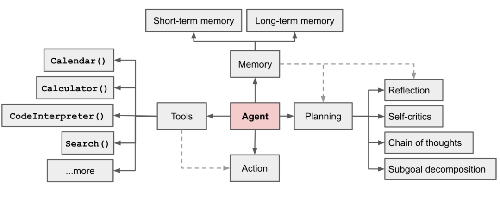

# 8.15来了，国产大模型该怎么选？

原创 适配多模型的小蓝 蓝莺IM _2023-08-09 10:01_ _发表于北京_

> 国产大模型到底该怎么选，你可以参考我们的经验，也可以在蓝莺IM控制台切换试用。
> 
> 如果你想知道选型的原因以及我们对未来的判断，可以继续阅读第二部分。
> 
> 最后是我们了解到的最新情况，希望对你当前业务选型有些帮助。

距离`8.15`还有一周，因为[《生成式人工智能管理办法》](https://mp.weixin.qq.com/s?__biz=MzAwMjU0MjIyNw==&mid=2651451323&idx=2&sn=0552bbe243af3d97c2bb79c571da52ec&scene=21#wechat_redirect)的规定，很多开发者都在加紧适配国产大模型服务。

蓝莺IM已经集成大部分公开API的国产大模型服务，现在开发者可以在智能消息服务中任意切换AI引擎，选择合适的模型试用。

## 如何选择国产大模型？

在适配集成过程中，我们重点关注大模型服务开放的三种能力：

1. 文本对话（Chat）
2. 嵌入接口（Embedding）
3. 函数调用（FunctionCall）

其中，文本问答接口是大模型API开放的第一个接口，预示着可以通过提示词与大模型进行交互；嵌入接口，意味着大模型开放了语言空间映射，我们可以在外部进行知识存储和检索；而函数调用则是未来驱动企业业务服务的重要措施。

汇总如下：

## 为什么嵌入接口和函数调用也很重要？

前段时间，OpenAI的Lilian Wen写了一篇[《大模型驱动的自治智能体》](https://mp.weixin.qq.com/s?__biz=MzAwMjU0MjIyNw==&mid=2651451323&idx=2&sn=0552bbe243af3d97c2bb79c571da52ec&scene=21#wechat_redirect)文章被广泛传播和讨论。其中将 Agent 定义为 LLM、记忆（Memory）、规划（Planning）以及工具（Tools）的集合（如下图），并对下一阶段AI的发展和研究进行了系统的梳理。

这篇文章非常值得阅读，中文版可见[这里](https://mp.weixin.qq.com/s?__biz=Mzg2OTY0MDk0NQ==&mid=2247502724&idx=1&sn=3d3eea620abbb46f09dc3b7440ac36be&scene=21#wechat_redirect)。

不过与Plugin机制一样，我们依然认为这个机会不会是OpenAI独占，而是大多数下一代的AI应用共享的。是的，他们也可以做到。

其中，记忆（Memory）就是为Agent提供业务和知识存储，也就是[企业知识库\[1\]](https://docs.lanyingim.com/articles/product-and-technologies/It-is-time-to-make-LLM-learn-enterprise-knowledge.html)在做的事情。虽然当前我们存储了文档，但实际上，还有更多可以内容可以放进来，包括用户实时的会话以及更多业务信息，这个我们后面展开讲。

在大模型外面构建知识记忆层，也即企业知识库的基础，就是嵌入接口。

而工具（Tools）则可以让Agent与外部服务交互，获取最新业务知识或者驱动外部服务。这个功能虽然可以通过提示词实现，比如约束返回数据结构在外层进行二次解析，但实际效果一直差强人意。

而函数调用接口则提供了一种更优雅而准确的实现，因此我们认为这是大模型能力开放的下一步。

也因为AI Agent的发展，我们认为对嵌入接口和函数调用接口的支持，是大模型选型的重要考虑因素。

## 国产大模型最新进展

我们计划会接入五家国产大模型，已经完成了三家接入。目前，智能服务可选AI引擎达到五家。

虽然各家进度不一，但好在有Minimax的快速开放，加上我们支持模型混合调用，因此在企业知识库以及后续工具调用的实现，都可以实现服务切换。

接入过程或多或少都遇到了一些问题，我们也分别与各家团队进行了沟通，以下是一些我们可以分享的信息：

### 1. [Minimax\[2\]](https://api.minimax.chat/)

> Minimax不仅是走得最快的大模型团队，也是最重视生态建设的团队，这非常值得称赞。
> 
> 而且对应用生态的重视不仅体现在于业务合作中，也体现在积极从实际应用的反馈中进行优化。
> 
> 另外提醒一下，本周内依然可以[在蓝莺IM服务里无限量使用Minimax\[3\]](https://docs.lanyingim.com/articles/product-and-technologies/Start-building-your-own-slash-AI-with-multiple-models-and-presets.html)，不要错过。

### 2. [百度文心一言\[4\]](https://yiyan.baidu.com)

> 百度虽然在倾集团之力投入研发，但毕竟团队庞大，加之产品需要与云平台整合，服务受到不少拖累。 遇到问题之后需要工单流转跨多个部门协作，对于一个新产品服务来讲，迭代速度确实比预想还要慢。
> 
> 大公司在这种情况下劣势与优势一样明显，BAT现在应该都面临同样的问题。不过AI的发展，同时对数字人等业务产生了极大的促进，百度在这方面的积累还是有不少优势。
> 
> 此外，嵌入接口费用比较高，定价达到OpenAI的三倍，这个问题无法忽视。

### 3. [智谱AI\[5\]](https://open.bigmodel.cn)

> 智谱的服务很令人期待，文本对话能力优秀，在我们的API调用AI助手的例子中与GPT3.5相当的水准。
> 
> 不过尚没有开放嵌入接口，最新消息是本周内会有好消息。

### 4. [讯飞星火\[6\]](https://xinghuo.xfyun.cn)

> 讯飞的API仍在测试阶段，也没有定价，据说正式发布要等8.15之后，因此我们暂时还没有上线。

### 5. [阿里通义千问\[7\]](https://tongyi.aliyun.com)

> 还没有开放的消息，原因同前述。

综上所述，在当前阶段如果选择纯粹国产方案，建议以Minimax为知识库底层，然后在其上进行选择文本对话引擎，比如智谱AI、百度文心一言或Minimax。

当然，微软Azure因为有全套OpenAI技术，也可以在后台测试时选用。

## 后记

进一步讨论国产大模型适配、能力对比以及各厂商最新进展，可添加「小蓝会聊天」微信进群讨论：

本文内容已进入小蓝文章知识库，可使用蓝莺 Link 提问：

[https://lanying.link/00h0vp \[8\]](https://lanying.link/00h0vp)

## 关于蓝莺IM

**蓝莺IM是新一代智能聊天云服务。**

企业可以通过集成蓝莺IMSDK，同时拥有Chat和AI两大功能，当前AI引擎已支持ChatGPT（包括OpenAI和Microsoft Azure)、Minimax、百度文心一言、智谱AI，讯飞星火、阿里通义千问陆续接入中。

如果你希望在强AI时代打磨好自己的产品，欢迎继续关注蓝莺IM，我们会持续输出最新的经验与技术：

### 参考资料

1. [是时候让大模型学习企业知识了](https://docs.lanyingim.com/articles/product-and-technologies/It-is-time-to-make-LLM-learn-enterprise-knowledge.html)
2. [Minimax](https://api.minimax.chat/)
3. [在蓝莺IM服务里无限量使用Minimax](https://docs.lanyingim.com/articles/product-and-technologies/Start-building-your-own-slash-AI-with-multiple-models-and-presets.html)
4. [百度文心一言](https://yiyan.baidu.com)
5. [智谱AI](https://open.bigmodel.cn)
6. [讯飞星火](https://xinghuo.xfyun.cn)
7. [阿里通义千问](https://tongyi.aliyun.com)
8. [小蓝文章AI助手](https://lanying.link/00h0vp)