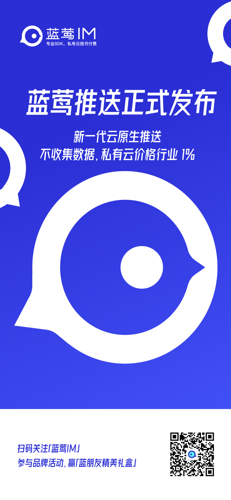

# 90%的私有软件项目没有推送提醒

会推送的 蓝莺IM _2022-09-23 20:21_

> 现在你有了新选择。
>
> 蓝莺推送正式发布，可私有部署的行业价格百分之一的云原生推送服务。
>
> 是时候提高 APP 的用户体验了，不要再因为没有推送提醒流失用户，不要再因为没有推送浪费用户的时间。
>
> 本文主要有以下几部分内容：
>
> 1.第三方推送服务的发展
>
> 2.云原生推送解决了什么问题
>
> 3.推送和即时通讯 IM 的关系
>
> 4.蓝莺推送统一SDK

> 无论你是想为APP添加推送通知，还是进行推送技术研究，这篇文章都值得阅读。

“你有一条新消息。”

如果你经常用微信聊天，这条在锁屏时点亮屏幕的通知肯定不陌生。是的，这就是推送服务做的事情，它为没有启动或在后台运行的 APP 提供了一个重新吸引用户注意力的机会，它也方便用户在使用订票、打车、外卖等 APP 的时候，不需要频繁刷新页面来查看服务状态，轻松处理任何其他事情。

当蓝莺推送发布的时候，我发现我不得不解释一下推送服务是什么，因为这个功能虽然如此常见，但却正因为过于常见而不被认为是一个独立的服务，更别提跟专业术语对应起来了。  

所以今天我们先介绍这传说中的第三方推送。  

## 第三方推送服务的发展

推送服务是随着移动互联网发展出现的，最早应该算苹果的 APNs（Apple Push Notification service），通过操作系统内置一个通道下发通知，取代了原来需要走运营商通道下发的短信。从开发者角度看，在提升用户体验的同时还节省了运营成本（短信费用），更重要的是，这极大提高了 APP 用户的活跃度和留存率。

安卓系统虽然号称与之抗衡，但在最开始的时候却没有统一的推送平台。后来有了 GCM，又遭遇谷歌退出中国，间接导致几大主流手机都无法使用其通道。在这样的背景下，第三方推送开始兴起，为安卓 APP 开发者提供统一的推送服务。

为了提高到达率，他们在实现功能后主要做了两件事，一是保活，即在主进程被杀死后，通过守护进程将自己拉起；二是相互唤醒，即只要有一个APP在运行，其可以通过进程消息将其他集成了同样 SDK 的 APP 也唤醒，以期提高通道链路的可用性。

但天下没有免费的午餐，这样的设计也带来一个极大的问题。随着 APP 数量的增多，一个安卓设备上会运行数十个推送服务，直接导致设备的耗电量急剧上升。

这极大影响了手机用户的体验，使得手机厂商纷纷建立了自己的推送通道，并同时限制第三方推送通道的运行。半推半就地，第三方推送服务也同时开始支持厂商推送的功能，自此，保活和互相拉活的技术也逐渐走进了历史。

到现在为止，各大主流手机厂商均已建立了自己的推送通道，这也意味着通过适配调用厂商通道，你已经可以为大多数用户发送推送提醒。而费力自建的长连接通道，只是补充服务了剩下的一小部分用户而已。

越来越重的研发投入，对于推送这样的非核心功能来讲，让很多开发者开始思考使用第三方服务。

除了那些十分重视数据安全的场景，他们是需要私有部署的项目。

除了那些执着追求保护用户隐私的应用，他们对使用第三方 SDK 非常审慎。

这便是云原生推送要解决的问题。  

## 云原生推送解决了什么问题  

**先说私有部署。**

在中国，除了自己做产品，大多数的软件项目都是以项目制私有部署的方式交付的，因为用户仍然有很多的理由不会上云。如果你留意云计算行业的报告，就会发现私有云和公有云仍然处在旗鼓相当的规模。

然而，当前行业里的第三方推送服务，基本都属于公有云架构，这也意味着其私有部署就是传统的软件实施项目，成本高昂周期漫长。

这样的交付模式下，一套推送系统的私有部署价格基本稳定在二三十万，这对于很多中小项目来讲是完全无法负担的。用户想保证数据完全将通讯限制在特定网络内，就只能舍弃推送，即使其可以提高用户体验。 

也因此，接近九成的私有软件项目不会选择保留推送功能，只是这不代表他们不想拥有推送。

云原生推送可以很好的满足这个需求。

多云架构设计使得其私有部署只需要十分钟安装。按照蓝莺云服务当前最低规格（百人）计算，费用约为 2000 元/年，是行业私有部署价格的百分之一。加上其支持订阅模式，可以按月付费，这可以进一步将企业月度现金流需求再降低一个数量级。

**再说隐私保护。**

在云服务刚刚兴起的阶段，用户付费意愿并不高。不过既然也是一帮搞互联网的，自然忘不了经典的「羊毛出在狗身上猪来买单」的商业模式。很多 SDK 也开始尝试通过广告营销的方式盈利。

他们为开发者提供免费 SDK 和服务，把从终端收集来的数据进行汇总整合进行用户画像，再结合广告营销系统来赚钱。这种模式在开始的阶段确实也走通了，也就是我们会看到的某些厂商会积极追求装机量，却并不在乎工具服务使用费用的原因。

只不过不断完善的法规政策已经有了清晰的方向，就是收集数据需要用户明确授权，这种商业模式也遇到了越来越多的挑战，因为用户授权意味着要穿透 APP 开发者才能进一步到达第三方服务提供者，这多少还是有点绕的。

就在上个月，[工信部又开始对重点类别的 APP 和 SDK 进行检测](https://news.cnr.cn/native/gd/20220826/t20220826_525987442.shtml)，整改侵害用户权益行为的 APP，问题列表中「违规收集个人数据」大量出现，说明了监管部门对用户隐私的重视，但也说明了个人数据收集的泛滥。 

虽然不是所有的云原生推送都能做到，但蓝莺推送不会收集终端隐私数据，不仅可以是商业模式上的设计，也可以从技术上得到验证。

商业模式上我们并不追求数据收集和数据变现，一心为用户提供工具技术并以此获得回报；技术上，云原生推送的公有云私有云使用同一架构和同样的API，因此可以通过私有部署版本来判断检验所有数据的流转，支持以技术手段验证隐私保护措施的执行。

说到这里，肯定有朋友已经注意到，云原生推送跟我们之前发布的云原生 IM 的设计是如此相似，他们的关系是什么呢？  

## 推送与即时通讯 IM 的关系  

推送和即时通讯两个服务最大的共同点莫过于是他们都是使用长链接技术与服务器进行消息的交换。但是系统设计不是一个库或组件，而是需要整体思考和权衡，其中很多决策都是根据业务进行的调整。

所以两者在设计上的区别还是非常明显： 

**1. 系统通知 vs 人与人沟通**

从功能上看，推送是后台服务对用户的一次通知，是单向的，而即时通讯是用户之间的沟通，是双向的。因此，后者要求有账号级别的的收件箱和发件箱，同一条消息在发送方和接收方的标识也会有不同；而前者消息发送方来源于其他系统，因此只需要有一个收件箱。

也因为内容的不同，推送通知的时效性要求比较高，过期通知是允许丢弃甚至会主动丢弃，因此只需要维护一个很小的快速存取服务，而且不需要维护历史记录。推送通知完的很短时间内，该通知的使命就完成了，不管成没成功。

即时通讯不同，多数情况下，人与人之间的交流是不能丢弃的，因此需要将消息进行持久化存储，并保证可靠性。更进一步，历史聊天记录也在很多情况下需要维护，已进行特定场景下的追溯、查阅。因此存储上，还会需要一个历史存储服务。

**2. 简单关系 vs 复杂关系**

推送服务里，账号都是独立的，彼此之间并没有联系。与之相反的是，在即时通讯里，用户之间是有关系的，一对一的关系从陌生人到好友到拉黑各有不同，一对多的关系则有群组、聊天室关系，也有衍生的管理员与成员关系。

这些要求，使得即时通讯服务需要有一个关系管理服务，并根据关系的情况控制消息的流转。

**3. 尽力投递  vs 可靠有序**

如前所述，系统通知和聊天消息的区别，使得即使是同样的下发，可靠性要求也不尽相同。不比推送服务对消息下发要求的尽力投递，即时通讯服务要求所有消息是可靠有序，既要不丢失又要按照发送的顺序让接收者看到，不然对方将会无法理解甚至完全收到相反的意思。

投递要求的提高，要求即时通讯从系统层面做更多的保证，尤其是协议设计，不仅要保证顺序投递，还要能识别乱序并在合适的时间发起修复。

只不过这所有区别，并不影响蓝莺推送的诞生。因为我们只需要即时通讯系统中的推送功能抽取出来对外服务即可。  

当然，除了抽取整理，除了云原生设计，这个新推送服务还有我们对极简设计的追求。

## 蓝莺推送统一SDK  

蓝莺推送延续了蓝莺IM的极简 API 设计思想和框架，将所有推送功能集中到了 PushService 类上，这样从代码架构上极大的方便开发者理解和使用。

统一SDK 的设计，使得开发者只需要一次集成，就可以同时拥有推送和IM两大服务，提高研发效率的同时，也会极大降低企业的 IT 支出。开发者可以根据需要，单独使用推送或即时通讯 IM，甚至可以在两者中随时切换。

由于默认即支持各主流厂商通道，为了进一步减低集成难度，蓝莺推送也内置了证书设置与更新机制。简单来说，就是开发者集成蓝莺推送之后，只需要在控制台设置好各厂商推送的证书，前端将厂商推送 SDK 打包，即可自动完成系统厂商的适配。[不再需要针对性调整各种推送令牌的申请和设置](https://docs.lanyingim.com/quick-start/push-dev-guide.html)。 

所以，是时候为你的APP添加推送提醒了把！！  

## **后记**

猜一猜，推送服务之后，下一个被云原生改造的服务是什么呢？我们评论里聊。  

## **引用**

1. [工信部通报47款侵害用户权益APP和SDK](https://news.cnr.cn/native/gd/20220826/t20220826_525987442.shtml)
2. [蓝莺推送开发指南（Push Development Guide）](https://docs.lanyingim.com/quick-start/push-dev-guide.html) 
3. [蓝莺IM：专业 SDK、私有云按月付费](https://www.lanyingim.com)

## **蓝朋友计划的最新情报**

我们正在以蓝莺IM开源项目为基础，打造一个专业的即时通讯技术社区，这便是我们的「蓝朋友计划」。此计划将会邀请社区技术专家一起，共同分享关于即时通讯（IM）技术相关内容，欢迎持续关注，也欢迎自荐或推荐。

