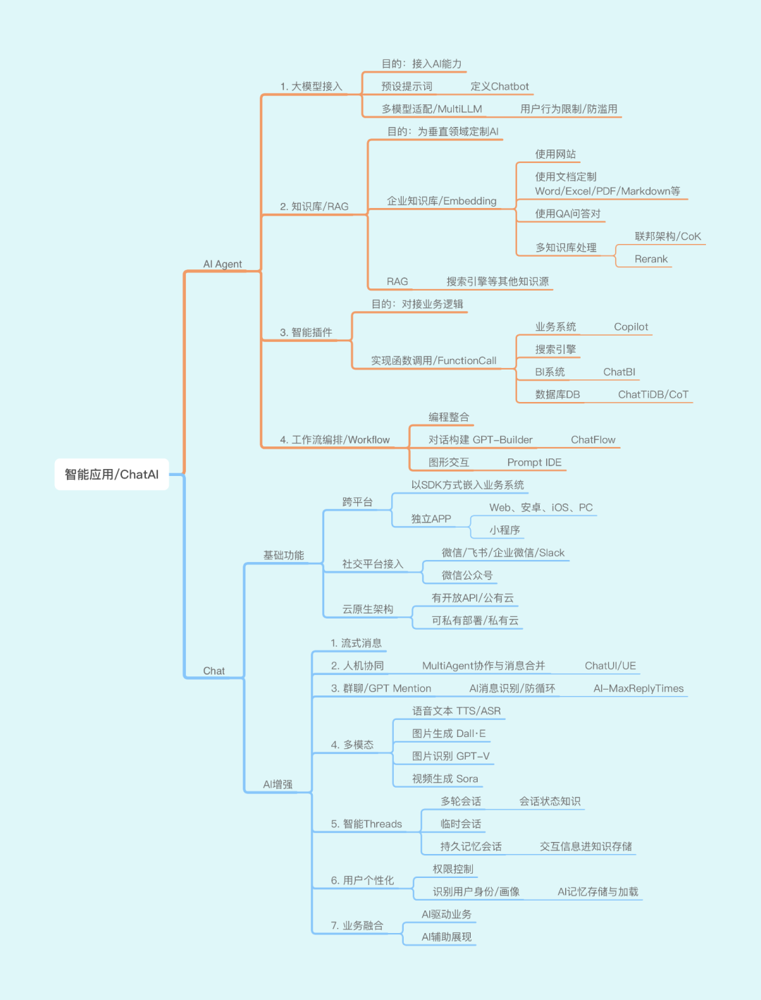
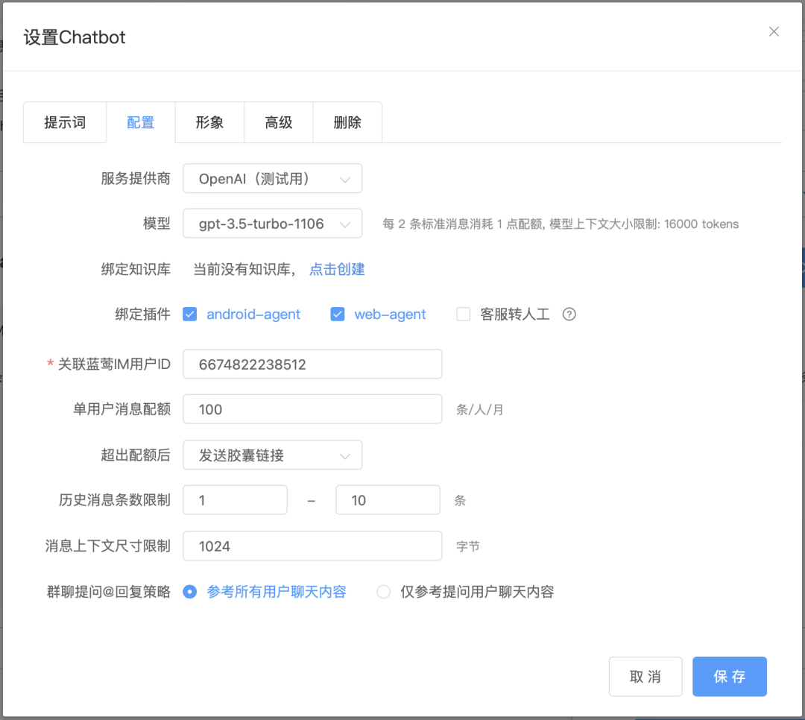

# 快速构建你的智能应用@GPT Mention

原创 一乐 蓝莺IM _2024-03-07 23:30_ _北京_

> ChatGPT在努力做成一个完整的ChatAPP，你却还只是在APP里增加AI吗？
> 
> 蓝莺IM里可以使用GPT Mention了，试着在群聊中加入AI，玩玩新的MultiAgent吧 🎉🎉🎉
> 
> 这是一篇给AI践行者阅读的文章，通过总结我们在ChatAI的探索，分享我们对于未来智能应用的看法，欢迎一起探讨，也希望为你构建智能应用提供一些启发。
> 
> 不管你是开发者还是产品人员，可通过本篇文章了解ChatAI的设计思路。  

做你会做的事，还是做应该做的事，这是一个选择。

当ChatGPT在努力做成一个ChatAPP，你却还只是在APP里增加AI吗？

当你做完AI的功能，才发现需要一个Chat功能，该如何做？

如果你在设计自己的产品，或者在为客户定制产品，那么这些问题是你需要思考的。

如果你还沉浸在Sora的震惊之中，不要忘了**今年以来，OpenAI还做了三件事：降价、自定义ChatGPT和GPT Mention**。

GPT Mention发布的时候，我在群里说我们的GPT Mention马上上线。有朋友感慨说你们动作真快。但说实话，不是动作快，是早就开始做了。

这不是炫耀，想一下我们如何在群里调戏AI就知道。对我们而言，只是在实现MultiAgent功能的时候，将其扩展到群聊场景而已。

当然，如果你比较熟悉Chat相关的功能，不是会使用聊天工具那种熟悉，而是知道如何开发实现每个功能的时候，这件事情会更容易理解。

**从ChatGPT将AI以聊天的方式展现在世人面前开始，所有过去人与人交流的方式，都会在与AI的交互中用到**。

这也意味着，下一代智能应用APP里对AI的使用，会出现在Chat的各种场景里。这是产品设计者必须考虑的，也是开发者需要提前准备的。

今年企业对待AI的态度有一个明显的变化。很多企业已经从思考应该做什么样的AI应用，改为试着用AI做一些事情，看看会为业务带来什么样的变化。

**对啊，试一试，比空想要更有价值。**

**但试一试，不意味着把所有都做一遍。**

在移动互联网成熟的现在，不自己研发IM聊天功能，而是集成一个SDK已经成为一种普遍共识。

但这种共识也并不是忽然产生的，而是在无数应用开发的实践，在无数产品创新的路上形成的。因为比起自研打造每一个功能，找到业务场景与用户的适配才重要。

就像建造高楼不需要自己烧砖头一样，专业的事情适合交给专业的人去做。有些事情虽然看起来毫不费力，实际上却需要十分的努力。

我们并没有期望能够立即达成这样的共识，不过还是可以分享我们将蓝莺IM改造成ChatAI APP所做的事情，也是我们认为每一个智能应用会需要做的事。

## 下一代的智能应用

下一代智能会是什么样，如何构建这样的新型应用，每一个面向未来的团队都在思考。

过去一年，AI在产品中的存在，比较共识的方式是Agent，我们也逐渐完成了以[大模型接入/多模型适配](https://docs.lanyingim.com/articles/product-and-technologies/how-to-choose-domestic-llm-services.html)、[企业知识库BlueVector](https://docs.lanyingim.com/articles/product-and-technologies/It-is-time-to-make-LLM-learn-enterprise-knowledge.html)、[智能插件/函数调用](https://docs.lanyingim.com/articles/product-and-technologies/AI-Powered-Applications-Plugins-App-Store-and-AI-Agents.html)三个核心产品为主的Agent平台。

但看起来好像也不过是**一个平平常常的Agent平台**，尤其是我们每一次也会分享产品的设计思路，似乎实现起来也并不难。

所以有的客户也会很坦率地问，用你们的框架跟我自己接入API有什么区别，如果是我只用到知识库或者向量库的话？

这个问题有一个简单的答案，也是在客户被证明过的。

那就是，如果你想以AI助手的方式来提供服务，那么你的AI也会需要嵌入到其他系统里，而这样的SDK我们早就准备好了。你不会再想着去做一个这样的聊天SDK的。

准确地说，你不仅需要一个可以嵌入的聊天SDK，**更需要一个智能时代的聊天SDK**。因为为了将AI Agent功能使用起来，在Chatbot/Agent的外表下，我们还做了更多：

如图所示，如果把内容全部展开，这篇文章会变得很长。因此这里只是概要说明，其他的作为系列文章，随着产品发布继续与各位探讨。

### Chat 基础功能

> * 跨平台
>   * 以SDK方式嵌入业务系统
>   * 独立APP：Web、安卓、iOS、PC、小程序
> * 社交平台接入
>   * 微信/飞书/企业微信/Slack
>   * 微信公众号
> * 云原生架构
>   * 有开放API/公有云
>   * 可私有部署/私有云
>     

作为企业级Chat SDK，以及基于其创建的Chatbot，最终都要在企业的产品或系统中发挥作用，大多数情况，这需要以SDK的方式嵌入业务系统。

如果企业的产品涉及多个平台，安卓、iOS、网页、小程序等，这个**SDK需要同时满足这些平台适配，并保持一致的用户体验**。

考虑到企业对数据安全的关切，不管是Agent还是聊天服务，一个企业级平台还需要**可以私有部署**，以方便客户企业对数据自主权的控制。

同时，由于社交平台的强大和封闭性，企业也将不得不将业务入口向社交平台扩展，这在当前Chatbot兴起的趋势下变得愈加重要。聊天服务能够**与社群打通，进入微信、企微、飞书等通道，全方位服务客户**，也变得重要起来。

以上都是基础的聊天服务所需功能，真正针对AI需要做的还有很多。

## Chat AI增强

> 1. 流式消息
> 2. 人机协同
>   * MultiAgent协作与消息合并  
>   * ChatUI/UE
> 3. 群聊/GPT Mention
>   * AI消息识别/防循环
> 4. 多模态
>   * 语音文本 TTS/ASR
>   * 图片生成 Dall·E
>   * 图片识别 GPT-V
>   * 视频生成 Sora
> 5. 智能Threads
>   * 多轮会话 - 会话状态知识
>   * 临时会话
>   * 持久记忆会话 - 交互信息进知识存储
> 6. 用户个性化
>   * 权限控制
>   * 识别用户身份/画像 - AI记忆存储与加载
> 7. 业务融合
>   * AI驱动业务
>   * AI辅助展现

## GPT Mention，群聊里的AI

理论上，将AI变为Chatbot之后放到群聊里，再配合聊天中的Mention消息，即可实现GPT Mention。但还有一件事情必须解决，那就是AI循环回复。

因为AI Chatbot一般被设定为对问话进行回复，因此一旦两个AI开始了对话，几乎可以确定的是，它们将进入无限会话，一直聊到永远。

AutoGPT就最早遇到了这个，因此它们对AI之间问答进行了最大次数限制，增加了`AI-MaxReplyTimes`，限制它是个固定值，你将会很快可以在控制台自定义调整它。

但这个设置起效的前提是，接收消息的AI Chatbot必须能够判断消息是否来自AI，也必须能够判断收到的是一个新问题，还是另一个AI发来的回复。

以此推导，如果MaxReplyTimes超过2，还必须能够判断消息是否是AI对自己的回复的回复。

因此，我们增加了**猜测AI消息标识**，来识别一条消息是否由AI生成。

本来是否是AI消息，只需要在消息的扩展字段中增加一个标识即可，这也是我们在开放API中增加的参数，发送消息时通过设置扩展字段`role:"AI"`来告诉平台，这是一条AI消息。

但是由于增加了社交平台接入，这些平台或者是通过RPA方式接入或者是因为太大以至于不会进行这样的更新，这个参数并不会被设置。这叫要求我们必须找到机制来**推测某条消息是否为AI发送**。

有了这个设置，就可以放心增加GPT Mention了，将多个AI放到一个群里协作，设计新的MultiAgent了。

进一步，我们**增加了新设置来调整群聊中AI对上下文的选取**。

**一个是参考所有用户聊天内容**。也就是说，AI在回复内容时将会知道之前群内其他人在这个期间讲的话，也就可以仅通过@提醒即可让其参与群内话题讨论。

**另一个是仅参考提问用户聊天内容**。这种情况下，AI在回复内容时讲只会参考当前用户的话，这样也可以仅通过@提醒来让AI回复，但保持在发送者消息限定的范围内。

## 再说大模型适配

在发布智能服务的时候，我们讲如果你需要接入不同的大模型，那么可以直接基于我们的服务构建产品，就完全不需要担心大模型接口变化，专注自己的业务即可。

这句话咋听起来并没有节省很多工程量，因为如果不实际尝试，很多人不会了解当前各家大模型之间除了明显的能力差距外，接口设计也是参差不齐。

这里又有一个新例子。

当我们要在将GPT Mention的能力扩展到其他大模型时，智谱GLM的接口里就没有user\_id，也就意味着大模型并无法从多角色对话消息中为每个角色构建单独的上下文。

当然，这并不是说智谱AI的能力不行，相反，它的推理能力是国内大模型中绝对是一流的。只不过在工程层面，特别是开放平台建设方面，还没有追赶到这一步而已。

只不过**作为应用开发者，等待或者时刻准备去做这样的适配，都有些让人焦虑**。

而用一个Agent平台的AI Framework，屏蔽大模型之间的工程区别，在需要时无缝切换也许是更明智的选择。

## 未完待续

篇幅关系，多模态、智能Threads、用户个性化、业务融合，我们后面的文章再一一展开。

**但与AI结合，就是为产品增加一个聊天窗口吗？**

这个问题看似平常，但其实只是一个关键问题的变种，那就是在智能时代，一个产品要具体变成什么样子。

我们将会在蓝莺AI案例分享系列里展开讨论，聊聊**如何为工作台添加一个AI助手**。相信一定会对你的产品思考有一些新的启发。

## 后记

试一试是有成本的，在这个AI开始吞噬软件的时代，进行快速低成本的尝试找到未来的业务，也许才是明智的选择。

**现在，以及相当长时间的未来，最重要的是还是找到产品与AI的最佳结合方式。**

用好一个框架，做好自己的业务，祝一切顺利！

## 继续关注我们

欢迎添加「小蓝会聊天」微信进群，一起探索智能时代的新应用：

本文内容已进入小蓝文章知识库，可使用蓝莺 Link 提问：

[https://lanying.link/00h0vp](https://lanying.link/00h0vp)

## 关于蓝莺IM

**蓝莺IM是新一代智能聊天云服务。**

企业可以通过集成蓝莺IMSDK，同时拥有Chat和AI两大功能，当前AI引擎已支持ChatGPT（包括OpenAI和Microsoft Azure)、Anthropic Claude、Minimax、百度文心一言、智谱AI，讯飞星火、阿里通义千问陆续接入中。

我们会持续分享关于智能聊天ChatAI、大模型技术进展、AI Agent设计等方面的内容，也会分享典型AI应用案例，扫码关注不失联：

