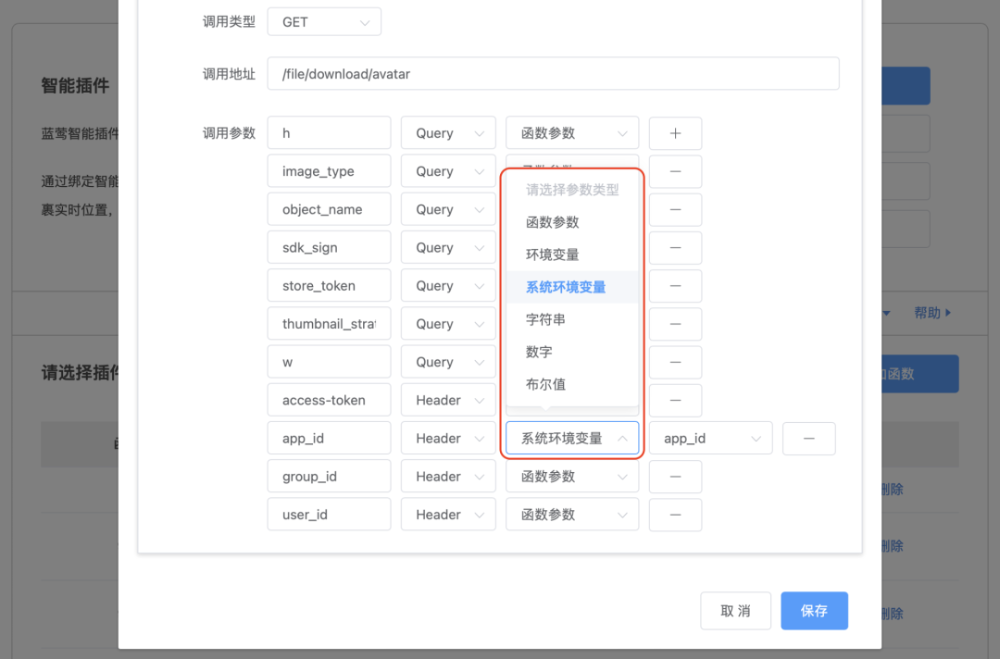

# 让有API的业务用上AI

原创 一乐 蓝莺IM _2023-11-12 17:06_ _发表于北京_

> GPT商店是ChatGPT生态的一大进步，只不过离企业应用仍有一段距离。
> 
> 每一个有API的服务都可以改造成AI插件。
> 
> 蓝莺AI插件已支持Swagger导入，企业级AI插件可以一键搞定了🎉。

[OpenAI DevDay](https://mp.weixin.qq.com/s?__biz=MzIzNjc1NzUzMw==&mid=2247702711&idx=1&sn=d447731f23e485aaab5e18988d7807a2&scene=21#wechat_redirect)结束，有人惊喜AI进入了新时代，也有人因此伤感，说OpenAI一顿操作，创业项目打了水漂。小道消息说，YC2023年的投资项目团灭，因为他们大多数解决的问题都被OpenAI覆盖。

我们倒是没那么悲观，因为Stateful这样的特性很早之前就已预料到，在前几天的[第九届全球软件大会:生成式AI应用开发峰会\[1\]](https://www.bagevent.com/event/8237772)也公开分享过。

这一回，OpenAI在用行动给出几个问题的答案：

1. 商业上，要面向开发者/2D，做GPT定制和用来分享分发的GPT商店；
2. 工程应用方面，要Stateful，用AssistantAPI解决更复杂的现实场景问题；
3. Agent怎么做，用自然语言定制业务逻辑；

而我们没有那么悲观的原因，在于他们或者跟预判一致，或者跟我们一直思考的方向一致，但当前的解决方案还并不够完整。

比如用自然语言定制业务逻辑的GPTBuilder，简化的是制作指令的过程。但在企业级应用里，难点其实不在于交互而是定义和固化。

企业级应用的业务复杂性，意味着仅靠自然语言描述清楚并不是容易的事，之前我们已知有ChatFlow这样的方案，限制也在于此。也因此，差不多同一时间，xAI出了一个[Prompt IDE\[2\]](https://x.ai/prompt-ide/)，这是他们对于这个问题的不同解法。

只不过，我们还是要赞一下GPT商店。通过把定制的GPTs直接通过链接分享出来，打通了GPT开发者（比起提示词工程师，我认为这个更为贴切）和使用者的联系。

这确是当前阶段最需要的，因为在过去的几个月里，AI的研发和落地一直处在冰火两重天的状态。

火的是GPT开发者在做很多好玩的工具，AI Agent热度不减，冰的是在业务实践中的迟缓。毕竟AI如何驱动当前业务，甚至让业务赚到新的一桶金，都不是容易思考的事。

由于一直在接触各种项目，我们也早就开始设计类似的GPT商店，目标也在打通GPT开发和使用的壁垒，让GPT开发者赚到钱。

只不过，蓝莺IM的GPT商店是企业级的。

除了可以分享提示词，同时也可以关联[企业知识库](https://docs.lanyingim.com/articles/product-and-technologies/It-is-time-to-make-LLM-learn-enterprise-knowledge.html)、[AI插件](https://docs.lanyingim.com/articles/product-and-technologies/AI-Powered-Applications-Plugins-App-Store-and-AI-Agents.html)。

更重要的是，我们会将这个能力扩展到[每一个国产大模型](https://docs.lanyingim.com/articles/product-and-technologies/how-to-choose-domestic-llm-services.html)，这也是一个跨LLM的GPT商店。

## AI插件升级：支持Swagger导入

很多人并不重视函数调用，忘记了这是OpenAI第一次生态失落后反思的产品。但其实，个人应用和企业应用一直是两条线，共同参与AI生态进化的双螺旋。

原因也正如前所述，企业应用的天然复杂性意味着，企业应用虽然需要AI驱动，但仅有提示词并不足够。而AI插件，借助函数调用的能力，可以用更精细的方式驱动更复杂的业务。

AI插件发布后，我们也看到了很多的实践应用，插件函数定义的易用性也变得重要起来。因此我们增加了Swagger支持，从现在开始，构建大型插件只需使用API的Swagger定义文件，即可在插件中创建函数映射。

导入后再调整函数调用权限部分即可。

更进一步，我们设计了**环境变量机制**，即可以通过在插件中定义环境变量，简化插件函数中的参数设置，示例如下：

欢迎试用，欢迎随时交流。

## 今日闲谈：数字员工是要替代员工吗？

“ChatGPT可以编程，未来程序员都不需要了。”

每次赞叹AI能力强大的时候，我都会听到这种言论。本来并不打算回应，但最近数字分身、数字员工聊得多，想想也确实是个有意思的问题。

出现这种想法，首先还是因为对程序员的定义太窄了，认为编程才是程序员。忘了最开始在[为ENIAC工作的女程序员\[3\]](https://m.thepaper.cn/baijiahao_16703327)，编程还只是文书工作。

而在没有ChatGPT之前，很多程序员的工作其实也是借助搜索引擎、StackOverflow找寻代码，然后应用在工作中。只不过现在ChatGPT更加强大，找到的代码质量更高了而已。

程序员的工作里，除去编程，还有很多与人的交互，与产品经理对接需求，与运维部门对接实施交付。这些于人对接的工作，都是AI很难替代的。

除非，产品经理也不是人，而是AI。

所以在我们讨论AI在未来组织内的角色，谈论数字员工的时候，其实是在讨论AI与人的边界。

按照当前的发展来看，AI可能会替代一部分人类工作，但并不太可能替代人类团队。未来的团队，作为组织的部分，更可能是是人类和AI的组合，共同完成工作。

毕竟，**这个世界是一个巨大的草台班子**。越大的组织越是草台，AI在组织内生存下来，胜算还太小。

## 后记

继续关注我们，共同探讨这个智能聊天的新时代，下一篇我们讲讲AI Agent和记忆。

如果你有自己的观点或者想参与讨论，欢迎添加「小蓝会聊天」微信进群：

本文内容已进入小蓝文章知识库，可使用蓝莺 Link 提问：

[https://lanying.link/00h0vp \[4\]](https://lanying.link/00h0vp)

## 关于蓝莺IM

**蓝莺IM是新一代智能聊天云服务。**

企业可以通过集成蓝莺IMSDK，同时拥有Chat和AI两大功能，当前AI引擎已支持ChatGPT（包括OpenAI和Microsoft Azure)、Minimax、百度文心一言、智谱AI，讯飞星火、阿里通义千问陆续接入中。

如果你希望在强AI时代打磨好自己的产品，欢迎继续关注蓝莺IM，我们会持续输出最新的经验与技术：

## 参考资料

1. [第九届全球软件大会:生成式AI应用开发峰会](https://www.bagevent.com/event/8237772)
2. [xAI Prompt IDE](https://x.ai/prompt-ide/)
3. [为ENIAC工作的女程序员](https://m.thepaper.cn/baijiahao_16703327)
4. [小蓝文章AI助手](https://lanying.link/00h0vp)