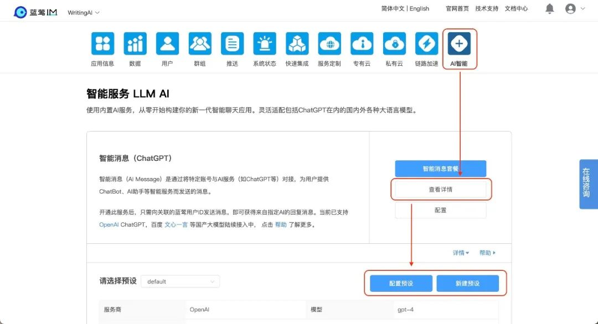

# 你有一个无限量使用大模型和企业知识库的机会

原创 适配多模型的小蓝 蓝莺IM _2023-08-02 10:30_ _发表于北京_

> 多模型适配完成，蓝莺企业知识库已可以切换国产大模型，第一站，从Minimax开始。
> 
> AI Chatbot也已支持多预设功能，你可以在聊天时启用自己的斜杠助手，使用命令`/+空格`查看更多。
> 
> 未来`10`天，你有一个尽情无限量使用大模型和企业知识库的机会，由Minimax和蓝莺IM共同提供，详情见文末介绍。

[企业知识库发布](https://docs.lanyingim.com/articles/product-and-technologies/It-is-time-to-make-LLM-learn-enterprise-knowledge.html)的时候，我们讲过要做多模型适配的原因。

一方面，[百模大战](https://mp.weixin.qq.com/s?__biz=MjM5OTExMjYwMA==&mid=2670148561&idx=5&sn=88827af43779a745718579a621797f38&scene=21#wechat_redirect)仍在如火如荼地进行，现在预测谁会胜出还未可知。我们对未来的判断是，只要最终不是只有一家胜出，那么必然是各有所长，即在某些应用场景，有一家比其他家更适合。

也因此，应用软件势必要适配测试多个大模型，以选择最适合业务的服务。

另一方面，[生成式人工智能管理办法](https://mp.weixin.qq.com/s?__biz=MzAwMjU0MjIyNw==&mid=2651451323&idx=2&sn=0552bbe243af3d97c2bb79c571da52ec&scene=21#wechat_redirect)发布，将于8月15日正式执行。昨天，苹果AppStore也在一夜间下架了很多应用，选择大模型服务以适应所在地法律法规，也成了应用必须优先考虑的事项。

而让应用可以轻松测试各种大模型服务，并平滑切换，是作为连接层的统一框架的工作。

这是蓝莺AI服务在研发之初就确定的目标。

## 1. 多模型第一站：Minimax

今天，多模型适配完成，你可以在[蓝莺IM控制台\[1\]](https://console.lanyingim.com/)的智能消息服务里选择不同厂商的大模型AI引擎：

如前所述，第一个上线的是[Minimax\[2\]](https://api.minimax.chat)。

Minimax作为国内大模型服务的先行者，在AGI技术突飞猛进的同时，率先对外开放嵌入接口（Embedding API），这个接口企业知识库的基础，也是我们首选接入的原因之一。

## 2. ChatAI基础：斜杠助手

智能消息服务增加了多预设支持。你可以为「智能消息」里的Chatbot增加多个预设，每一个预设可以单独选择AI引擎并设置提示词等相关参数，如图：

ChatBot支持多预设，意味着你在同AI对话时，可以通过`/+空格`唤出多个不同的命令，应对完全不同的需求。

所以，还记得那个在聊天框中唤起的斜杠AI吗？

现在开始，定义自己的AI助手吧！

## 本周不容错过的活动！！！👏🏻

未来`10`天，你有一个**可以尽情无限量使用大模型的机会**，这个机会由Minimax提供，也有一个免费体验企业知识库的机会，这个机会由蓝莺IM提供。

> 免费注册蓝莺IM控制台，开启智能消息和企业知识库服务，选择Minimax即可体验。

进一步了解详情，或者讨论多模型对比、ChatAI等话题，可添加「小蓝会聊天」微信进群。

本文内容已进入小蓝文章知识库，可使用蓝莺 Link 提问：

[https://lanying.link/00h0vp \[3\]](https://lanying.link/00h0vp)

## 下一步，你想玩的是大模型是哪家？

留言告诉我们吧。

## 关于蓝莺IM

**蓝莺IM是新一代智能聊天云服务。**

企业可以通过集成蓝莺IMSDK，同时拥有Chat和AI两大功能，当前AI引擎已支持ChatGPT、Minimax，百度文心一言、阿里通义千问等均在接入中。

如果你希望在强AI时代打磨好自己的产品，欢迎继续关注蓝莺IM，我们会持续输出最新的经验与技术：

打造新一代智能聊天APP，使用蓝莺IM SDK！

## 参考资料

1. [蓝莺IM控制台](https://console.lanyingim.com/)
2. [Minimax](https://api.minimax.chat)
3. [小蓝文章助手](https://lanying.link/00h0vp)