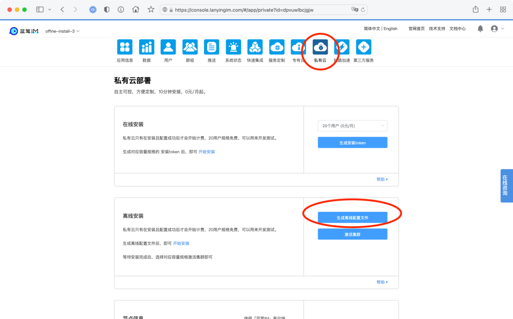

# 从云市场 Marketplace 到光盘行动

一乐 蓝莺IM _2022-08-23 21:09_

> 还记得最近一次使用光盘是什么时候吗？  
>
> **私有云支持PAYG模式是一个云服务否是多云架构的检验标准，光盘分发是一个云服务是否完成云原生改造的检验标准。**  
>
> 阅读全文，了解云原生软件先锋蓝莺IM的最新动态。

昨天（2022年8月22日），亚马逊云科技宣布，由西云数据运营的亚马逊云科技Marketplace（中国区）正式支持付费AMI (Amazon Machine Image) 镜像产品，通过灵活的定价模式，客户将实现按需或按年付费并快速部署AMI产品。此项发布简化了客户购买流程，进一步提升亚马逊云科技Marketplace（中国区）的用户体验，同时也为独立软件供应商提供了更多的销售机会。首批上架的付费AMI产品来自Fortinet、红帽、SUSE、TigerGraph、映云和美信拓扑等亚马逊云科技合作伙伴网络成员。

> https://www.amazonaws.cn/en/newsroom/2022/0822-Marketplace/

是的，美信拓扑荣幸成为首批上架产品的亚马逊云科技合作伙伴网络成员，这次上的是全新升级的「蓝莺IM私有云」百人版和千人版：

> https://awsmarketplace.amazonaws.cn/marketplace/search/results?x=0&y=0&searchTerms=Lanying+IM+Server

去年我们发布免费版的时候，已经发过操作指南，所以这里不再赘述，感兴趣的同学可以阅读《[美信拓扑 IM 登陆亚马逊云市场（中国区）](maximtop-im-launched-on-amazon-cloud-market-china.md)》《[一毛钱一小时的 IM 私有云要吗？](want-an-im-private-cloud-for-a-dime-an-hour.md)》。

有一点需要提醒的是，这次收费版本的供应商是西云数据。也就是说，这两个版本在中国区是由西云数据代理，在亚马逊云科技Marketplace（中国区）里购买，你将获得：

**1. 双倍服务**

你将获得亚马逊云科技 Marketplace （中国区）官方支持，以及美信拓扑的原厂支持，双重质量保障，可以放心使用。

**2. 统一结算**

由于计费完全打通，你可以通过云市场 Marketplace 统一结算，只需在配置时进入蓝莺IM控制台即可。财务流程更加简单。

你可能会好奇，私有云跟随镜像启动之前就做了，这次发布有什么新的改进呢？  

我们发布的原因，当然部分是因为收费云市场在国内第一次发布，以及两年过去，蓝莺IM仍然是「应用开发」类别里唯一支持按小时售卖的云服务产品：

> https://awsmarketplace.amazonaws.cn/marketplace/search/results?page=1&filters=PricingPlan&PricingPlan=Hourly&searchTerms=&category=3c015f8c-b83c-4b7d-a544-29e87950c267

还有一部分原因是，随着云市场的这次发布，蓝莺IM的光盘版也发布了！🎉🎉🎉

你没有看错，以后可以通过一张光盘，直接安装蓝莺IM私有云了。

光盘版有什么用？可能很多朋友会有疑问，毕竟现在光盘光驱都要退出历史舞台了。

光盘版的核心，其实是蓝莺IM私有云的离线安装版本。我们第一版发布的时候，我们使用的是在线安装模式，即下载一个很小的安装包做 Bootstrap 引导，后面再根据安装程序配置下载安装关联软件比如 K8S、Ceph 等，最后会下载相关的容器镜像 Docker Image。整个安装过程十分钟，很多时间都用在了网络传输上，具体问题和解决方案我们在《[十分钟安装一套即时通讯 IM 私有云](install-an-instant-messaging-im-private-cloud-in-ten-minutes.md)》里也提过。

现在离线安装版发布，这部分下载影响的时间基本被省去，**光盘版的安装时间已经只需五分钟左右**。

然而再加速显然不是我们的主要目的，因为十分钟的安装效率已经超越了行业第二好水平百倍以上。真正打动我们还是客户，有个客户找过来说：

> 我们需要很多套 IM，给下属各个单位装备使用，在他们使用的场景下，网络不可用或被破坏的情况。

对一些集团客户、安全客户，有一个「规模分发，开箱即用」的场景，于是我们开始了这个光盘行动。  

把服务部署改造成光盘安装，还是核心解决两个问题，配置和 License 管理。这两个问题也是我们选择在线安装的原因，即通过在线实现配置的下发，并对付费用户进行自动延期或关停。

不过有了相关基础设施服务，要变成离线安装，只需要重新思考兼容解决方案即可。最后的结果也就是你可以在后台看到的，为原来的一键安装增加了两个步骤：

**第一步：安装前生成离线配置文件**

这一步的重点是对集群进行适当的配置，我们利用了官网的控制台，所有的配置项设置后，可以通过配置文件导出，可以给安装程序使用。

**第二步：安装后激活服务**

License 管理要保证开通合适的规格，并执行有效期管控到期关停，而且要防止底层复制。因此在安装后会需要根据安装系统生成一个集群指纹，我们称其为 License-Key，通过控制台获取相应的 License，可以用来激活服务。

下载则改变之前下载引导程序的方式为下载一个 iso 文件，里面打包了所有的可执行程序。直接挂载或者刻成光盘，随意使用。详细文档可参考：

> https://docs.lanyingim.com/quick-start/how-to-deploy-private-cloud.html#单机版离线安装

我们称其为光盘版，是因为只有光盘能够表达一个与世界隔绝安装过程中那种隐隐在发生什么的奇妙的感觉。

**后记**

想到二十年前，选配电脑还要特别在意光驱的型号和能力，因为需要自己刻录光碟。那时候游戏也都是这种模式。  

插入光盘，在滋啦滋啦的读盘声中，进入一个个有趣的迥异的世界。忘不了那些从红色警戒里发出回荡在房间里的魔性语言：  

**椰丝儿，椰丝儿，爱喂狗，脖子右拧。。。。**  

光盘算是最让人沉浸的安装模式了吧。  

你还记得最近一次使用光盘是什么时候吗？欢迎留言评论，我们会抽取一位幸运的朋友送出「蓝莺IM」品牌礼盒一套。

**蓝朋友计划的最新情报**

我们正在以蓝莺IM开源项目为基础，打造一个专业的即时通讯技术社区，这便是我们的「蓝朋友计划」。此计划将会邀请社区技术专家一起，共同分享关于即时通讯（IM）技术相关内容，欢迎持续关注，也欢迎自荐或推荐。

