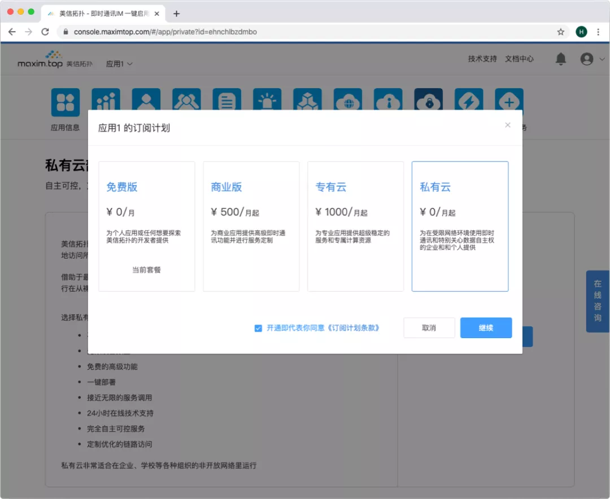
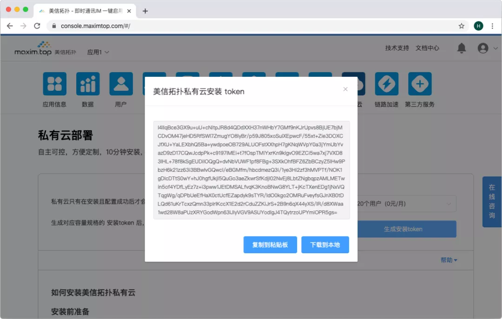
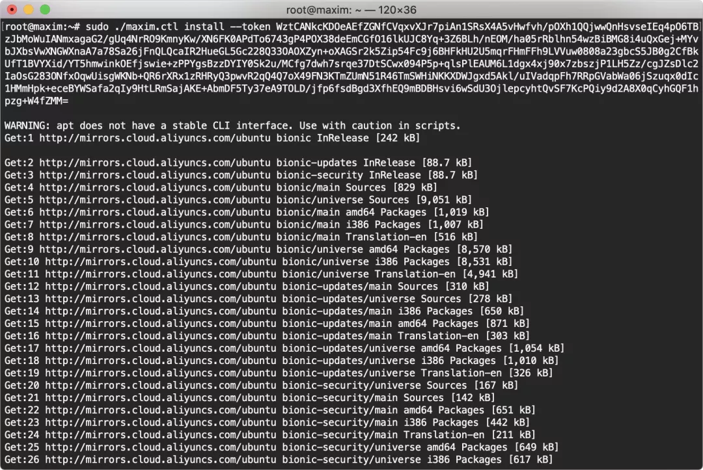

# 十分钟安装一套即时通讯 IM 私有云

原创 一乐 美信拓扑 _2020-03-26 19:49_


虽然企业上云已是趋势，但考虑到 IT 管理、数据安全和基础设施仍在改造适应阶段，私有云模式，也即云服务的私有部署，仍是很多企业采用云服务的典型模式。

过去相当长时间里，这给云服务带来了不小的挑战，一方面是用户需求的特殊性，要求云服务必须满足极高的伸缩性，可以支持更小的规格或者更大的规格，另一方面是复杂多变的本地环境，让服务的适配和部署遇到了诸多困难。

幸运的是，强烈的需求带动了技术的发展，容器技术在过去几年中迅猛发展，成为了美信拓扑多云架构的基石。

美信拓扑所有服务均已完成云原生改造，使得私有云可以稳定可靠地运行在从裸机服务器、私有云计算平台到各种内部容器平台环境中的重要依靠。

**三步操作，十分钟安装，即刻体验多云架构的即时通讯私有云：**

## 第一步 创建应用

登录控制台 点击创建应用。应用创建默认为免费版套餐，也可以升级为商业版。


###

## 第二步 开通私有云服务

1\. 应用创建成功后，进入应用详情页面。


2\. 点击更改计划，选择私有云，点击“继续”。



3\. 点击私有云图标，进入私有云详情页面，下载安装包 maxim.ctl

```
wget https://package.maximtop.com/linux/amd64/maxim.ctl
```


4\. 获取安装token。可以复制到粘贴板，也可以下载到本地文件备用，安装脚本里我们用 maxim.token.XXXXXX.txt 演示。



###

## 第三步 安装私有云

安装准备

* 操作系统：

> Linux操作系统，推荐 Ubuntu 18.04

* 硬件配置：

> CPU 4核 内存 8G 硬盘100G

* 如果选择安装集群版， 需要3台或更多服务器
* 下载安装包 maxim.ctl

## **单机版安装指南**

1\. 首先，准备好一台用来私有部署的服务器，将ssh登录到这台服务器上。然后，执行下载安装脚本命令，并增加可执行权限。命令如下：

```
wget https://package.maximtop.com/linux/amd64/maxim.ctl && sudo chmod u+x maxim.ctl
```

执行结果截图：


2\. 运行安装

根据网络情况选择是否添加 -net 参数，以便安装程序在完成后正确设置DNS。

A. 如果安装服务器已有公网IP，执行如下命令开始安装。

```
sudo ./maxim.ctl install --token INSTALL_TOKEN
```

注意：提示“Enter maxim install token:”，请输入已复制的安装Token，继续执行安装。

开始执行的截图：



安装完成的截图：


B. 本地环境不可进行外部访问，安装时需要添加参数 --net internal 提示安装程序选择内网IP注册。

执行如下命令开始安装：

```
sudo ./maxim.ctl install --net internal --token INSTALL_TOKEN
```

提示：安装脚本会提示“Enter maxim install token:”，请输入已复制的安装Token，继续执行安装。

开始执行的截图：


安装完成的截图：


提示：等待安装完成，耗时10-15分钟左右，即可安装完成。

## **集群版安装指南**

1\. 配置集群访问权限

配置第一台主机对其余主机的ssh权限，以三台主机 172.16.0.78 、172.16.0.79 、172.16.0.80 为例。

ssh登录master节点（172.16.0.78）执行如下命令，生成ssh用的公私钥：

```
sudo ssh-keygen -t rsa -f ~/.ssh/id_rsa -P ''
```

执行结果截图：


执行如下命令, 将命令的输出分别在主机172.16.0.78 ，172.16.0.79 ，172.16.0.80上执行

```
sudo echo "sudo echo \"`cat ~/.ssh/id_rsa.pub`\" >> ~/.ssh/authorized_keys"
```

命令输出结果截图：


命令输出在172.16.0.78的执行结果：


命令输出在172.16.0.79的执行结果：


命令输出在172.16.0.80的执行结果：


2\. ssh登录到第一台主机172.16.0.78上 执行如下命令下载安装脚本，并增加可执行权限

```
wget https://package.maximtop.com/linux/amd64/maxim.ctl && sudo chmod u+x maxim.ctl
```

执行结果截图：


3\. 运行安装

根据网络情况选择是否添加 -net 参数，以便安装程序在完成后正确设置DNS。

A. 如果服务器已有公网IP，执行如下命令开始安装。

```
sudo ./maxim.ctl install --nodelist 172.16.0.78 172.16.0.79 172.16.0.80 --token INSTALL_TOKEN
```

提示：安装脚本会提示“Enter maxim install token:”，请输入已复制的安装Token，继续执行安装。

开始执行的截图：


安装完成的截图：


B. 如果本地环境不可进行外部访问，安装时需要添加参数 --net internal 提示安装程序选择内网IP注册。执行如下命令开始安装。

```
sudo ./maxim.ctl install --nodelist 172.16.0.78 172.16.0.79 172.16.0.80 --net internal --token INSTALL_TOKEN
```

提示：安装脚本会提示“Enter maxim install token:”，请输入已复制的安装Token，继续执行安装。

开始执行的截图：


安装完成的截图：


提示：等待安装完成，耗时10-20分钟左右，即可安装完成。

## 其他

1\. 服务安装完会需要联系服务器自检，如果确定本地环境不可进行外部访问，安装时需要添加参数 --net internal 提示安装程序选择内网IP注册。

2\. 如果机器有防火墙，需要保证端口443和80允许访问。

3\. 如何查看私有云安装进度，以及数据迁移状态？


4\. 安装完成后，打开美信拓扑控制台进入系统状态页面。


点击查看原文或者访问[美信拓扑官网](https://www.maximtop.com)了解更多

关注「美信拓扑」公众号 ，了解一键启用多云架构的即时通讯云服务 
