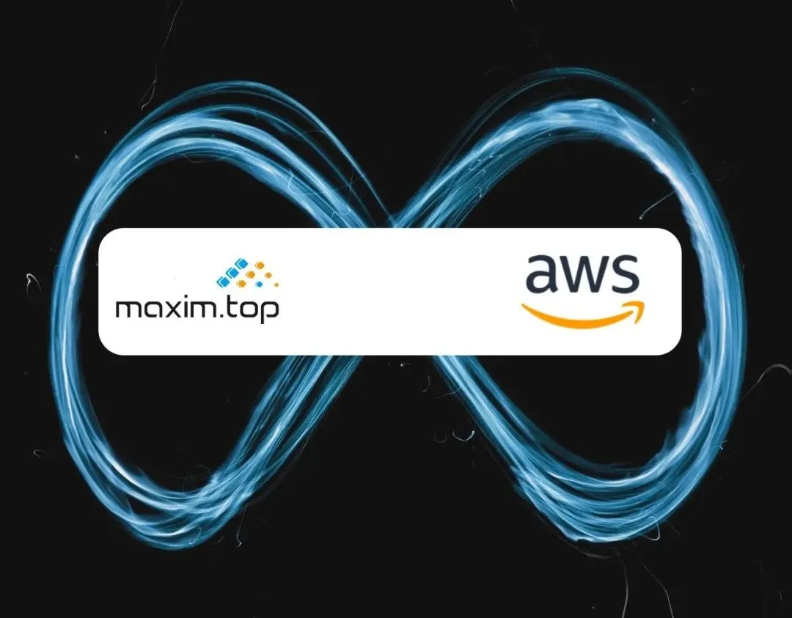

# 美信拓扑 IM 登陆亚马逊云市场（中国区）

原创 艾姆姐 美信拓扑 _2021-11-08 22:55_

> 迄今为止，美信拓扑是第一个也是唯一上线亚马逊云市场（中国区）的即时通讯云服务厂商，也仍然是唯一上线阿里云云市场的即时通讯云服务。
>
> **“能否实现公有云和私有云的统一管控，一键启用按月付费，是检验云原生IM 的重要标准。” —— 美信拓扑创始人兼CEO 一乐**
>
> 本文适合正在了解云原生、即时通讯、或 IM 服务选型的技术/管理人员阅读。

作者 | 艾姆姐

继上线阿里云、青云云市场后，美信拓扑新一代云原生 IM 正式上线亚马逊云市场，只需购买主机时选择镜像，即可启用[每小时一毛钱的 IM 私有云](want-an-im-private-cloud-for-a-dime-an-hour.md)服务。

截至发稿，美信拓扑是第一个也是唯一上线亚马逊云市场（中国）的即时通讯云服务厂商，也仍然是唯一上线阿里云云市场的即时通讯云服务。



## 新一代云原生 IM

如果说云服务的第一波浪潮是通过集中控制、以租代售方式降低成本进而重构基础设施的话，云原生技术引领的无疑是新的浪潮，那就是在保证数据和管控体验的基础上，将数据和服务的所有权交回用户。

模块化组件化带来的研发效率提升，必将重构软件交付行业，给技术外包、软件服务商、集成商更具性价比的选择。这也是美信拓扑研发新一代云原生 IM 的缘由。

我们已经有多篇文章介绍美信拓扑 IM 服务，相信很多朋友都对云原生 IM 已经有所理解，这里简单总结汇总。

简而言之，一个真正的云原生 IM 要做到以下几点：

### 1. 多云架构

多云架构本质上是统一架构和多云适配。统一架构后，我们可以在提供统一 API 服务基础上，以插件式的方式替换组件服务，适应从公有云服务到裸金属服务器等不同基础设施。

这个适应，用我们的方法就是将所有服务进行云原生改造，比如使用容器和 K8S 等技术。

这也是我们的服务可以有极致伸缩性的基础，从可以支撑千人同时在线的[树莓派安装的 IM 私有云](how-much-concurrency-is-supported-by-im-private-cloud-in-raspberry-pi.md)，到千万级同时在线的美信拓扑公有云/专有云服务，拥有同样的架构，也都可以[在十分钟内部署实施](install-an-instant-messaging-im-private-cloud-in-ten-minutes.md)。

### 2. 统一管控

在介绍美信拓扑 IM 私有云的时候我们提过，是否有统一的控制台，是真正的私有云和传统私有部署的区别。当然，在云服务刚刚兴起的时候，云服务厂商把公有云私有部署作为私有云售卖给客户，有随意引申技术术语的嫌疑，也有技术无法实现的无奈。然而，现在技术发展和市场认知已经完全不同了。

私有云当然是要私有化的部署但也要有云服务的体验，其中重要的一个就是控制台的统一。这个统一，不仅方便用户管控，也使得服务在云上云下的无缝迁移变得可能。

在在此基础上的，自适应SDK（后面专门介绍）则保证了服务和数据的迁移完全平滑，且不需要客户端重新集成，进一步保证用户体验。

### 3. 按月付费

我们讲过，云服务降本增效的核心是以租代售，也就是通过多租户设计共享资源，同时因为是租赁，则改变了原来终身可用为当期可用，这也是「订阅制」的由来。

当租赁从公有云扩展到私有云的时候，相当于进一步降低了私有云的成本，因为在过去，后者都是终身授权，这往往意味着居高不下的价格。参考[SaaS定价二：按月付费的私有云](saas-pricing-two-monthly-private-cloud.md)，云原生 IM 的私有云，价格仅为行业价格的百分之一。

### 4. 云市场兼容

严格来讲，这不是一个标准，但确实是一个很好的验证云服务是否是云原生的方法。

因为能够上云市场，必须能够支持更短的计费周期，按月甚至按小时按秒，对于公有云这只是开关问题，但对于私有云来讲，就需要要有更有效的授权控制。同时，最重要的是，要能在云市场的统一管控下，这也就意味着，私有云需要有与公有云一样的控制平面。

还是之前的例子，这种改变看起来跟 Office 2019 转为 Office 365 一样，但不一样的是，IM 云服务要求在服务部署安装之后还要配置，因此服务的控制台也必须在安装后处于可访问状态。

也因此我们列在这里，作为一个检验标准。

所以，你知道为什么美信拓扑现在（仍然）是唯一上线 AWS 云市场和阿里云云市场的 IM 云厂商了吗？😁

## 如何购买使用

进入亚马逊云服务市场搜索「IM」，或者直接点击美信拓扑 IM AWS 链接：

[https://awsmarketplace.amazonaws.cn/marketplace/pp/prodview-rxkhawftzpws2](https://awsmarketplace.amazonaws.cn/marketplace/pp/prodview-rxkhawftzpws2)

第一步：选择服务区域和机器配置。


第二步：接受条款并订阅。


第三步：选择版本和区域。


第四步：选择机器配置。


第五步：创建网络和安全组。


第六步：基于供应商设置新建安全组。


第七步：设置密钥并启动机器。


最后一步：

机器启动后会自动安装美信拓扑 IM 私有云（大概需要十几分钟）。随后可以登录到服务器终端，执行命令获取用户名、密码、AppID等信息：

```
cat /etc/maxim/market
```

其中，用户名和密码用于登录美信拓扑控制台台， AppID 则用于客户端登录和服务端调用。

如果需要进一步配置或定制，可参考阿里云云市场文章：[一毛钱一小时的 IM 私有云要吗？](want-an-im-private-cloud-for-a-dime-an-hour.md)

祝玩得开心😊

## **引用**

1、[十分钟安装一套即时通讯 IM 私有云](install-an-instant-messaging-im-private-cloud-in-ten-minutes.md)\
2、[树莓派中的 IM 私有云支持多少并发？](how-much-concurrency-is-supported-by-im-private-cloud-in-raspberry-pi.md)\
3、[阿里云云市场：美信拓扑 IM 私有](https://market.aliyun.com/products/56014009/cmjj00041852.html)\
4、[美信拓扑官方控制台](https://console.maximtop.com)\
5、[美信拓扑 IM 私有部署指南](../../quick-start/how-to-deploy-private-cloud.md)\
6、[美信拓扑 IM 客户端与SDK下载](https://www.maximtop.com/downloads/)\
7、[美信拓扑开源 Github 地址](https://github.com/maxim-top)\
8、[Maxim.Top IM Server - Private Cloud](https://awsmarketplace.amazonaws.cn/marketplace/pp/prodview-rxkhawftzpws2)

## 关于

**美信拓扑**，一家很酷的技术公司，他们研发的新一代云原生 IM，是可以一键启用多云架构的即时通讯云服务，具有超强的伸缩能力，可以支撑从亿级用户千万并发的公有云服务，到一台主机十分钟安装完成的私有云。目前各种组件正在陆续开源。

**特别提示**

继续关注「美信拓扑」，了解新一代云原生 IM、即时通讯技术与开源。


