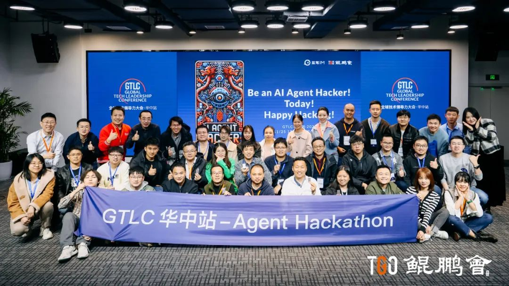
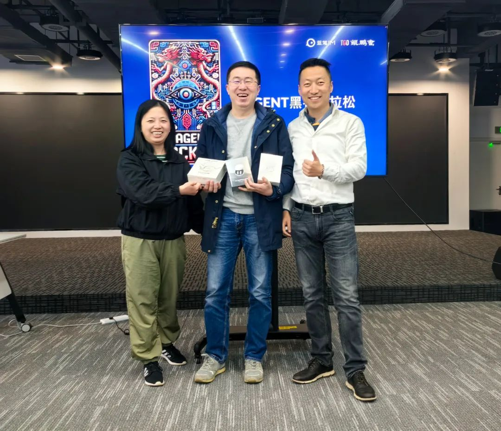
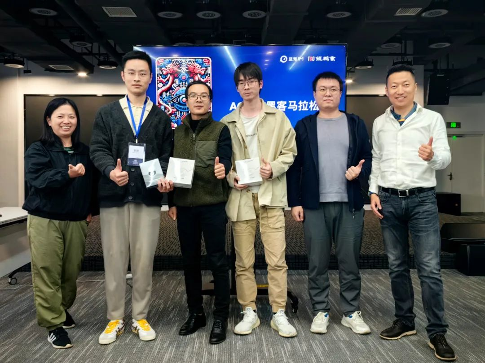
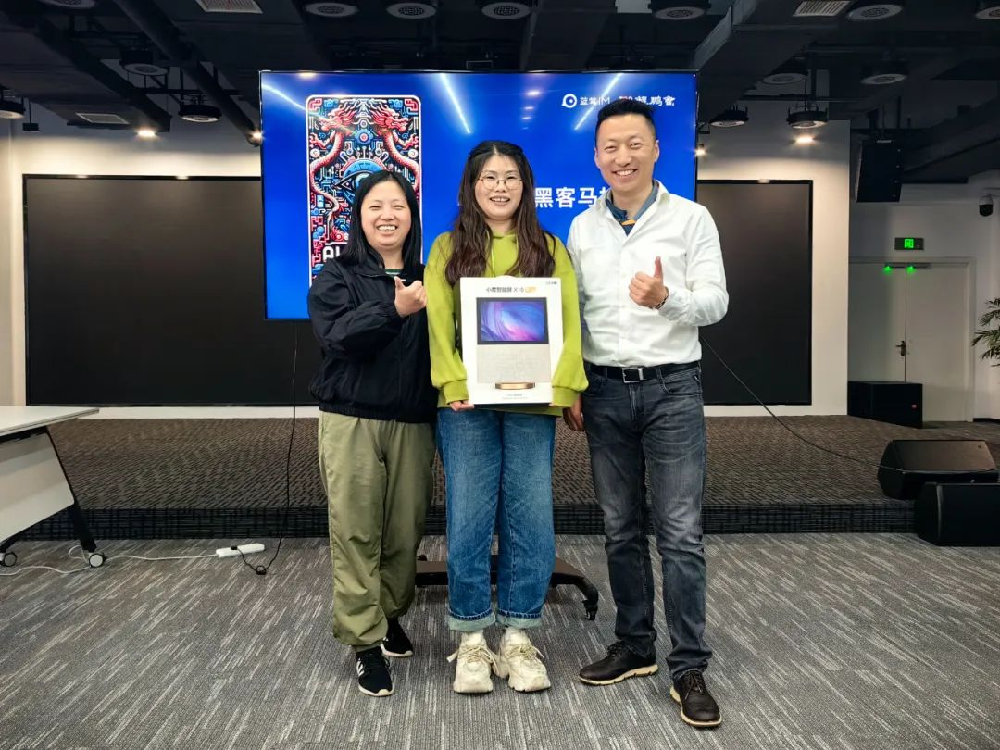
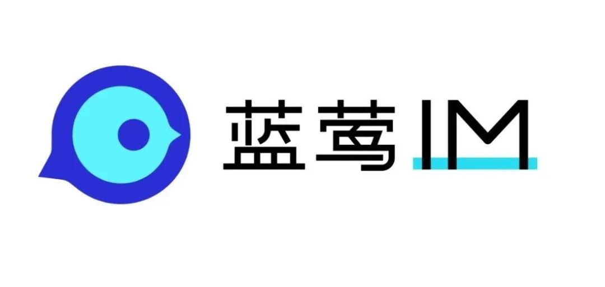

# 一场AI AGENT黑客马拉松能玩出什么

TGO鲲鹏会 蓝莺IM _2023-11-30 10:10_ _发表于北京_

> 全球技术领导力峰会·华中站 Agent Hackathon 完美收官，AI Agent Hacker 荣耀诞生！🎉🎉🎉
>
> 所有作品均已发布为蓝莺GPT胶囊。也就是说，你可以在创建Chatbot时通过导入GPT胶囊，来查看它们的提示词、使用它们设计的知识库和AI插件。
>
> 你可以试玩，也可以再次创作，自己设计更具个性的Chatbot，它们是：
>
> 最佳AI创作奖：区块链信息查询助手，可以调用某交易所API获取区块链信息，GPT胶囊ID：541594。
>
> 最受欢迎AI奖：大叔杨的数字分身，根据大叔杨的经验帮助提问者设计会议议程和方案，GPT胶囊ID：277431。
>
> 最关心人类AI奖：慢阻肺康养管家，为患者用户提供饮食、用药指导，并提供心理健康疏导，GPT胶囊ID：526747。
>
> Happy Hacking\~ Be an AI Agent Hacker today! 😎😎😎

今日，在 TGO 鲲鹏会主办的 GTLC 大会·华中站[（点此回顾）](http://mp.weixin.qq.com/s?__biz=MzA4NTU2MTg3MQ==\&mid=2655241995\&idx=1\&sn=72e6f5ba90cbc4f5e7aabec9d2042914\&chksm=8461606bb316e97d0bf57bad85239a742039be7f739ce0cc32b4d72a302775d0380b9fff9ce0\&scene=21#wechat_redirect)中所特别呈现的一场引领 AI 实战的重头戏——Agent Hackathon 活动圆满收官。这场为期两天的活动，不仅是一次技术的盛会，更是未来 AI Agent Hacker 们的荣耀诞生之地。

在第一天的活动中，首先由 Agent Hackathon 出品人 & 顾问、蓝莺 IM 创始人兼 CEO、TGO 鲲鹏会（北京）董事一乐（梁宇鹏）向与会 11 只队伍的 40 位 AI Agent Hacker 同步日程安排、活动规则、奖品设置等内容，每支参赛队伍中均由 TGO 鲲鹏会学员担任队长，旨在确保每个队伍都有足够的资源和指导来完成他们的项目。

随后，Agent Hackathon 顾问、AI 应用咨询专家、南瓜博士公众号主笔、TGO 鲲鹏会 (上海) 学员艾芙（徐雁斐），围绕 AI Agent 和 Prompt Engineering 的应用与实践向与会 AI Agent Hacker 进行了详细介绍。此外，她还提出了使用思维导图和伪代码提升 Prompt 效果，并介绍了创意产生、方案探讨和 AI Agent 开发流程等，助力与会 AI Agent Hacker 发挥出更优异的表现。

最后， 11 只队伍的 40 位 AI Agent Hacker 开启激烈的创新与实践竞技。经过两天的角逐，在今日举行的总结研讨会上，所有项目都经过了精心的讨论和公平的投票。

## AI 奖项

### 1、最佳 AI 创作奖：第七组

Agent 名称：Blockchain Info Assistant

链接：https://lanying.link/fdfa7w

> 通过查询链上的资产、gas 费、批量查询余额、交易统计信息、稳定资产的发行销毁情况等，帮助交易者更好的分析市场的动态，作出合理的交易决策。

\### 2、最受欢迎 AI 奖：第十组

Agent 名称：大叔杨的数字分身

链接：https://lanying.link/472wvl

> 大叔杨的数字分身，可以帮助用户运用大叔杨的智慧规划和设计会议流程，提供有关高效会议管理的建议，并在必要时提出适当的问题以确保会议顺利进行。同时，大叔杨的数字分身还能够帮助用户澄清会议目标，明确参与者角色，制定议程，并让会议更具有生产性和意义。

### 3、最关心人类奖：第六组

Agent 名称：慢阻肺康养管家

链接：https://lanying.link/7z1ily

> 可以根据用户口味偏好、特殊病症、禁忌等，为用户提供饮食、用药指导；在提供营养健康方案的同时，还能提供心理健康的指导，帮助用户实现综合康复。

## 人类奖项

### 1、最靠谱人类奖：徐艳萍

> 她代表全组坚持到活动最后，且始终在积极调试Agent，深受现场所有参与者的认可。

这场 Hackathon 的成功不仅在于它的技术深度和广泛的参与，更在于它为每一位参与者提供了展现自己才华的舞台。无论是梦想成为未来技术领袖的青年才俊，还是在企业中推动技术进步的开发者，亦或是追求个人技术卓越的独立创客，他们都在这里找到了自己的位置。

“Be an AI Agent Hacker! Today! Happy Hacking!”，不仅仅是一句鼓舞人心的口号，更是对每一位技术人的期许。在这场科技与智慧的盛宴中，每一位参与者都成为了这场科技革命的重要实践者。

Agent Hackathon 完美收官，AI Agent Hacker 的荣耀之路刚刚开始，我们期待着他们在智能时代的新篇章中书写更多辉煌！

## 感谢共创伙伴

**本次 Agent Hackthon 活动的成功举办离不开首都在线、未来智能、蓝莺 IM 的大力支持。**

**首都在线**面向全球客户提供优质的云计算、大数据、人工智能等技术产品与服务，打造贴近客户业务场景的行业解决方案，致力于以云服务赋能数字经济，通过持续加速人工智能产业的布局和发展，为客户提供坚实的底座和服务。

首都在线立足中国，服务全球市场，业务范围遍及 50 多个国家，在国内以及海外三大核心区域美洲、欧洲、亚太设有 24 个地域区域，52 个可用区，94 个数据中心，上千个边缘算力节点覆盖，只需 5 分钟即可完成全球业务的多点部署。

**未来智能**是一家将人机交互做到真正实用的科技新消费品公司。公司始终致力于创造“具有情感和个性化， 多模态混合交互，真正能解决用户问题”的高品质产品，把我们心中对未来期许通过科技手段带到现实， 让每个人都能感受未来智能的美好。

**蓝莺 IM** 是新一代智能聊天云服务。企业可以通过集成蓝莺 IMSDK，同时拥有 Chat 和 AI 两大功能。目前全球每新出货七台智能手机就有一台使用了蓝莺 IM 技术。

蓝莺 AltGPTs，是一个跨 LLM 的企业级 GPT 商店，已正式对外公开发布，让 GPT 开发者可以基于包括 ChatGPT 在内的所有大模型构建应用。

## 后记

欢迎继续关注我们，共同探讨这个智能聊天的新时代，下一篇我们讲讲蓝莺GPT商店AltGPTs。

如果你有自己的观点或者想参与讨论，欢迎添加「小蓝会聊天」微信进群：

